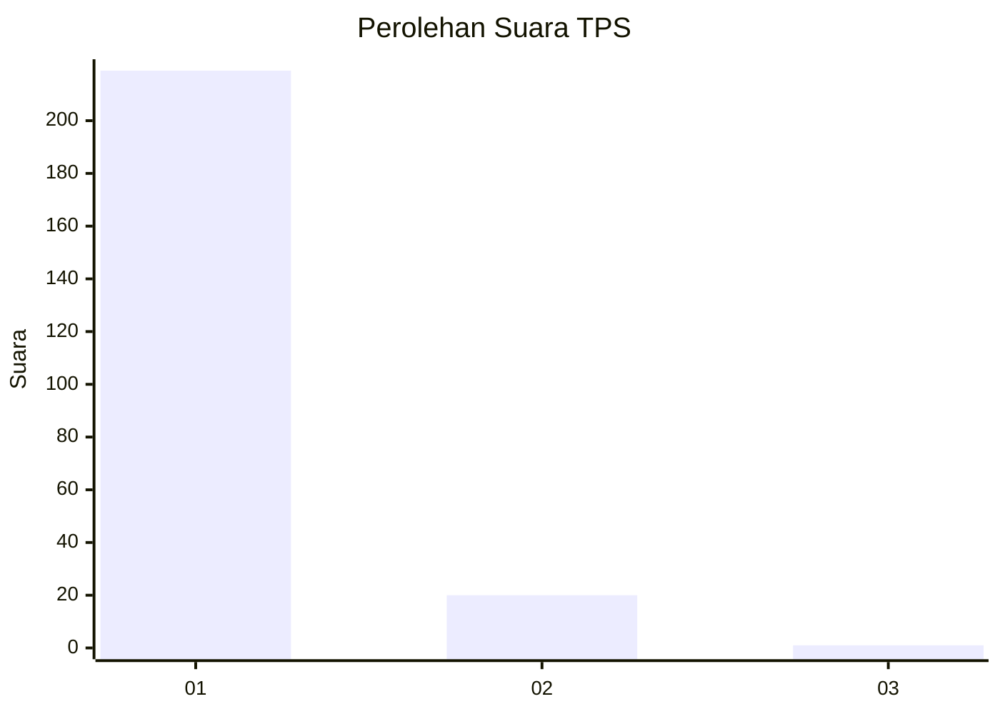
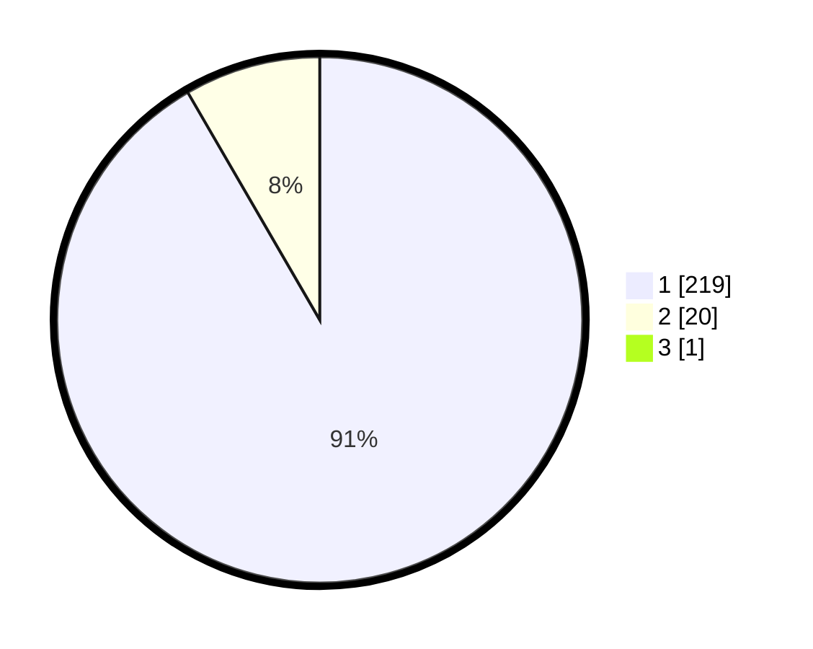

# Hasil

## Grafik

## Tabel

| No. | Nama Paslon    | Suara | Suara (raw) | Persentase |
|:--- |:-------------- | -----:| -----------:| ----------:|
| 1   | ANIES MUHAIMIN | 219   | [219][p-1]  | 91,25      |
| 2   | PRABOWO GIBRAN | 20    | [20][p-2]   | 8,33       |
| 3   | GANJAR MAHFUD  | 1     | [1][p-3]    | 0,42       |

[p-1]: https://github.com/gigit-pemilu/pemilu-2024-11-aceh/blob/main/pilpres/hitung-suara/sub/11-aceh/sub/74-kota-langsa/sub/01-langsa-timur/sub/2011-matang-panyang/sub/002-tps/sub/paslon-1.txt
[p-2]: https://github.com/gigit-pemilu/pemilu-2024-11-aceh/blob/main/pilpres/hitung-suara/sub/11-aceh/sub/74-kota-langsa/sub/01-langsa-timur/sub/2011-matang-panyang/sub/002-tps/sub/paslon-2.txt
[p-3]: https://github.com/gigit-pemilu/pemilu-2024-11-aceh/blob/main/pilpres/hitung-suara/sub/11-aceh/sub/74-kota-langsa/sub/01-langsa-timur/sub/2011-matang-panyang/sub/002-tps/sub/paslon-3.txt

## Foto C Plano

https://sirekap-obj-formc.kpu.go.id/9bd6/pemilu/ppwp/11/74/01/20/11/1174012011002-20240219-123841--5b95121e-dd6c-4064-aa47-968797f9c768.jpg

https://sirekap-obj-formc.kpu.go.id/9bd6/pemilu/ppwp/11/74/01/20/11/1174012011002-20240214-195235--297746dc-7bdf-4572-bdfe-371985685d26.jpg

https://sirekap-obj-formc.kpu.go.id/9bd6/pemilu/ppwp/11/74/01/20/11/1174012011002-20240214-201513--c4f8d128-aa65-4c5c-a131-75d27d4256d8.jpg

## Metadata

| Key        | Value               |
| ---------- | ------------------- |
| Time Stamp | 2024-02-19 13:00:00 |

