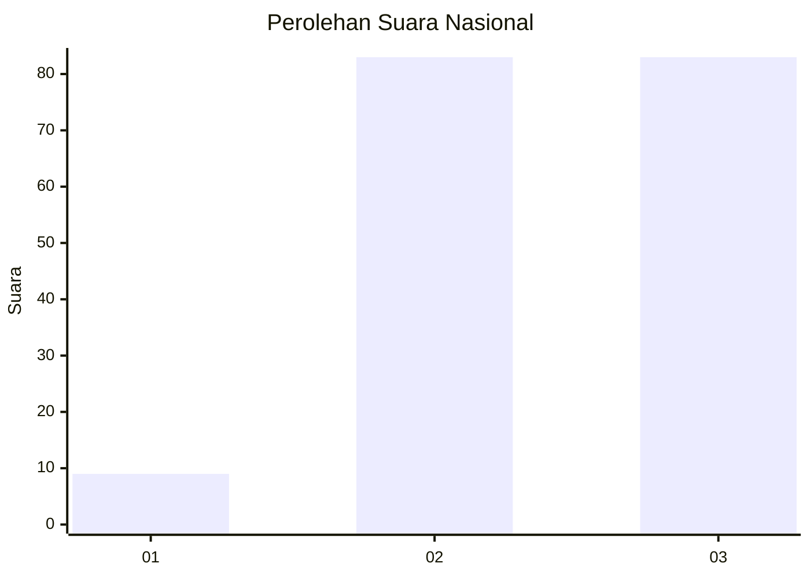
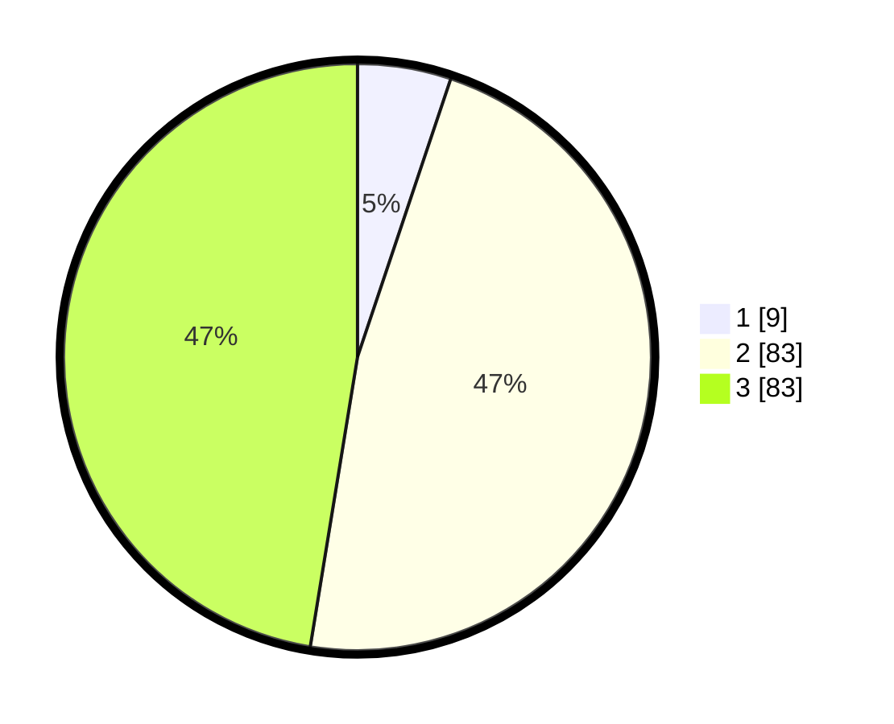

# Hasil

## Grafik

## Tabel

| No. | Nama Paslon    | Suara | Suara (raw) | Persentase |
|:--- |:-------------- | -----:| -----------:| ----------:|
| 1   | ANIES MUHAIMIN | 9     | [9][p-1]    | 5,14       |
| 2   | PRABOWO GIBRAN | 83    | [83][p-2]   | 47,43      |
| 3   | GANJAR MAHFUD  | 83    | [83][p-3]   | 47,43      |

[p-1]: https://github.com/gigit-pemilu/pemilu-2024/blob/main/pilpres/hitung-suara/sub/11-aceh/sub/74-kota-langsa/sub/01-langsa-timur/sub/2015-alue-merbau/sub/001-tps/sub/paslon-1.txt
[p-2]: https://github.com/gigit-pemilu/pemilu-2024/blob/main/pilpres/hitung-suara/sub/11-aceh/sub/74-kota-langsa/sub/01-langsa-timur/sub/2015-alue-merbau/sub/001-tps/sub/paslon-2.txt
[p-3]: https://github.com/gigit-pemilu/pemilu-2024/blob/main/pilpres/hitung-suara/sub/11-aceh/sub/74-kota-langsa/sub/01-langsa-timur/sub/2015-alue-merbau/sub/001-tps/sub/paslon-3.txt

## Foto C Plano

https://sirekap-obj-formc.kpu.go.id/e612/pemilu/ppwp/11/74/01/20/15/1174012015001-20240220-101337--e656c242-1497-4423-8fff-228d786e16f3.jpg

https://sirekap-obj-formc.kpu.go.id/e612/pemilu/ppwp/11/74/01/20/15/1174012015001-20240220-101502--4baf355a-dbfd-4a31-adbc-36a425a41f47.jpg

https://sirekap-obj-formc.kpu.go.id/e612/pemilu/ppwp/11/74/01/20/15/1174012015001-20240220-101559--dced25cc-3325-4f8c-a1d8-7fb6e1cbf9ea.jpg

## Metadata

| Key        | Value               |
| ---------- | ------------------- |
| Time Stamp | 2024-02-20 11:00:00 |

## DATA PEMILIH TETAP

Jumlah pemilih dalam DPT: **242**.
 * L: **30**.
 * P: **882**.

## DATA PENGGUNA HAK PILIH

Jumlah pengguna hak pilih dalam DPT: **772**.
 * L: **52**.
 * P: **727**.

Jumlah pengguna hak pilih dalam DPTb: **6**.
 * L: **884**.
 * P: **880**.

Jumlah pengguna hak pilih dalam DPK: **8**.
 * L: **0**.
 * P: **6**.

Jumlah pengguna hak pilih: **207**.
 * L: **406**.
 * P: **882**.

## JUMLAH SUARA SAH DAN TIDAK SAH

JUMLAH SELURUH SUARA SAH: **204**.

JUMLAH SUARA TIDAK SAH: **3**.

JUMLAH SELURUH SUARA SAH DAN SUARA TIDAK SAH: **207**.

