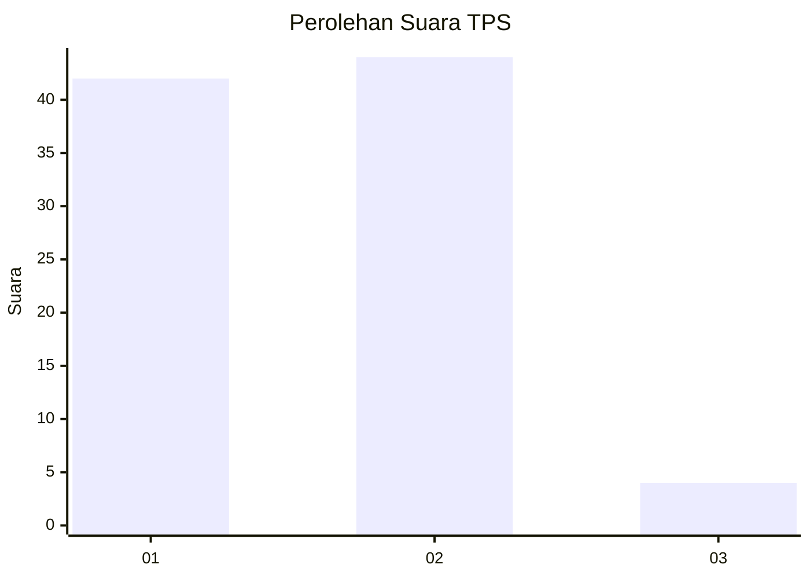
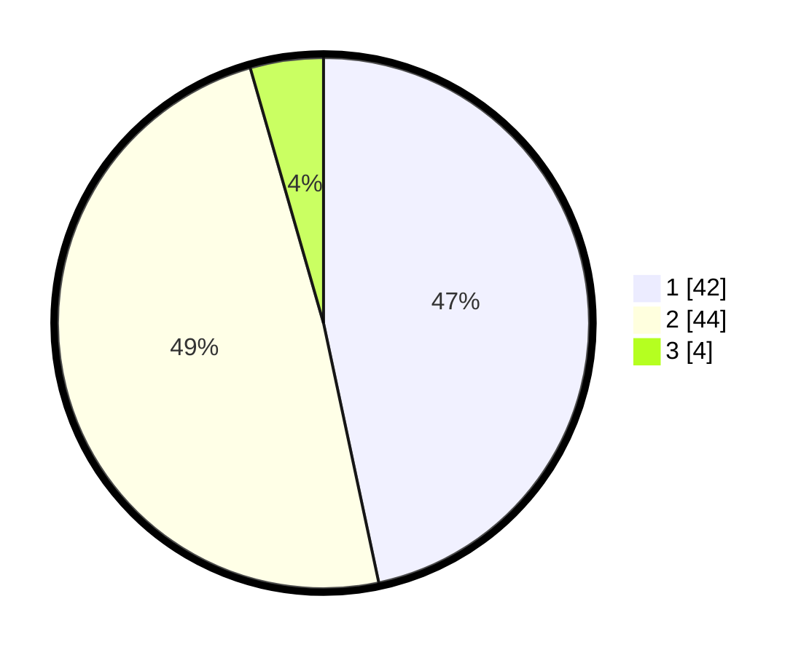

# Hasil

## Grafik

## Tabel

| No. | Nama Paslon    | Suara | Suara (raw) | Persentase |
|:--- |:-------------- | -----:| -----------:| ----------:|
| 1   | ANIES MUHAIMIN | 42    | [42][p-1]   | 46,67      |
| 2   | PRABOWO GIBRAN | 44    | [44][p-2]   | 48,89      |
| 3   | GANJAR MAHFUD  | 4     | [4][p-3]    | 4,44       |

[p-1]: https://github.com/gigit-pemilu/pemilu-2024-11-aceh/blob/main/pilpres/hitung-suara/sub/11-aceh/sub/74-kota-langsa/sub/01-langsa-timur/sub/2021-sungai-lueng/sub/005-tps/sub/paslon-1.txt
[p-2]: https://github.com/gigit-pemilu/pemilu-2024-11-aceh/blob/main/pilpres/hitung-suara/sub/11-aceh/sub/74-kota-langsa/sub/01-langsa-timur/sub/2021-sungai-lueng/sub/005-tps/sub/paslon-2.txt
[p-3]: https://github.com/gigit-pemilu/pemilu-2024-11-aceh/blob/main/pilpres/hitung-suara/sub/11-aceh/sub/74-kota-langsa/sub/01-langsa-timur/sub/2021-sungai-lueng/sub/005-tps/sub/paslon-3.txt

## Foto C Plano

https://sirekap-obj-formc.kpu.go.id/b26a/pemilu/ppwp/11/74/01/20/21/1174012021005-20240223-151241--8e76ba49-922c-4b64-bcc6-dc2c4f96b494.jpg

https://sirekap-obj-formc.kpu.go.id/b26a/pemilu/ppwp/11/74/01/20/21/1174012021005-20240223-151358--905c737b-4e55-4a61-a71d-fe03fdc30748.jpg

https://sirekap-obj-formc.kpu.go.id/b26a/pemilu/ppwp/11/74/01/20/21/1174012021005-20240223-151506--8248e59a-f18a-462d-84da-c70b5c72bf12.jpg

## Metadata

| Key        | Value               |
| ---------- | ------------------- |
| Time Stamp | 2024-02-24 22:31:28 |

## DATA PEMILIH TETAP

Jumlah pemilih dalam DPT: **251**.
 * L: **133**.
 * P: **116**.

## DATA PENGGUNA HAK PILIH

Jumlah pengguna hak pilih dalam DPT: **934**.
 * L: **870**.
 * P: **894**.

Jumlah pengguna hak pilih dalam DPTb: **8**.
 * L: **880**.
 * P: **808**.

Jumlah pengguna hak pilih dalam DPK: **83**.
 * L: **2**.
 * P: **83**.

Jumlah pengguna hak pilih: **187**.
 * L: **892**.
 * P: **895**.

## JUMLAH SUARA SAH DAN TIDAK SAH

JUMLAH SELURUH SUARA SAH: **184**.

JUMLAH SUARA TIDAK SAH: **3**.

JUMLAH SELURUH SUARA SAH DAN SUARA TIDAK SAH: **187**.

