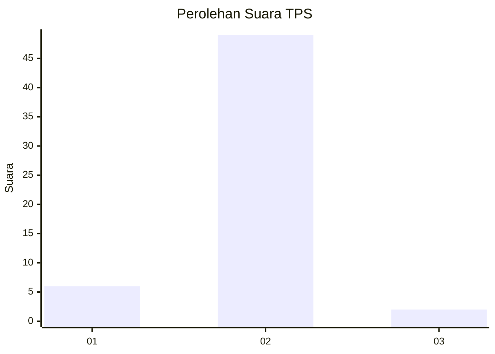
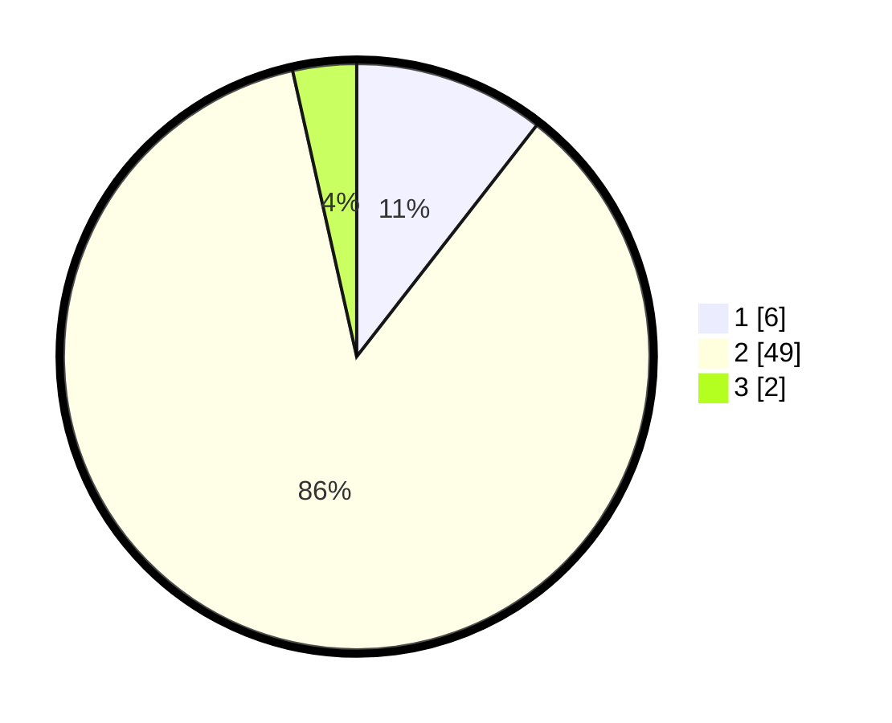

# Hasil

## Grafik

## Tabel

| No. | Nama Paslon    | Suara | Suara (raw) | Persentase |
|:--- |:-------------- | -----:| -----------:| ----------:|
| 1   | ANIES MUHAIMIN | 6     | [6][p-1]    | 10,53      |
| 2   | PRABOWO GIBRAN | 49    | [49][p-2]   | 85,96      |
| 3   | GANJAR MAHFUD  | 2     | [2][p-3]    | 3,51       |

[p-1]: https://github.com/gigit-pemilu/pemilu-2024-11-aceh/blob/main/pilpres/hitung-suara/sub/11-aceh/sub/74-kota-langsa/sub/01-langsa-timur/sub/2021-sungai-lueng/sub/901-tps/sub/paslon-1.txt
[p-2]: https://github.com/gigit-pemilu/pemilu-2024-11-aceh/blob/main/pilpres/hitung-suara/sub/11-aceh/sub/74-kota-langsa/sub/01-langsa-timur/sub/2021-sungai-lueng/sub/901-tps/sub/paslon-2.txt
[p-3]: https://github.com/gigit-pemilu/pemilu-2024-11-aceh/blob/main/pilpres/hitung-suara/sub/11-aceh/sub/74-kota-langsa/sub/01-langsa-timur/sub/2021-sungai-lueng/sub/901-tps/sub/paslon-3.txt

## Foto C Plano

https://sirekap-obj-formc.kpu.go.id/2675/pemilu/ppwp/11/74/01/20/21/1174012021901-20240223-204500--79048d15-ac2c-4a92-abb2-fe6dbe0ca1af.jpg

https://sirekap-obj-formc.kpu.go.id/2675/pemilu/ppwp/11/74/01/20/21/1174012021901-20240223-210522--c790706c-3324-4f9a-ad50-ddf97b7a74df.jpg

https://sirekap-obj-formc.kpu.go.id/2675/pemilu/ppwp/11/74/01/20/21/1174012021901-20240223-210721--21617bef-d5bc-4ab9-a482-4e95448b8caa.jpg

## Metadata

| Key        | Value               |
| ---------- | ------------------- |
| Time Stamp | 2024-02-24 22:31:28 |

## DATA PEMILIH TETAP

Jumlah pemilih dalam DPT: **225**.
 * L: **225**.
 * P: **0**.

## DATA PENGGUNA HAK PILIH

Jumlah pengguna hak pilih dalam DPT: **120**.
 * L: **120**.
 * P: **0**.

Jumlah pengguna hak pilih dalam DPTb: **41**.
 * L: **36**.
 * P: **5**.

Jumlah pengguna hak pilih dalam DPK: **0**.
 * L: **0**.
 * P: **0**.

Jumlah pengguna hak pilih: **161**.
 * L: **156**.
 * P: **5**.

## JUMLAH SUARA SAH DAN TIDAK SAH

JUMLAH SELURUH SUARA SAH: **158**.

JUMLAH SUARA TIDAK SAH: **3**.

JUMLAH SELURUH SUARA SAH DAN SUARA TIDAK SAH: **161**.

