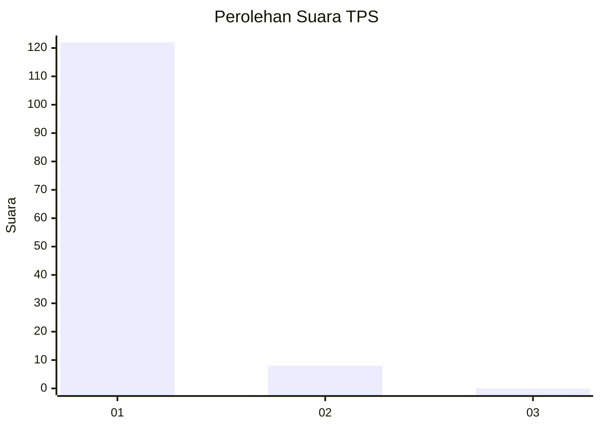
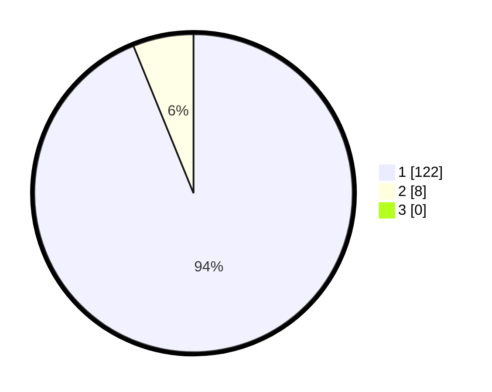

# Hasil

## Grafik

## Tabel

| No. | Nama Paslon    | Suara | Suara (raw) | Persentase |
|:--- |:-------------- | -----:| -----------:| ----------:|
| 1   | ANIES MUHAIMIN | 122   | [122][p-1]  | 93,85      |
| 2   | PRABOWO GIBRAN | 8     | [8][p-2]    | 6,15       |
| 3   | GANJAR MAHFUD  | 0     | [0][p-3]    | 0,00       |

[p-1]: https://github.com/gigit-pemilu/pemilu-2024-11-aceh/blob/main/pilpres/hitung-suara/sub/11-aceh/sub/74-kota-langsa/sub/02-langsa-barat/sub/2005-lhok-banie/sub/005-tps/sub/paslon-1.txt
[p-2]: https://github.com/gigit-pemilu/pemilu-2024-11-aceh/blob/main/pilpres/hitung-suara/sub/11-aceh/sub/74-kota-langsa/sub/02-langsa-barat/sub/2005-lhok-banie/sub/005-tps/sub/paslon-2.txt
[p-3]: https://github.com/gigit-pemilu/pemilu-2024-11-aceh/blob/main/pilpres/hitung-suara/sub/11-aceh/sub/74-kota-langsa/sub/02-langsa-barat/sub/2005-lhok-banie/sub/005-tps/sub/paslon-3.txt

## Foto C Plano

https://sirekap-obj-formc.kpu.go.id/76ca/pemilu/ppwp/11/74/02/20/05/1174022005005-20240222-160058--c06b7408-6e64-46ef-bf9d-777db2f4b0c8.jpg

https://sirekap-obj-formc.kpu.go.id/76ca/pemilu/ppwp/11/74/02/20/05/1174022005005-20240222-160208--04036026-f795-4e04-b4ed-690636276e62.jpg

https://sirekap-obj-formc.kpu.go.id/76ca/pemilu/ppwp/11/74/02/20/05/1174022005005-20240222-160932--295ed6ed-1c00-4941-a06b-a4f817d34f6c.jpg

## Metadata

| Key        | Value               |
| ---------- | ------------------- |
| Time Stamp | 2024-02-22 20:00:00 |

## DATA PEMILIH TETAP

Jumlah pemilih dalam DPT: **173**.
 * L: **96**.
 * P: **77**.

## DATA PENGGUNA HAK PILIH

Jumlah pengguna hak pilih dalam DPT: **130**.
 * L: **66**.
 * P: **64**.

Jumlah pengguna hak pilih dalam DPTb: **3**.
 * L: **1**.
 * P: **2**.

Jumlah pengguna hak pilih dalam DPK: **15**.
 * L: **5**.
 * P: **10**.

Jumlah pengguna hak pilih: **148**.
 * L: **72**.
 * P: **76**.

## JUMLAH SUARA SAH DAN TIDAK SAH

JUMLAH SELURUH SUARA SAH: **130**.

JUMLAH SUARA TIDAK SAH: **18**.

JUMLAH SELURUH SUARA SAH DAN SUARA TIDAK SAH: **148**.

