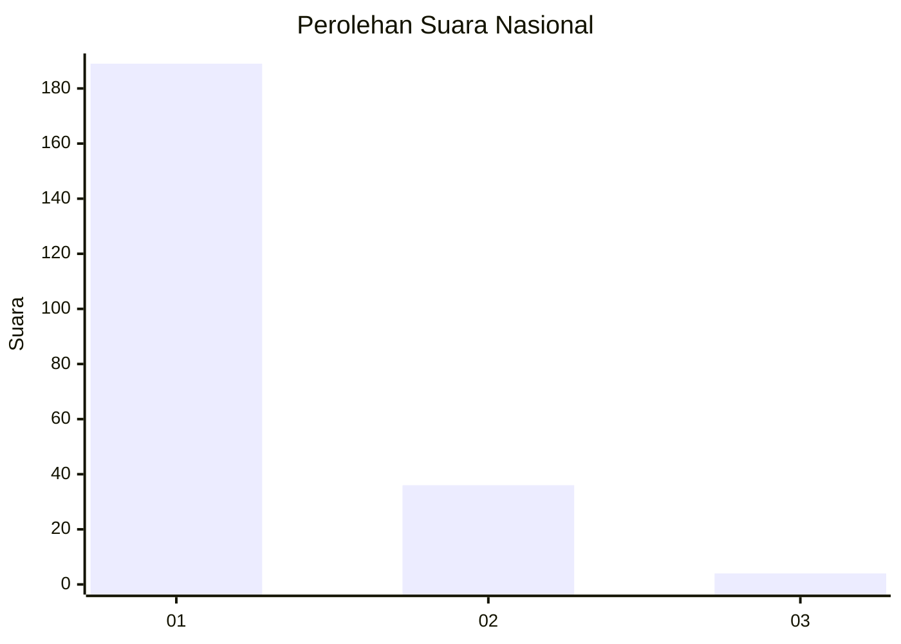
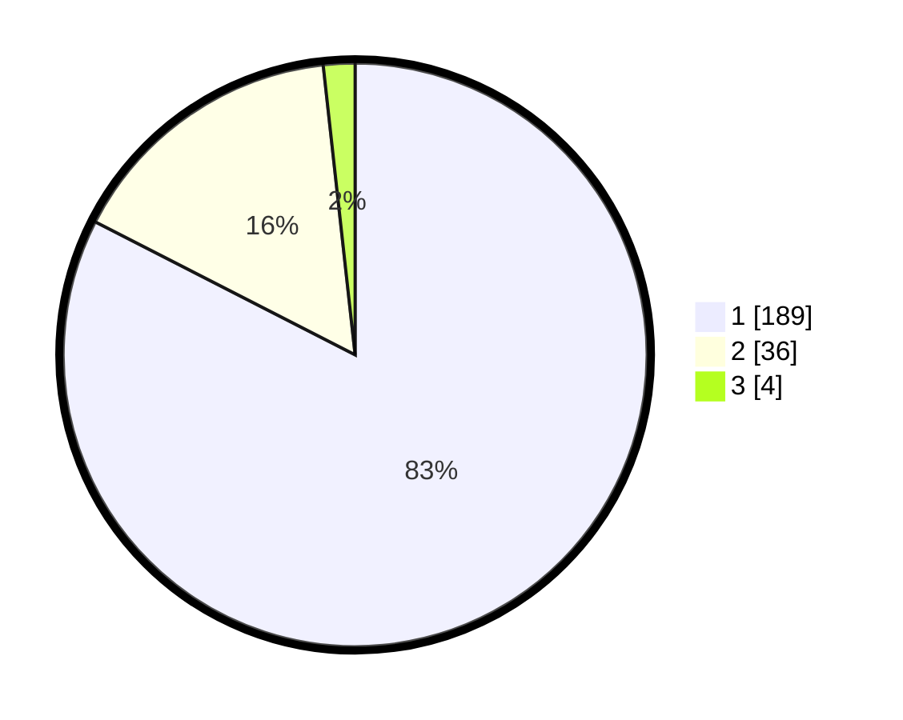

# Hasil

## Grafik

## Tabel

| No. | Nama Paslon    | Suara | Suara (raw) | Persentase |
|:--- |:-------------- | -----:| -----------:| ----------:|
| 1   | ANIES MUHAIMIN | 189   | [189][p-1]  | 82,53      |
| 2   | PRABOWO GIBRAN | 36    | [36][p-2]   | 15,72      |
| 3   | GANJAR MAHFUD  | 4     | [4][p-3]    | 1,75       |

[p-1]: https://github.com/gigit-pemilu/pemilu-2024/blob/main/pilpres/hitung-suara/sub/11-aceh/sub/74-kota-langsa/sub/02-langsa-barat/sub/2005-lhok-banie/sub/006-tps/sub/paslon-1.txt
[p-2]: https://github.com/gigit-pemilu/pemilu-2024/blob/main/pilpres/hitung-suara/sub/11-aceh/sub/74-kota-langsa/sub/02-langsa-barat/sub/2005-lhok-banie/sub/006-tps/sub/paslon-2.txt
[p-3]: https://github.com/gigit-pemilu/pemilu-2024/blob/main/pilpres/hitung-suara/sub/11-aceh/sub/74-kota-langsa/sub/02-langsa-barat/sub/2005-lhok-banie/sub/006-tps/sub/paslon-3.txt

## Foto C Plano

https://sirekap-obj-formc.kpu.go.id/f298/pemilu/ppwp/11/74/02/20/05/1174022005006-20240215-162040--2159502f-6fa1-49d5-9c96-a08a18a1bc8f.jpg

https://sirekap-obj-formc.kpu.go.id/f298/pemilu/ppwp/11/74/02/20/05/1174022005006-20240215-162315--18d61983-3619-46a9-8e89-6db80bab6e2b.jpg

https://sirekap-obj-formc.kpu.go.id/f298/pemilu/ppwp/11/74/02/20/05/1174022005006-20240215-162407--5a3f89b8-fd48-4bad-824b-7f801c952c5d.jpg

## Metadata

| Key        | Value               |
| ---------- | ------------------- |
| Time Stamp | 2024-02-16 22:30:00 |

