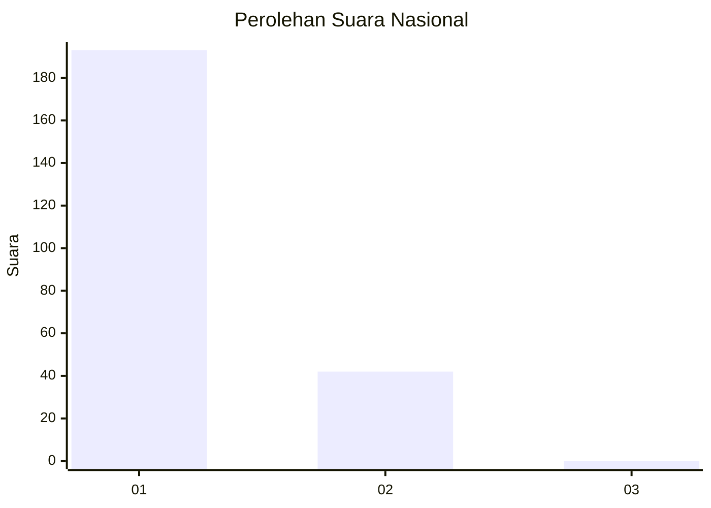
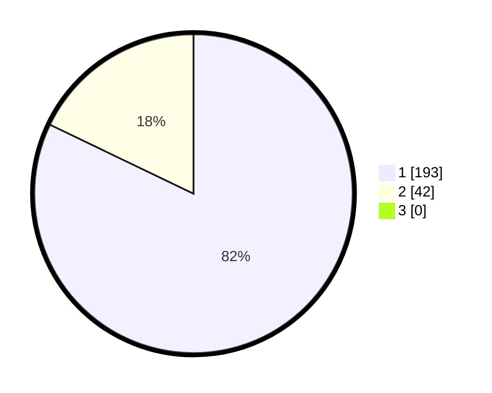

# Hasil

## Grafik

## Tabel

| No. | Nama Paslon    | Suara | Suara (raw) | Persentase |
|:--- |:-------------- | -----:| -----------:| ----------:|
| 1   | ANIES MUHAIMIN | 193   | [193][p-1]  | 82,13      |
| 2   | PRABOWO GIBRAN | 42    | [42][p-2]   | 17,87      |
| 3   | GANJAR MAHFUD  | 0     | [0][p-3]    | 0,00       |

[p-1]: https://github.com/gigit-pemilu/pemilu-2024/blob/main/pilpres/hitung-suara/sub/11-aceh/sub/74-kota-langsa/sub/02-langsa-barat/sub/2005-lhok-banie/sub/008-tps/sub/paslon-1.txt
[p-2]: https://github.com/gigit-pemilu/pemilu-2024/blob/main/pilpres/hitung-suara/sub/11-aceh/sub/74-kota-langsa/sub/02-langsa-barat/sub/2005-lhok-banie/sub/008-tps/sub/paslon-2.txt
[p-3]: https://github.com/gigit-pemilu/pemilu-2024/blob/main/pilpres/hitung-suara/sub/11-aceh/sub/74-kota-langsa/sub/02-langsa-barat/sub/2005-lhok-banie/sub/008-tps/sub/paslon-3.txt

## Foto C Plano

https://sirekap-obj-formc.kpu.go.id/96f7/pemilu/ppwp/11/74/02/20/05/1174022005008-20240222-202748--8d6763e1-d06c-4517-940e-a95622d2ca94.jpg

https://sirekap-obj-formc.kpu.go.id/96f7/pemilu/ppwp/11/74/02/20/05/1174022005008-20240215-075753--f20a33b5-963d-4fca-80b8-41f4264346dc.jpg

https://sirekap-obj-formc.kpu.go.id/96f7/pemilu/ppwp/11/74/02/20/05/1174022005008-20240215-075949--4c45bd9d-11d8-4560-b23a-5c920ddd2475.jpg

## Metadata

| Key        | Value               |
| ---------- | ------------------- |
| Time Stamp | 2024-02-22 21:00:00 |

