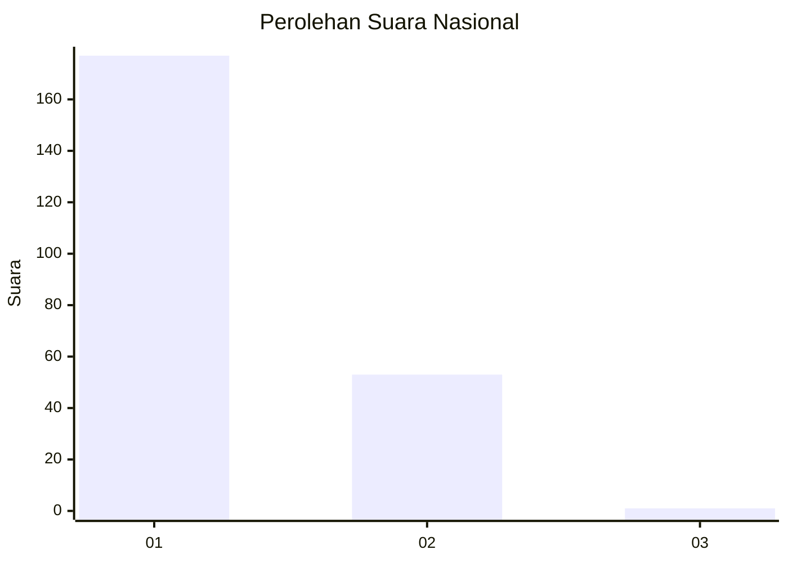
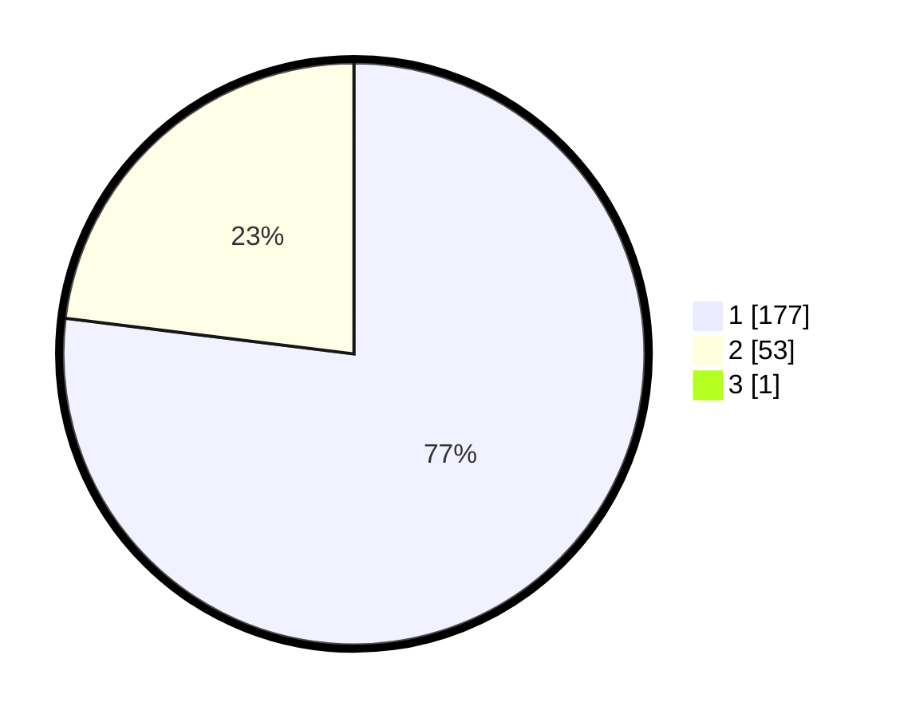

# Hasil

## Grafik

## Tabel

| No. | Nama Paslon    | Suara | Suara (raw) | Persentase |
|:--- |:-------------- | -----:| -----------:| ----------:|
| 1   | ANIES MUHAIMIN | 177   | [177][p-1]  | 76,62      |
| 2   | PRABOWO GIBRAN | 53    | [53][p-2]   | 22,94      |
| 3   | GANJAR MAHFUD  | 1     | [1][p-3]    | 0,43       |

[p-1]: https://github.com/gigit-pemilu/pemilu-2024/blob/main/pilpres/hitung-suara/sub/11-aceh/sub/74-kota-langsa/sub/02-langsa-barat/sub/2006-pb-teungoh/sub/001-tps/sub/paslon-1.txt
[p-2]: https://github.com/gigit-pemilu/pemilu-2024/blob/main/pilpres/hitung-suara/sub/11-aceh/sub/74-kota-langsa/sub/02-langsa-barat/sub/2006-pb-teungoh/sub/001-tps/sub/paslon-2.txt
[p-3]: https://github.com/gigit-pemilu/pemilu-2024/blob/main/pilpres/hitung-suara/sub/11-aceh/sub/74-kota-langsa/sub/02-langsa-barat/sub/2006-pb-teungoh/sub/001-tps/sub/paslon-3.txt

## Foto C Plano

https://sirekap-obj-formc.kpu.go.id/552f/pemilu/ppwp/11/74/02/20/06/1174022006001-20240215-053353--32a6ce1d-86af-4765-a1eb-2ea170f4cdf6.jpg

https://sirekap-obj-formc.kpu.go.id/552f/pemilu/ppwp/11/74/02/20/06/1174022006001-20240215-053512--7145bc1b-dddc-42c7-8c95-102369d0b0db.jpg

https://sirekap-obj-formc.kpu.go.id/552f/pemilu/ppwp/11/74/02/20/06/1174022006001-20240215-053544--396231ab-01e4-4b82-bac2-b9a22d6613aa.jpg

## Metadata

| Key        | Value               |
| ---------- | ------------------- |
| Time Stamp | 2024-02-19 16:00:00 |

