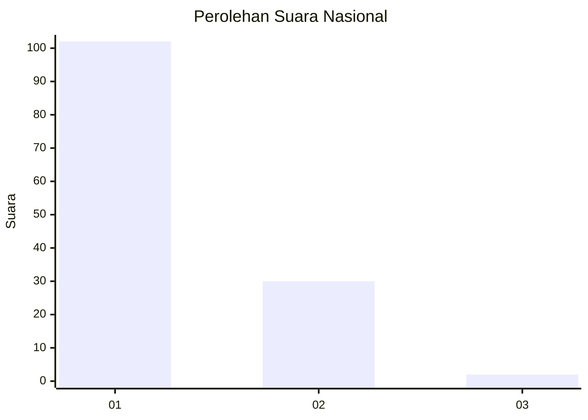
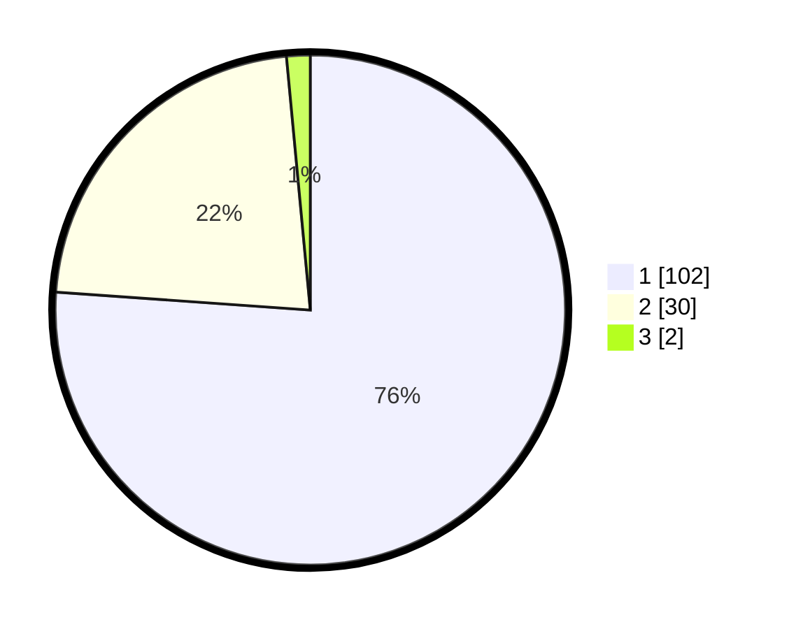

# Hasil

## Grafik

## Tabel

| No. | Nama Paslon    | Suara | Suara (raw) | Persentase |
|:--- |:-------------- | -----:| -----------:| ----------:|
| 1   | ANIES MUHAIMIN | 102   | [102][p-1]  | 76,12      |
| 2   | PRABOWO GIBRAN | 30    | [30][p-2]   | 22,39      |
| 3   | GANJAR MAHFUD  | 2     | [2][p-3]    | 1,49       |

[p-1]: https://github.com/gigit-pemilu/pemilu-2024/blob/main/pilpres/hitung-suara/sub/11-aceh/sub/74-kota-langsa/sub/02-langsa-barat/sub/2006-pb-teungoh/sub/006-tps/sub/paslon-1.txt
[p-2]: https://github.com/gigit-pemilu/pemilu-2024/blob/main/pilpres/hitung-suara/sub/11-aceh/sub/74-kota-langsa/sub/02-langsa-barat/sub/2006-pb-teungoh/sub/006-tps/sub/paslon-2.txt
[p-3]: https://github.com/gigit-pemilu/pemilu-2024/blob/main/pilpres/hitung-suara/sub/11-aceh/sub/74-kota-langsa/sub/02-langsa-barat/sub/2006-pb-teungoh/sub/006-tps/sub/paslon-3.txt

## Foto C Plano

https://sirekap-obj-formc.kpu.go.id/b265/pemilu/ppwp/11/74/02/20/06/1174022006006-20240225-221536--f62d4133-f503-43e0-884a-46207669e07a.jpg

https://sirekap-obj-formc.kpu.go.id/b265/pemilu/ppwp/11/74/02/20/06/1174022006006-20240225-221603--221f0a4c-8114-4388-b6b9-ffab0aa3f7ba.jpg

https://sirekap-obj-formc.kpu.go.id/b265/pemilu/ppwp/11/74/02/20/06/1174022006006-20240225-221626--102655d9-8c49-42e4-86a1-d273fa3459a2.jpg

## Metadata

| Key        | Value               |
| ---------- | ------------------- |
| Time Stamp | 2024-02-28 19:00:00 |

