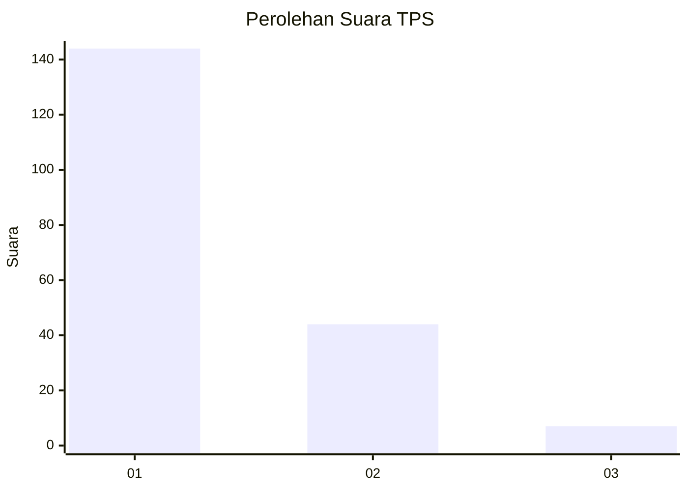
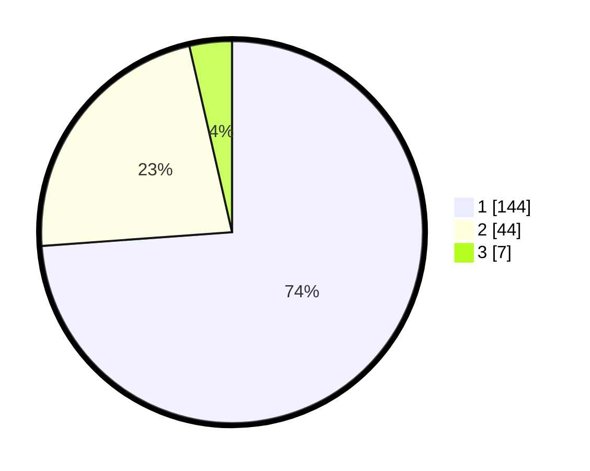

# Hasil

## Grafik

## Tabel

| No. | Nama Paslon    | Suara | Suara (raw) | Persentase |
|:--- |:-------------- | -----:| -----------:| ----------:|
| 1   | ANIES MUHAIMIN | 144   | [144][p-1]  | 73,85      |
| 2   | PRABOWO GIBRAN | 44    | [44][p-2]   | 22,56      |
| 3   | GANJAR MAHFUD  | 7     | [7][p-3]    | 3,59       |

[p-1]: https://github.com/gigit-pemilu/pemilu-2024-11-aceh/blob/main/pilpres/hitung-suara/sub/11-aceh/sub/74-kota-langsa/sub/02-langsa-barat/sub/2015-matang-seulimeng/sub/001-tps/sub/paslon-1.txt
[p-2]: https://github.com/gigit-pemilu/pemilu-2024-11-aceh/blob/main/pilpres/hitung-suara/sub/11-aceh/sub/74-kota-langsa/sub/02-langsa-barat/sub/2015-matang-seulimeng/sub/001-tps/sub/paslon-2.txt
[p-3]: https://github.com/gigit-pemilu/pemilu-2024-11-aceh/blob/main/pilpres/hitung-suara/sub/11-aceh/sub/74-kota-langsa/sub/02-langsa-barat/sub/2015-matang-seulimeng/sub/001-tps/sub/paslon-3.txt

## Foto C Plano

https://sirekap-obj-formc.kpu.go.id/7fef/pemilu/ppwp/11/74/02/20/15/1174022015001-20240214-201948--c5ad84a3-b057-4509-aed6-31d4ebafdf10.jpg

https://sirekap-obj-formc.kpu.go.id/7fef/pemilu/ppwp/11/74/02/20/15/1174022015001-20240214-202151--2a3418f0-1d2a-47af-9667-9f039e5aef76.jpg

https://sirekap-obj-formc.kpu.go.id/7fef/pemilu/ppwp/11/74/02/20/15/1174022015001-20240214-202045--b4ff5fa1-1c71-46bb-948b-bc40cb035fa3.jpg

## Metadata

| Key        | Value               |
| ---------- | ------------------- |
| Time Stamp | 2024-02-19 20:00:00 |

