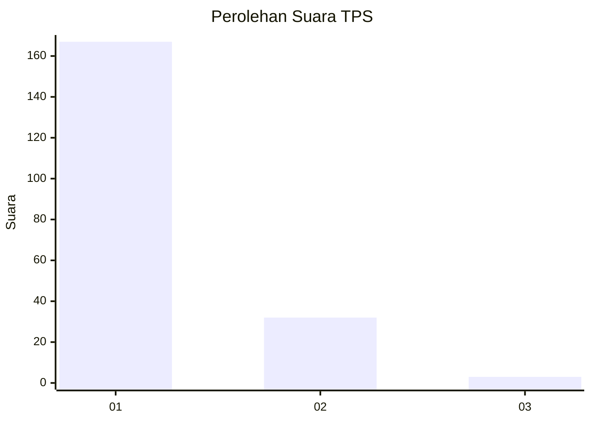
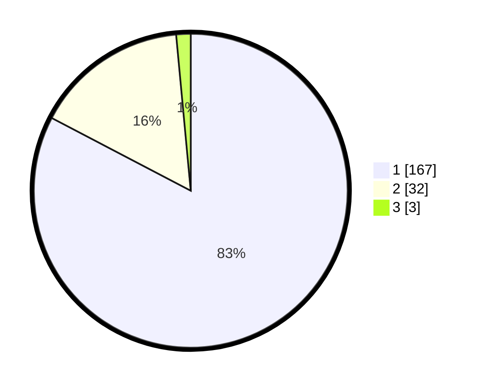

# Hasil

## Grafik

## Tabel

| No. | Nama Paslon    | Suara | Suara (raw) | Persentase |
|:--- |:-------------- | -----:| -----------:| ----------:|
| 1   | ANIES MUHAIMIN | 167   | [167][p-1]  | 82,67      |
| 2   | PRABOWO GIBRAN | 32    | [32][p-2]   | 15,84      |
| 3   | GANJAR MAHFUD  | 3     | [3][p-3]    | 1,49       |

[p-1]: https://github.com/gigit-pemilu/pemilu-2024-11-aceh/blob/main/pilpres/hitung-suara/sub/11-aceh/sub/74-kota-langsa/sub/02-langsa-barat/sub/2015-matang-seulimeng/sub/003-tps/sub/paslon-1.txt
[p-2]: https://github.com/gigit-pemilu/pemilu-2024-11-aceh/blob/main/pilpres/hitung-suara/sub/11-aceh/sub/74-kota-langsa/sub/02-langsa-barat/sub/2015-matang-seulimeng/sub/003-tps/sub/paslon-2.txt
[p-3]: https://github.com/gigit-pemilu/pemilu-2024-11-aceh/blob/main/pilpres/hitung-suara/sub/11-aceh/sub/74-kota-langsa/sub/02-langsa-barat/sub/2015-matang-seulimeng/sub/003-tps/sub/paslon-3.txt

## Foto C Plano

https://sirekap-obj-formc.kpu.go.id/f3bb/pemilu/ppwp/11/74/02/20/15/1174022015003-20240215-034505--6af4b3ac-8d17-4536-b5a7-80a057eca1c0.jpg

https://sirekap-obj-formc.kpu.go.id/f3bb/pemilu/ppwp/11/74/02/20/15/1174022015003-20240215-034723--07324e89-8b94-4c4a-9795-f3ef5f912b3f.jpg

https://sirekap-obj-formc.kpu.go.id/f3bb/pemilu/ppwp/11/74/02/20/15/1174022015003-20240215-034943--25f1b15e-f3df-41e3-9606-4215e93c1b40.jpg

## Metadata

| Key        | Value               |
| ---------- | ------------------- |
| Time Stamp | 2024-02-17 19:30:00 |

