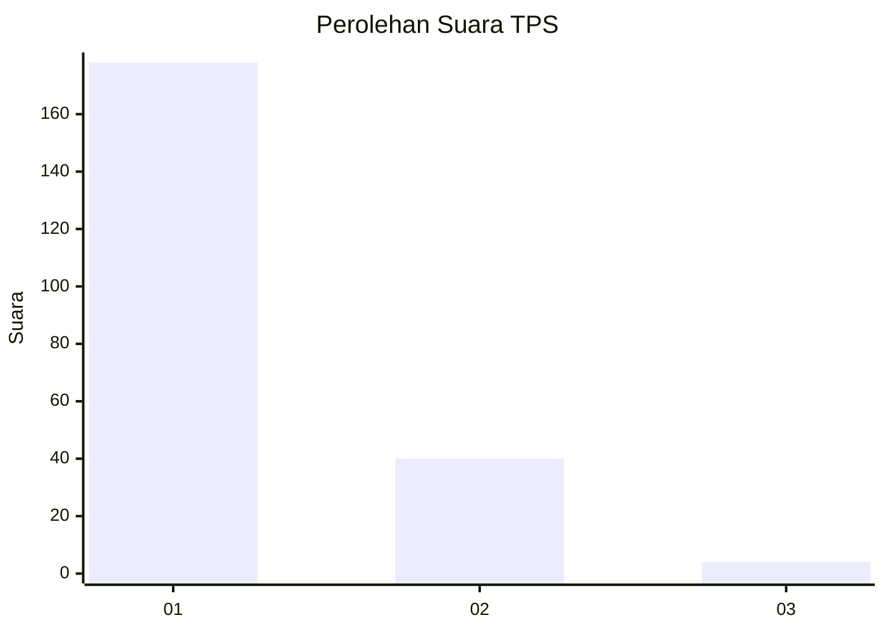
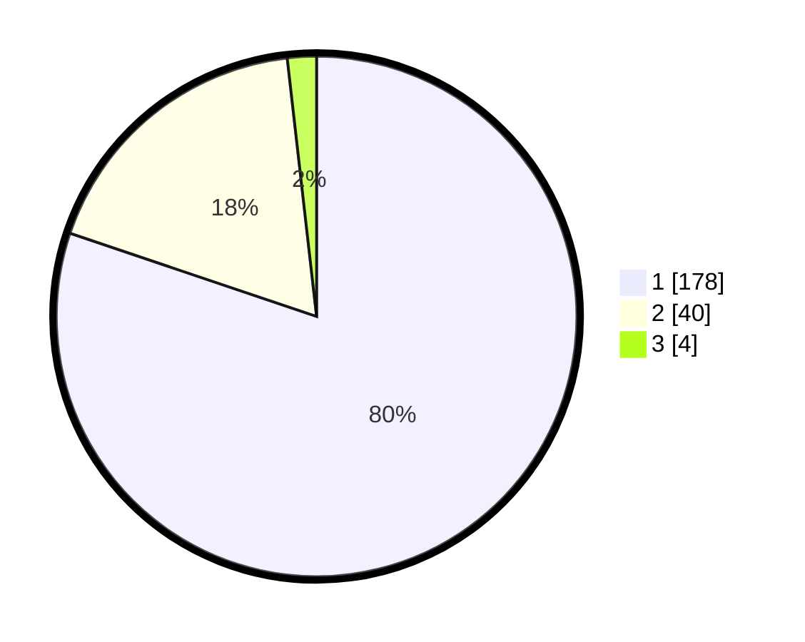

# Hasil

## Grafik

## Tabel

| No. | Nama Paslon    | Suara | Suara (raw) | Persentase |
|:--- |:-------------- | -----:| -----------:| ----------:|
| 1   | ANIES MUHAIMIN | 178   | [178][p-1]  | 80,18      |
| 2   | PRABOWO GIBRAN | 40    | [40][p-2]   | 18,02      |
| 3   | GANJAR MAHFUD  | 4     | [4][p-3]    | 1,80       |

[p-1]: https://github.com/gigit-pemilu/pemilu-2024-11-aceh/blob/main/pilpres/hitung-suara/sub/11-aceh/sub/74-kota-langsa/sub/02-langsa-barat/sub/2015-matang-seulimeng/sub/004-tps/sub/paslon-1.txt
[p-2]: https://github.com/gigit-pemilu/pemilu-2024-11-aceh/blob/main/pilpres/hitung-suara/sub/11-aceh/sub/74-kota-langsa/sub/02-langsa-barat/sub/2015-matang-seulimeng/sub/004-tps/sub/paslon-2.txt
[p-3]: https://github.com/gigit-pemilu/pemilu-2024-11-aceh/blob/main/pilpres/hitung-suara/sub/11-aceh/sub/74-kota-langsa/sub/02-langsa-barat/sub/2015-matang-seulimeng/sub/004-tps/sub/paslon-3.txt

## Foto C Plano

https://sirekap-obj-formc.kpu.go.id/7e10/pemilu/ppwp/11/74/02/20/15/1174022015004-20240218-211801--f49e1cfe-c877-49a8-8948-baf554d323a7.jpg

https://sirekap-obj-formc.kpu.go.id/7e10/pemilu/ppwp/11/74/02/20/15/1174022015004-20240218-211820--a9a475ac-a859-418f-9b68-03b712702b64.jpg

https://sirekap-obj-formc.kpu.go.id/7e10/pemilu/ppwp/11/74/02/20/15/1174022015004-20240218-211835--6413dd3e-8d8f-4a15-8205-9cf73385f9d2.jpg

## Metadata

| Key        | Value               |
| ---------- | ------------------- |
| Time Stamp | 2024-02-19 20:00:00 |

