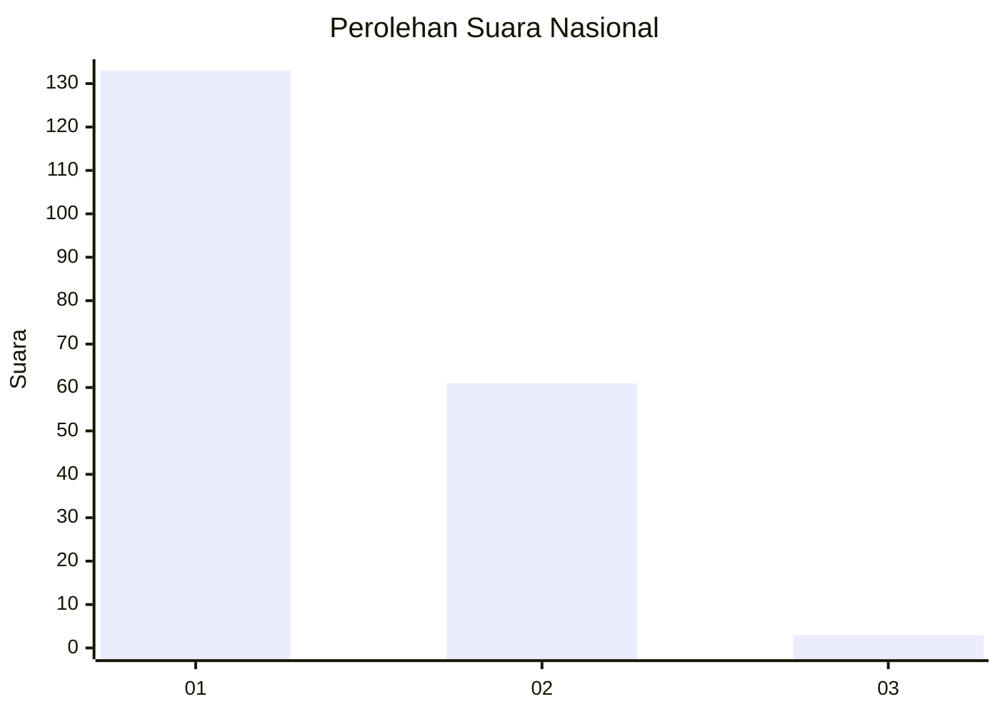
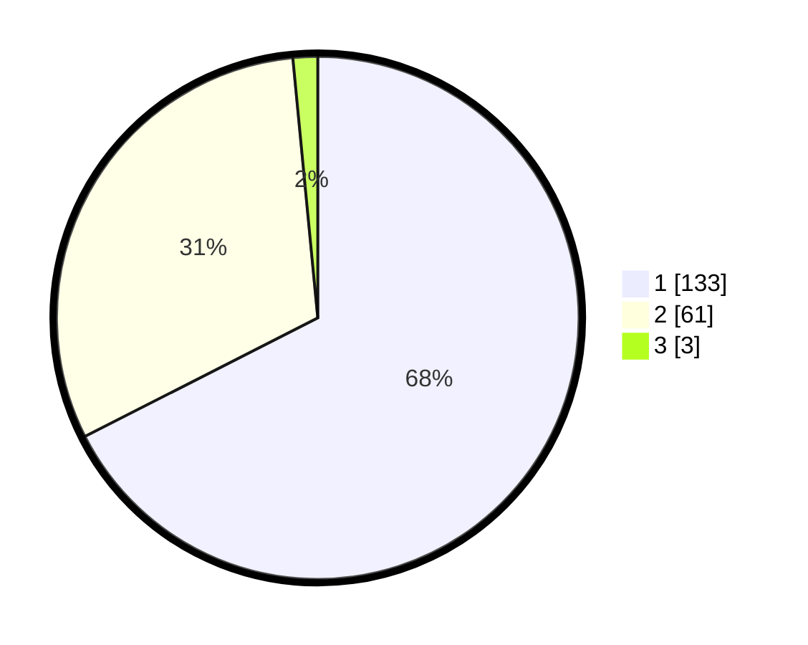

# Hasil

## Grafik

## Tabel

| No. | Nama Paslon    | Suara | Suara (raw) | Persentase |
|:--- |:-------------- | -----:| -----------:| ----------:|
| 1   | ANIES MUHAIMIN | 133   | [133][p-1]  | 67,51      |
| 2   | PRABOWO GIBRAN | 61    | [61][p-2]   | 30,96      |
| 3   | GANJAR MAHFUD  | 3     | [3][p-3]    | 1,52       |

[p-1]: https://github.com/gigit-pemilu/pemilu-2024/blob/main/pilpres/hitung-suara/sub/11-aceh/sub/74-kota-langsa/sub/02-langsa-barat/sub/2015-matang-seulimeng/sub/005-tps/sub/paslon-1.txt
[p-2]: https://github.com/gigit-pemilu/pemilu-2024/blob/main/pilpres/hitung-suara/sub/11-aceh/sub/74-kota-langsa/sub/02-langsa-barat/sub/2015-matang-seulimeng/sub/005-tps/sub/paslon-2.txt
[p-3]: https://github.com/gigit-pemilu/pemilu-2024/blob/main/pilpres/hitung-suara/sub/11-aceh/sub/74-kota-langsa/sub/02-langsa-barat/sub/2015-matang-seulimeng/sub/005-tps/sub/paslon-3.txt

## Foto C Plano

https://sirekap-obj-formc.kpu.go.id/df36/pemilu/ppwp/11/74/02/20/15/1174022015005-20240218-215439--c1655f11-4269-49bd-80e8-daba5b6941ac.jpg

https://sirekap-obj-formc.kpu.go.id/df36/pemilu/ppwp/11/74/02/20/15/1174022015005-20240218-215456--31e738cb-4e22-4374-b254-653614111f34.jpg

https://sirekap-obj-formc.kpu.go.id/df36/pemilu/ppwp/11/74/02/20/15/1174022015005-20240218-215521--5b7440a1-c751-4085-9fa3-6839fb60c63d.jpg

## Metadata

| Key        | Value               |
| ---------- | ------------------- |
| Time Stamp | 2024-02-19 20:00:00 |

