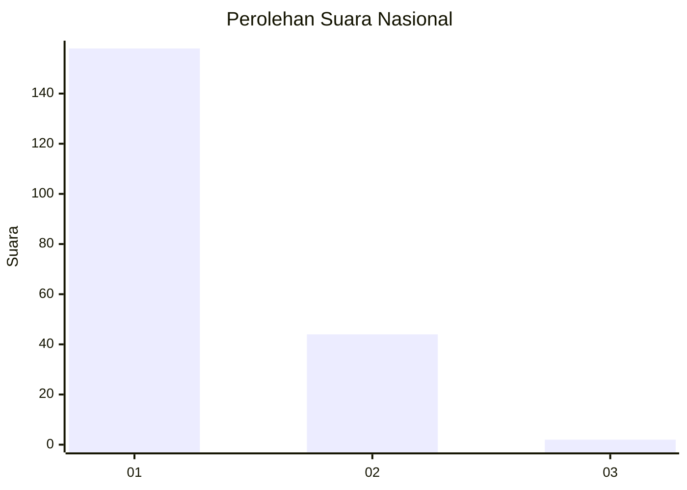
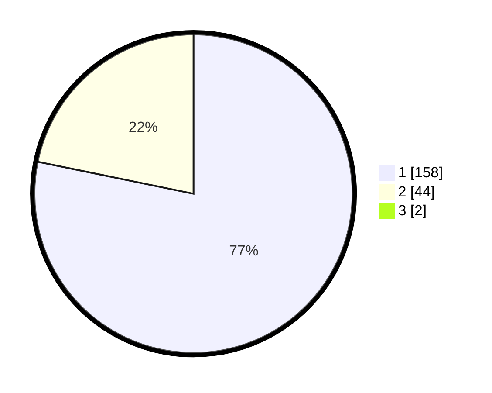

# Hasil

## Grafik

## Tabel

| No. | Nama Paslon    | Suara | Suara (raw) | Persentase |
|:--- |:-------------- | -----:| -----------:| ----------:|
| 1   | ANIES MUHAIMIN | 158   | [158][p-1]  | 77,45      |
| 2   | PRABOWO GIBRAN | 44    | [44][p-2]   | 21,57      |
| 3   | GANJAR MAHFUD  | 2     | [2][p-3]    | 0,98       |

[p-1]: https://github.com/gigit-pemilu/pemilu-2024/blob/main/pilpres/hitung-suara/sub/11-aceh/sub/74-kota-langsa/sub/02-langsa-barat/sub/2015-matang-seulimeng/sub/010-tps/sub/paslon-1.txt
[p-2]: https://github.com/gigit-pemilu/pemilu-2024/blob/main/pilpres/hitung-suara/sub/11-aceh/sub/74-kota-langsa/sub/02-langsa-barat/sub/2015-matang-seulimeng/sub/010-tps/sub/paslon-2.txt
[p-3]: https://github.com/gigit-pemilu/pemilu-2024/blob/main/pilpres/hitung-suara/sub/11-aceh/sub/74-kota-langsa/sub/02-langsa-barat/sub/2015-matang-seulimeng/sub/010-tps/sub/paslon-3.txt

## Foto C Plano

https://sirekap-obj-formc.kpu.go.id/5d48/pemilu/ppwp/11/74/02/20/15/1174022015010-20240215-033300--bae6130b-13e4-4248-bd3f-7c08518e8c67.jpg

https://sirekap-obj-formc.kpu.go.id/5d48/pemilu/ppwp/11/74/02/20/15/1174022015010-20240215-033406--dacb6305-86e4-4ce3-b853-70352964930c.jpg

https://sirekap-obj-formc.kpu.go.id/5d48/pemilu/ppwp/11/74/02/20/15/1174022015010-20240215-033507--e02dd868-5ea3-469a-9e34-16c034d9c9c1.jpg

## Metadata

| Key        | Value               |
| ---------- | ------------------- |
| Time Stamp | 2024-02-15 15:00:29 |

