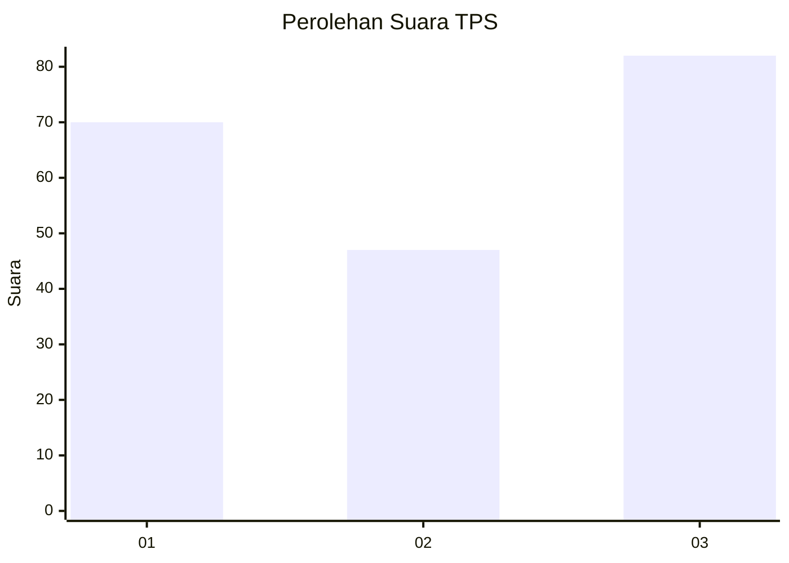
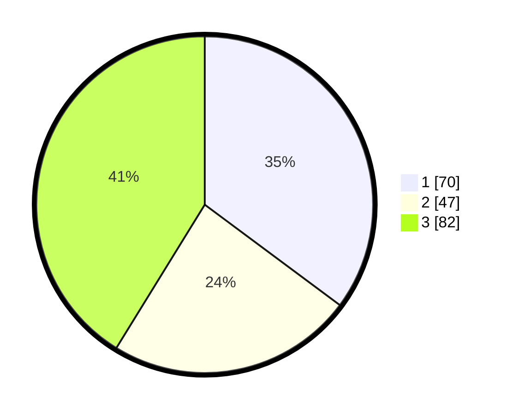

# Hasil

## Grafik

## Tabel

| No. | Nama Paslon    | Suara | Suara (raw) | Persentase |
|:--- |:-------------- | -----:| -----------:| ----------:|
| 1   | ANIES MUHAIMIN | 70    | [70][p-1]   | 35,18      |
| 2   | PRABOWO GIBRAN | 47    | [47][p-2]   | 23,62      |
| 3   | GANJAR MAHFUD  | 82    | [82][p-3]   | 41,21      |

[p-1]: https://github.com/gigit-pemilu/pemilu-2024-11-aceh/blob/main/pilpres/hitung-suara/sub/11-aceh/sub/74-kota-langsa/sub/02-langsa-barat/sub/2016-sungai-pauh/sub/003-tps/sub/paslon-1.txt
[p-2]: https://github.com/gigit-pemilu/pemilu-2024-11-aceh/blob/main/pilpres/hitung-suara/sub/11-aceh/sub/74-kota-langsa/sub/02-langsa-barat/sub/2016-sungai-pauh/sub/003-tps/sub/paslon-2.txt
[p-3]: https://github.com/gigit-pemilu/pemilu-2024-11-aceh/blob/main/pilpres/hitung-suara/sub/11-aceh/sub/74-kota-langsa/sub/02-langsa-barat/sub/2016-sungai-pauh/sub/003-tps/sub/paslon-3.txt

## Foto C Plano

https://sirekap-obj-formc.kpu.go.id/c6bf/pemilu/ppwp/11/74/02/20/16/1174022016003-20240221-143200--d320ceee-9457-415d-a9b6-bebab97416b5.jpg

https://sirekap-obj-formc.kpu.go.id/c6bf/pemilu/ppwp/11/74/02/20/16/1174022016003-20240221-143219--7557a08e-5b32-4c7f-ae23-977543963163.jpg

https://sirekap-obj-formc.kpu.go.id/c6bf/pemilu/ppwp/11/74/02/20/16/1174022016003-20240221-143240--05fecc83-d949-4b0d-bb32-996fd9d095a7.jpg

## Metadata

| Key        | Value               |
| ---------- | ------------------- |
| Time Stamp | 2024-02-21 15:00:00 |

## DATA PEMILIH TETAP

Jumlah pemilih dalam DPT: **200**.
 * L: **257**.
 * P: **707**.

## DATA PENGGUNA HAK PILIH

Jumlah pengguna hak pilih dalam DPT: **255**.
 * L: **877**.
 * P: **755**.

Jumlah pengguna hak pilih dalam DPTb: **844**.
 * L: **88**.
 * P: **355**.

Jumlah pengguna hak pilih dalam DPK: **464**.
 * L: **404**.
 * P: **868**.

Jumlah pengguna hak pilih: **689**.
 * L: **838**.
 * P: **651**.

## JUMLAH SUARA SAH DAN TIDAK SAH

JUMLAH SELURUH SUARA SAH: **88**.

JUMLAH SUARA TIDAK SAH: **881**.

JUMLAH SELURUH SUARA SAH DAN SUARA TIDAK SAH: **589**.

