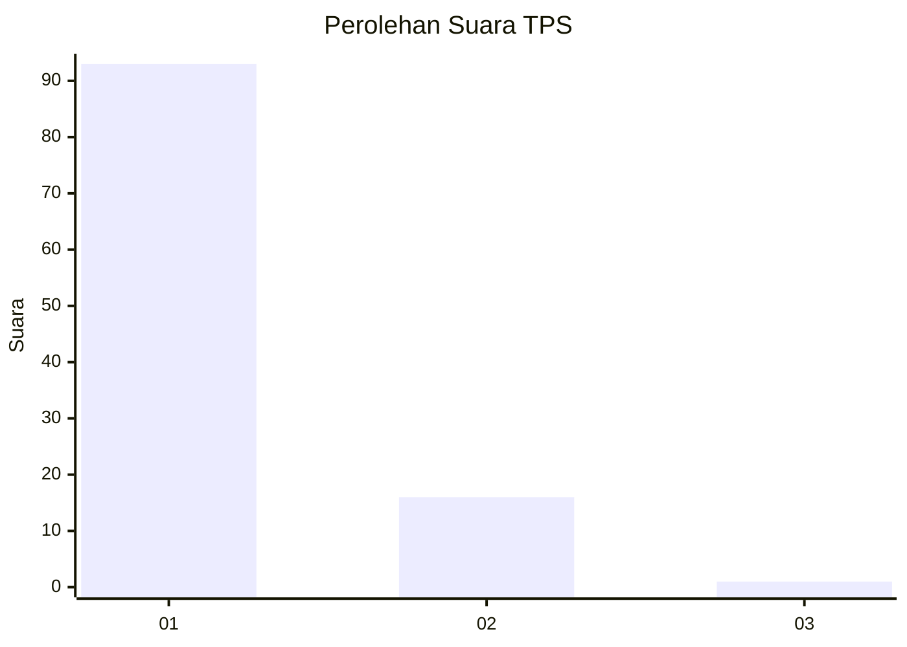
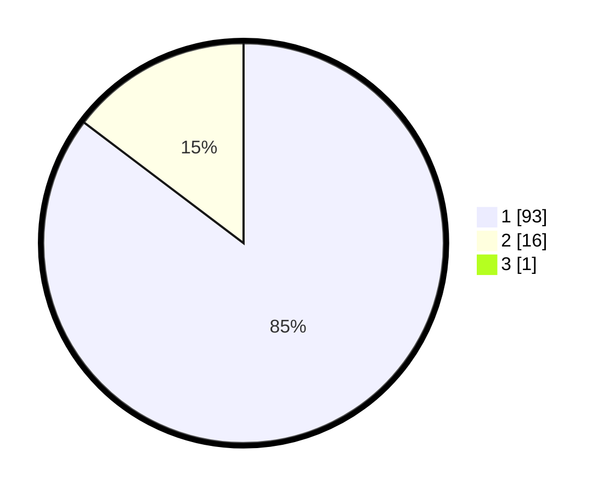

# Hasil

## Grafik

## Tabel

| No. | Nama Paslon    | Suara | Suara (raw) | Persentase |
|:--- |:-------------- | -----:| -----------:| ----------:|
| 1   | ANIES MUHAIMIN | 93    | [93][p-1]   | 84,55      |
| 2   | PRABOWO GIBRAN | 16    | [16][p-2]   | 14,55      |
| 3   | GANJAR MAHFUD  | 1     | [1][p-3]    | 0,91       |

[p-1]: https://github.com/gigit-pemilu/pemilu-2024-11-aceh/blob/main/pilpres/hitung-suara/sub/11-aceh/sub/74-kota-langsa/sub/02-langsa-barat/sub/2016-sungai-pauh/sub/011-tps/sub/paslon-1.txt
[p-2]: https://github.com/gigit-pemilu/pemilu-2024-11-aceh/blob/main/pilpres/hitung-suara/sub/11-aceh/sub/74-kota-langsa/sub/02-langsa-barat/sub/2016-sungai-pauh/sub/011-tps/sub/paslon-2.txt
[p-3]: https://github.com/gigit-pemilu/pemilu-2024-11-aceh/blob/main/pilpres/hitung-suara/sub/11-aceh/sub/74-kota-langsa/sub/02-langsa-barat/sub/2016-sungai-pauh/sub/011-tps/sub/paslon-3.txt

## Foto C Plano

https://sirekap-obj-formc.kpu.go.id/6678/pemilu/ppwp/11/74/02/20/16/1174022016011-20240215-055314--5ede7516-69d2-4c28-8b25-b175837fd1f6.jpg

https://sirekap-obj-formc.kpu.go.id/6678/pemilu/ppwp/11/74/02/20/16/1174022016011-20240214-225049--55445a6a-10fb-408b-ad0c-a77e55189afe.jpg

https://sirekap-obj-formc.kpu.go.id/6678/pemilu/ppwp/11/74/02/20/16/1174022016011-20240214-225054--c4222204-6ff3-465b-b660-ccd41644fc0f.jpg

## Metadata

| Key        | Value               |
| ---------- | ------------------- |
| Time Stamp | 2024-02-19 20:00:00 |

