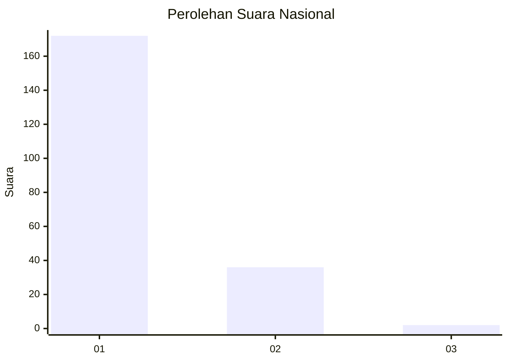
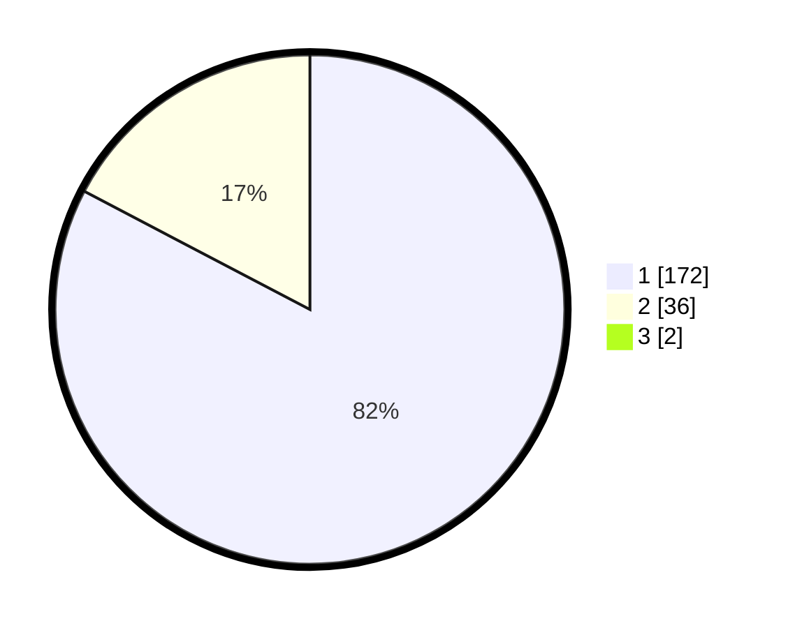

# Hasil

## Grafik

## Tabel

| No. | Nama Paslon    | Suara | Suara (raw) | Persentase |
|:--- |:-------------- | -----:| -----------:| ----------:|
| 1   | ANIES MUHAIMIN | 172   | [172][p-1]  | 81,90      |
| 2   | PRABOWO GIBRAN | 36    | [36][p-2]   | 17,14      |
| 3   | GANJAR MAHFUD  | 2     | [2][p-3]    | 0,95       |

[p-1]: https://github.com/gigit-pemilu/pemilu-2024/blob/main/pilpres/hitung-suara/sub/11-aceh/sub/74-kota-langsa/sub/02-langsa-barat/sub/2018-teulaga-tujuh/sub/004-tps/sub/paslon-1.txt
[p-2]: https://github.com/gigit-pemilu/pemilu-2024/blob/main/pilpres/hitung-suara/sub/11-aceh/sub/74-kota-langsa/sub/02-langsa-barat/sub/2018-teulaga-tujuh/sub/004-tps/sub/paslon-2.txt
[p-3]: https://github.com/gigit-pemilu/pemilu-2024/blob/main/pilpres/hitung-suara/sub/11-aceh/sub/74-kota-langsa/sub/02-langsa-barat/sub/2018-teulaga-tujuh/sub/004-tps/sub/paslon-3.txt

## Foto C Plano

https://sirekap-obj-formc.kpu.go.id/8d8c/pemilu/ppwp/11/74/02/20/18/1174022018004-20240225-154032--ac592a51-a6cb-4134-99f9-17787c178911.jpg

https://sirekap-obj-formc.kpu.go.id/8d8c/pemilu/ppwp/11/74/02/20/18/1174022018004-20240225-154115--84bbd85e-3261-434e-a610-12a54c9fd7a2.jpg

https://sirekap-obj-formc.kpu.go.id/8d8c/pemilu/ppwp/11/74/02/20/18/1174022018004-20240225-154208--55281d92-3a33-4084-bf41-a07c28e0e022.jpg

## Metadata

| Key        | Value               |
| ---------- | ------------------- |
| Time Stamp | 2024-02-28 20:00:00 |

