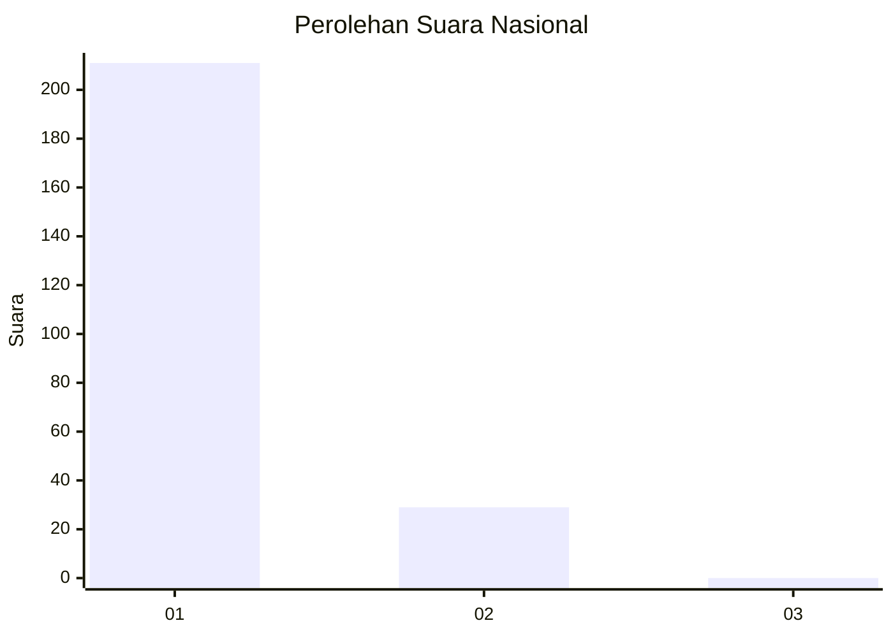
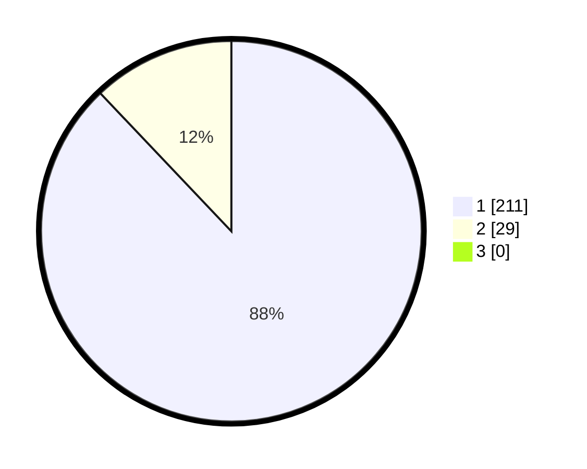

# Hasil

## Grafik

## Tabel

| No. | Nama Paslon    | Suara | Suara (raw) | Persentase |
|:--- |:-------------- | -----:| -----------:| ----------:|
| 1   | ANIES MUHAIMIN | 211   | [211][p-1]  | 87,92      |
| 2   | PRABOWO GIBRAN | 29    | [29][p-2]   | 12,08      |
| 3   | GANJAR MAHFUD  | 0     | [0][p-3]    | 0,00       |

[p-1]: https://github.com/gigit-pemilu/pemilu-2024/blob/main/pilpres/hitung-suara/sub/11-aceh/sub/74-kota-langsa/sub/02-langsa-barat/sub/2018-teulaga-tujuh/sub/005-tps/sub/paslon-1.txt
[p-2]: https://github.com/gigit-pemilu/pemilu-2024/blob/main/pilpres/hitung-suara/sub/11-aceh/sub/74-kota-langsa/sub/02-langsa-barat/sub/2018-teulaga-tujuh/sub/005-tps/sub/paslon-2.txt
[p-3]: https://github.com/gigit-pemilu/pemilu-2024/blob/main/pilpres/hitung-suara/sub/11-aceh/sub/74-kota-langsa/sub/02-langsa-barat/sub/2018-teulaga-tujuh/sub/005-tps/sub/paslon-3.txt

## Foto C Plano

https://sirekap-obj-formc.kpu.go.id/fc45/pemilu/ppwp/11/74/02/20/18/1174022018005-20240215-042244--ecf5dc15-abaa-4465-beba-22bf595943f7.jpg

https://sirekap-obj-formc.kpu.go.id/fc45/pemilu/ppwp/11/74/02/20/18/1174022018005-20240215-041923--7025fba6-cdf2-4461-ae57-0c05507b5aeb.jpg

https://sirekap-obj-formc.kpu.go.id/fc45/pemilu/ppwp/11/74/02/20/18/1174022018005-20240215-042022--0aca6474-fb50-48bc-9535-92baa4ba2c3a.jpg

## Metadata

| Key        | Value               |
| ---------- | ------------------- |
| Time Stamp | 2024-02-19 20:00:00 |

