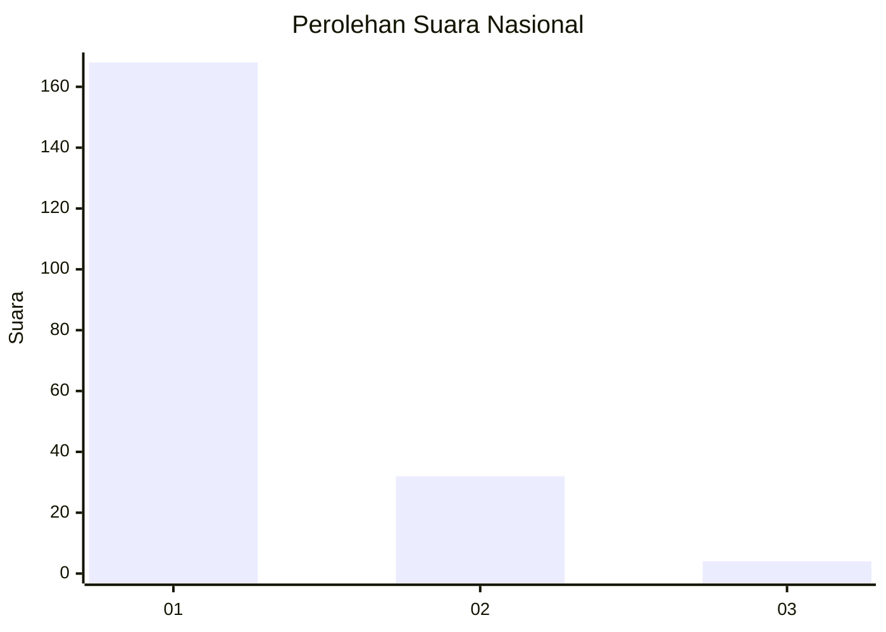
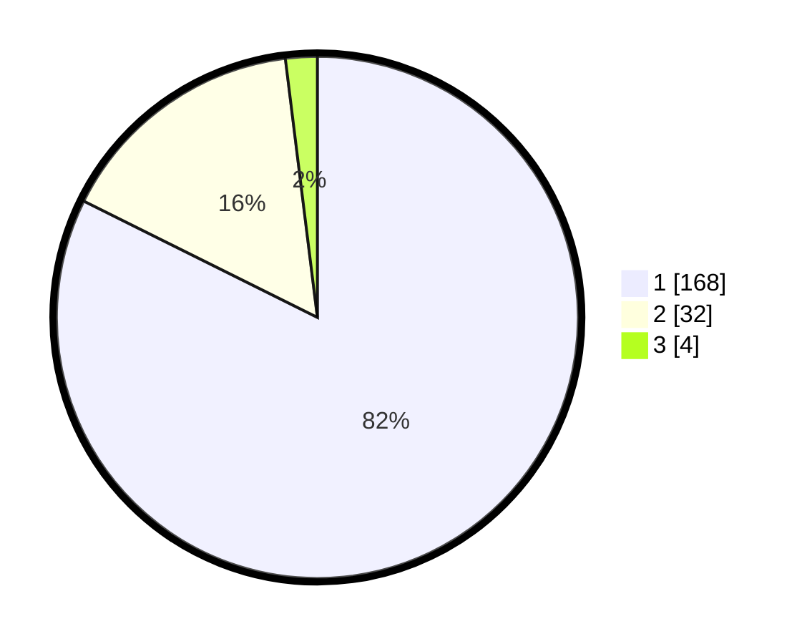

# Hasil

## Grafik

## Tabel

| No. | Nama Paslon    | Suara | Suara (raw) | Persentase |
|:--- |:-------------- | -----:| -----------:| ----------:|
| 1   | ANIES MUHAIMIN | 168   | [168][p-1]  | 82,35      |
| 2   | PRABOWO GIBRAN | 32    | [32][p-2]   | 15,69      |
| 3   | GANJAR MAHFUD  | 4     | [4][p-3]    | 1,96       |

[p-1]: https://github.com/gigit-pemilu/pemilu-2024/blob/main/pilpres/hitung-suara/sub/11-aceh/sub/74-kota-langsa/sub/02-langsa-barat/sub/2022-sungai-pauh-firdaus/sub/001-tps/sub/paslon-1.txt
[p-2]: https://github.com/gigit-pemilu/pemilu-2024/blob/main/pilpres/hitung-suara/sub/11-aceh/sub/74-kota-langsa/sub/02-langsa-barat/sub/2022-sungai-pauh-firdaus/sub/001-tps/sub/paslon-2.txt
[p-3]: https://github.com/gigit-pemilu/pemilu-2024/blob/main/pilpres/hitung-suara/sub/11-aceh/sub/74-kota-langsa/sub/02-langsa-barat/sub/2022-sungai-pauh-firdaus/sub/001-tps/sub/paslon-3.txt

## Foto C Plano

https://sirekap-obj-formc.kpu.go.id/7941/pemilu/ppwp/11/74/02/20/22/1174022022001-20240215-003840--d2b7d5cf-84b9-491d-9868-0b323f1d9110.jpg

https://sirekap-obj-formc.kpu.go.id/7941/pemilu/ppwp/11/74/02/20/22/1174022022001-20240215-004931--aa708cb4-d8cd-432b-afac-9c38d1d30d31.jpg

https://sirekap-obj-formc.kpu.go.id/7941/pemilu/ppwp/11/74/02/20/22/1174022022001-20240215-005053--5ffff111-851d-43c1-840e-5d9e4d6820af.jpg

## Metadata

| Key        | Value               |
| ---------- | ------------------- |
| Time Stamp | 2024-02-20 09:00:00 |

