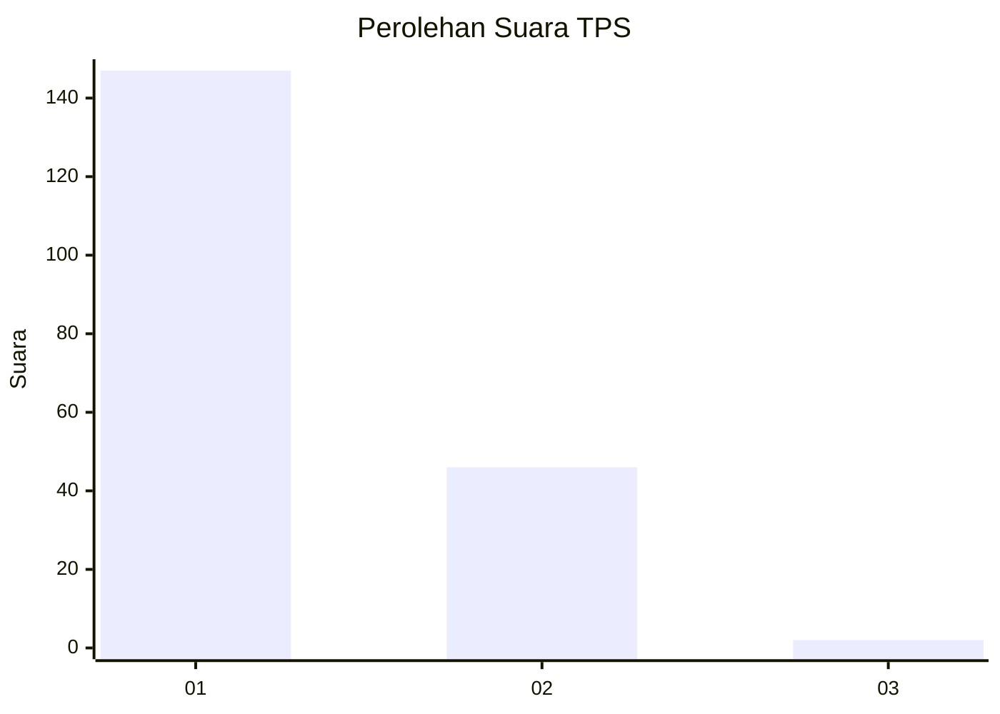
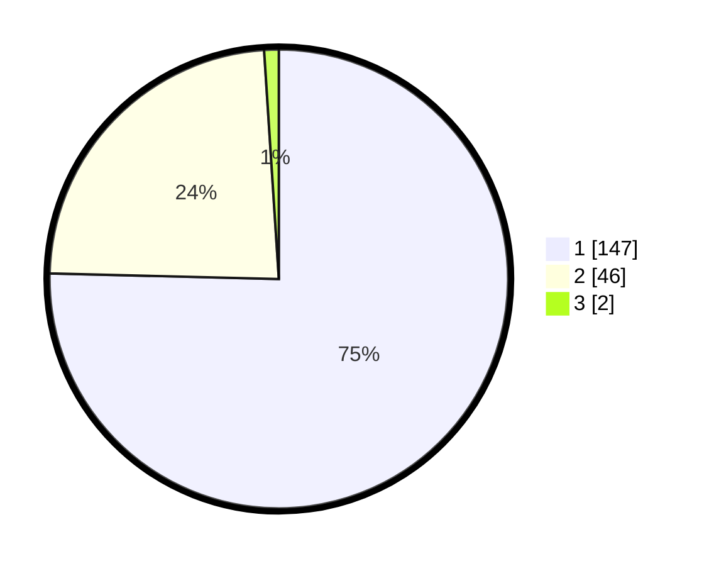

# Hasil

## Grafik

## Tabel

| No. | Nama Paslon    | Suara | Suara (raw) | Persentase |
|:--- |:-------------- | -----:| -----------:| ----------:|
| 1   | ANIES MUHAIMIN | 147   | [147][p-1]  | 75,38      |
| 2   | PRABOWO GIBRAN | 46    | [46][p-2]   | 23,59      |
| 3   | GANJAR MAHFUD  | 2     | [2][p-3]    | 1,03       |

[p-1]: https://github.com/gigit-pemilu/pemilu-2024-11-aceh/blob/main/pilpres/hitung-suara/sub/11-aceh/sub/74-kota-langsa/sub/03-langsa-kota/sub/2001-teungoh/sub/004-tps/sub/paslon-1.txt
[p-2]: https://github.com/gigit-pemilu/pemilu-2024-11-aceh/blob/main/pilpres/hitung-suara/sub/11-aceh/sub/74-kota-langsa/sub/03-langsa-kota/sub/2001-teungoh/sub/004-tps/sub/paslon-2.txt
[p-3]: https://github.com/gigit-pemilu/pemilu-2024-11-aceh/blob/main/pilpres/hitung-suara/sub/11-aceh/sub/74-kota-langsa/sub/03-langsa-kota/sub/2001-teungoh/sub/004-tps/sub/paslon-3.txt

## Foto C Plano

https://sirekap-obj-formc.kpu.go.id/cc30/pemilu/ppwp/11/74/03/20/01/1174032001004-20240218-203655--ce8b412a-2a7b-4bda-b0d1-8bc6d6583df9.jpg

https://sirekap-obj-formc.kpu.go.id/cc30/pemilu/ppwp/11/74/03/20/01/1174032001004-20240218-203805--7b7c2a3d-33d7-414f-8b18-3edb383b0ef5.jpg

https://sirekap-obj-formc.kpu.go.id/cc30/pemilu/ppwp/11/74/03/20/01/1174032001004-20240218-203832--f417e0d6-2efd-4dcf-a80b-3a428948b181.jpg

## Metadata

| Key        | Value               |
| ---------- | ------------------- |
| Time Stamp | 2024-02-19 06:16:00 |

## DATA PEMILIH TETAP

Jumlah pemilih dalam DPT: **277**.
 * L: **146**.
 * P: **177**.

## DATA PENGGUNA HAK PILIH

Jumlah pengguna hak pilih dalam DPT: **101**.
 * L: **777**.
 * P: **86**.

Jumlah pengguna hak pilih dalam DPTb: **777**.
 * L: **0**.
 * P: **0**.

Jumlah pengguna hak pilih dalam DPK: **744**.
 * L: **4**.
 * P: **7**.

Jumlah pengguna hak pilih: **444**.
 * L: **40**.
 * P: **110**.

## JUMLAH SUARA SAH DAN TIDAK SAH

JUMLAH SELURUH SUARA SAH: **145**.

JUMLAH SUARA TIDAK SAH: **5**.

JUMLAH SELURUH SUARA SAH DAN SUARA TIDAK SAH: **201**.

