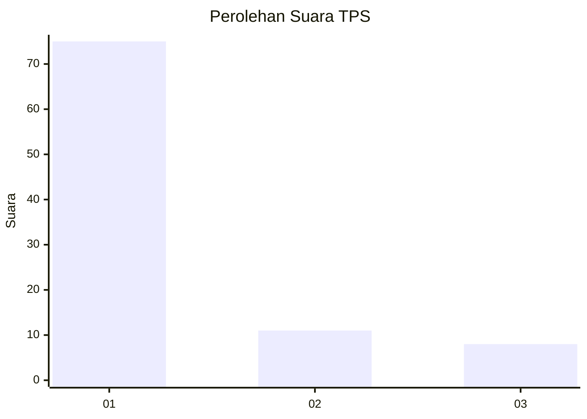
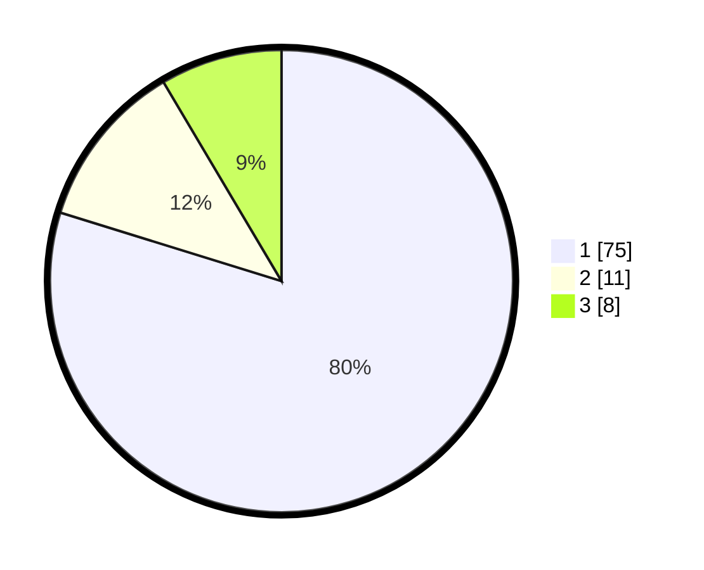

# Hasil

## Grafik

## Tabel

| No. | Nama Paslon    | Suara | Suara (raw) | Persentase |
|:--- |:-------------- | -----:| -----------:| ----------:|
| 1   | ANIES MUHAIMIN | 75    | [75][p-1]   | 79,79      |
| 2   | PRABOWO GIBRAN | 11    | [11][p-2]   | 11,70      |
| 3   | GANJAR MAHFUD  | 8     | [8][p-3]    | 8,51       |

[p-1]: https://github.com/gigit-pemilu/pemilu-2024-11-aceh/blob/main/pilpres/hitung-suara/sub/11-aceh/sub/74-kota-langsa/sub/03-langsa-kota/sub/2002-peukan-langsa/sub/003-tps/sub/paslon-1.txt
[p-2]: https://github.com/gigit-pemilu/pemilu-2024-11-aceh/blob/main/pilpres/hitung-suara/sub/11-aceh/sub/74-kota-langsa/sub/03-langsa-kota/sub/2002-peukan-langsa/sub/003-tps/sub/paslon-2.txt
[p-3]: https://github.com/gigit-pemilu/pemilu-2024-11-aceh/blob/main/pilpres/hitung-suara/sub/11-aceh/sub/74-kota-langsa/sub/03-langsa-kota/sub/2002-peukan-langsa/sub/003-tps/sub/paslon-3.txt

## Foto C Plano

https://sirekap-obj-formc.kpu.go.id/323b/pemilu/ppwp/11/74/03/20/02/1174032002003-20240219-231617--aedcfd7f-b294-4d1e-8a36-12b2a4a45793.jpg

https://sirekap-obj-formc.kpu.go.id/323b/pemilu/ppwp/11/74/03/20/02/1174032002003-20240219-231618--0cbd1e58-fc7b-44a3-9901-a5dceaa5d656.jpg

https://sirekap-obj-formc.kpu.go.id/323b/pemilu/ppwp/11/74/03/20/02/1174032002003-20240219-231617--57dee849-ab2a-40ce-ad2d-9c1b012b6eff.jpg

## Metadata

| Key        | Value               |
| ---------- | ------------------- |
| Time Stamp | 2024-02-20 09:00:00 |

## DATA PEMILIH TETAP

Jumlah pemilih dalam DPT: **186**.
 * L: **104**.
 * P: **82**.

## DATA PENGGUNA HAK PILIH

Jumlah pengguna hak pilih dalam DPT: **94**.
 * L: **52**.
 * P: **42**.

Jumlah pengguna hak pilih dalam DPTb: **1**.
 * L: **0**.
 * P: **1**.

Jumlah pengguna hak pilih dalam DPK: **0**.
 * L: **0**.
 * P: **0**.

Jumlah pengguna hak pilih: **95**.
 * L: **52**.
 * P: **43**.

## JUMLAH SUARA SAH DAN TIDAK SAH

JUMLAH SELURUH SUARA SAH: **94**.

JUMLAH SUARA TIDAK SAH: **1**.

JUMLAH SELURUH SUARA SAH DAN SUARA TIDAK SAH: **95**.

