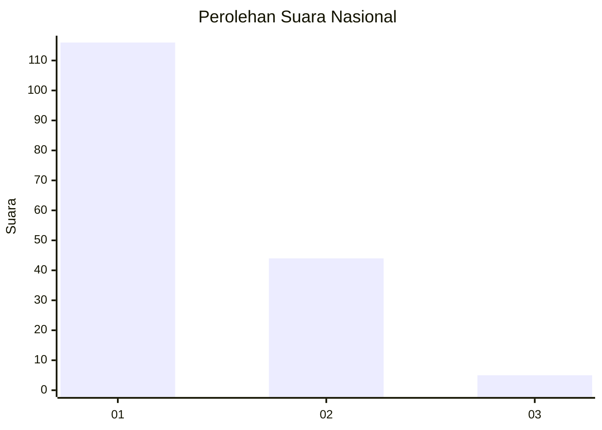
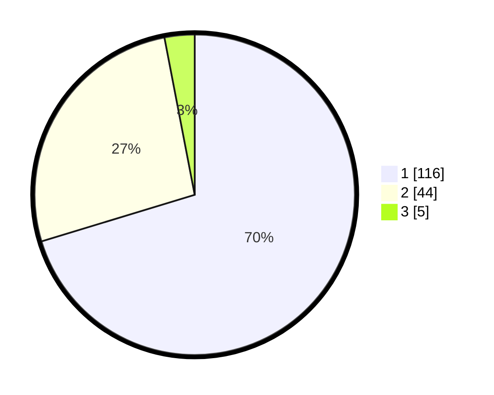

# Hasil

## Grafik

## Tabel

| No. | Nama Paslon    | Suara | Suara (raw) | Persentase |
|:--- |:-------------- | -----:| -----------:| ----------:|
| 1   | ANIES MUHAIMIN | 116   | [116][p-1]  | 70,30      |
| 2   | PRABOWO GIBRAN | 44    | [44][p-2]   | 26,67      |
| 3   | GANJAR MAHFUD  | 5     | [5][p-3]    | 3,03       |

[p-1]: https://github.com/gigit-pemilu/pemilu-2024/blob/main/pilpres/hitung-suara/sub/11-aceh/sub/74-kota-langsa/sub/03-langsa-kota/sub/2005-paya-bujok-blang-pase/sub/004-tps/sub/paslon-1.txt
[p-2]: https://github.com/gigit-pemilu/pemilu-2024/blob/main/pilpres/hitung-suara/sub/11-aceh/sub/74-kota-langsa/sub/03-langsa-kota/sub/2005-paya-bujok-blang-pase/sub/004-tps/sub/paslon-2.txt
[p-3]: https://github.com/gigit-pemilu/pemilu-2024/blob/main/pilpres/hitung-suara/sub/11-aceh/sub/74-kota-langsa/sub/03-langsa-kota/sub/2005-paya-bujok-blang-pase/sub/004-tps/sub/paslon-3.txt

## Foto C Plano

https://sirekap-obj-formc.kpu.go.id/56c4/pemilu/ppwp/11/74/03/20/05/1174032005004-20240222-152141--5fd3f1b0-9bdc-4b83-ae43-dab7d1d33c1b.jpg

https://sirekap-obj-formc.kpu.go.id/56c4/pemilu/ppwp/11/74/03/20/05/1174032005004-20240222-152333--71f0b0a9-1dd7-46b9-8af5-7930e9ad4501.jpg

## Metadata

| Key        | Value               |
| ---------- | ------------------- |
| Time Stamp | 2024-02-22 16:00:00 |

