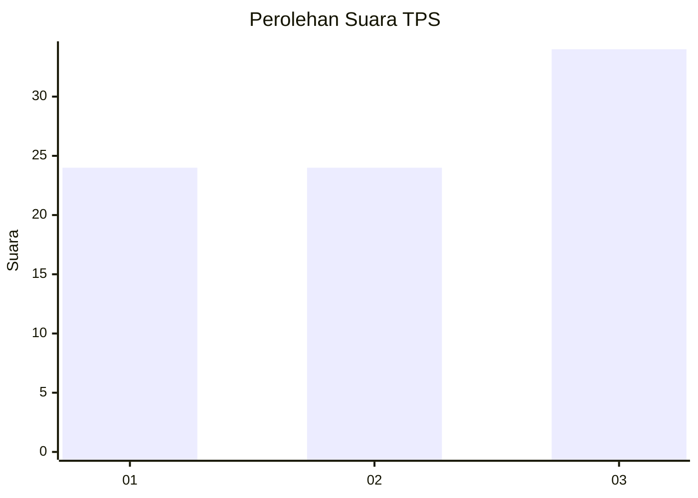
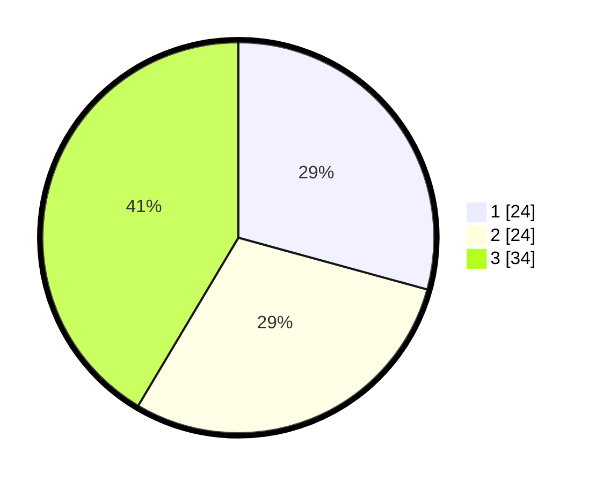

# Hasil

## Grafik

## Tabel

| No. | Nama Paslon    | Suara | Suara (raw) | Persentase |
|:--- |:-------------- | -----:| -----------:| ----------:|
| 1   | ANIES MUHAIMIN | 24    | [24][p-1]   | 29,27      |
| 2   | PRABOWO GIBRAN | 24    | [24][p-2]   | 29,27      |
| 3   | GANJAR MAHFUD  | 34    | [34][p-3]   | 41,46      |

[p-1]: https://github.com/gigit-pemilu/pemilu-2024-11-aceh/blob/main/pilpres/hitung-suara/sub/11-aceh/sub/74-kota-langsa/sub/03-langsa-kota/sub/2006-blang/sub/005-tps/sub/paslon-1.txt
[p-2]: https://github.com/gigit-pemilu/pemilu-2024-11-aceh/blob/main/pilpres/hitung-suara/sub/11-aceh/sub/74-kota-langsa/sub/03-langsa-kota/sub/2006-blang/sub/005-tps/sub/paslon-2.txt
[p-3]: https://github.com/gigit-pemilu/pemilu-2024-11-aceh/blob/main/pilpres/hitung-suara/sub/11-aceh/sub/74-kota-langsa/sub/03-langsa-kota/sub/2006-blang/sub/005-tps/sub/paslon-3.txt

## Foto C Plano

https://sirekap-obj-formc.kpu.go.id/7422/pemilu/ppwp/11/74/03/20/06/1174032006005-20240223-162119--133467b8-19f6-49ad-9ddc-a72fac624712.jpg

https://sirekap-obj-formc.kpu.go.id/7422/pemilu/ppwp/11/74/03/20/06/1174032006005-20240223-162327--7044c953-1136-480c-a450-4a9edc92439c.jpg

https://sirekap-obj-formc.kpu.go.id/7422/pemilu/ppwp/11/74/03/20/06/1174032006005-20240223-162648--78d137a0-ee6e-4e3f-989b-4739ef67db3a.jpg

## Metadata

| Key        | Value               |
| ---------- | ------------------- |
| Time Stamp | 2024-02-24 22:31:28 |

## DATA PEMILIH TETAP

Jumlah pemilih dalam DPT: **222**.
 * L: **2**.
 * P: **222**.

## DATA PENGGUNA HAK PILIH

Jumlah pengguna hak pilih dalam DPT: **222**.
 * L: **2**.
 * P: **2**.

Jumlah pengguna hak pilih dalam DPTb: **357**.
 * L: **686**.
 * P: **627**.

Jumlah pengguna hak pilih dalam DPK: **5**.
 * L: **4**.
 * P: **86**.

Jumlah pengguna hak pilih: **72**.
 * L: **881**.
 * P: **896**.

## JUMLAH SUARA SAH DAN TIDAK SAH

JUMLAH SELURUH SUARA SAH: **170**.

JUMLAH SUARA TIDAK SAH: **2**.

JUMLAH SELURUH SUARA SAH DAN SUARA TIDAK SAH: **172**.

