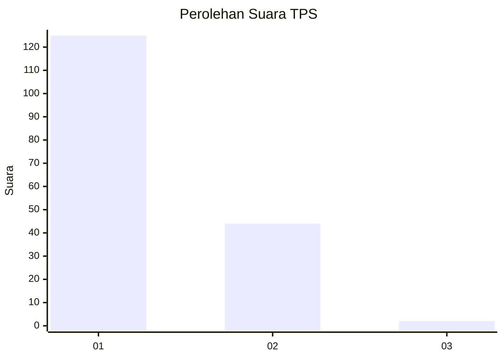
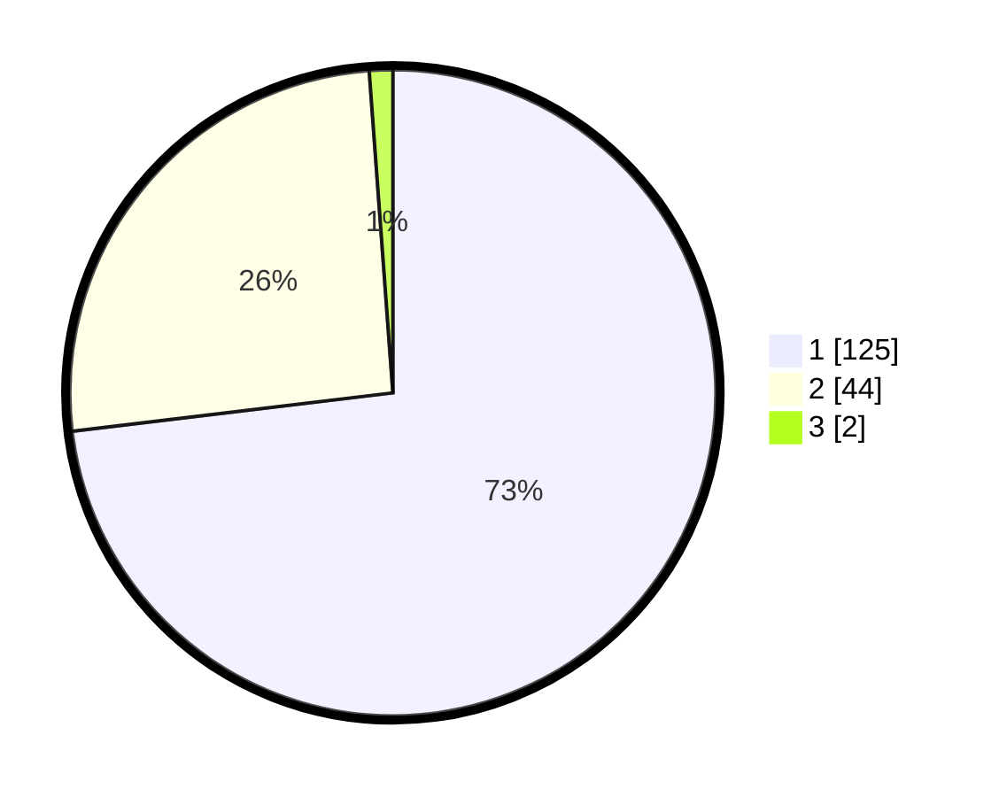

# Hasil

## Grafik

## Tabel

| No. | Nama Paslon    | Suara | Suara (raw) | Persentase |
|:--- |:-------------- | -----:| -----------:| ----------:|
| 1   | ANIES MUHAIMIN | 125   | [125][p-1]  | 73,10      |
| 2   | PRABOWO GIBRAN | 44    | [44][p-2]   | 25,73      |
| 3   | GANJAR MAHFUD  | 2     | [2][p-3]    | 1,17       |

[p-1]: https://github.com/gigit-pemilu/pemilu-2024-11-aceh/blob/main/pilpres/hitung-suara/sub/11-aceh/sub/74-kota-langsa/sub/03-langsa-kota/sub/2006-blang/sub/007-tps/sub/paslon-1.txt
[p-2]: https://github.com/gigit-pemilu/pemilu-2024-11-aceh/blob/main/pilpres/hitung-suara/sub/11-aceh/sub/74-kota-langsa/sub/03-langsa-kota/sub/2006-blang/sub/007-tps/sub/paslon-2.txt
[p-3]: https://github.com/gigit-pemilu/pemilu-2024-11-aceh/blob/main/pilpres/hitung-suara/sub/11-aceh/sub/74-kota-langsa/sub/03-langsa-kota/sub/2006-blang/sub/007-tps/sub/paslon-3.txt

## Foto C Plano

https://sirekap-obj-formc.kpu.go.id/37be/pemilu/ppwp/11/74/03/20/06/1174032006007-20240223-205417--e058c2ec-56dc-4f59-bfe3-e21144674b73.jpg

https://sirekap-obj-formc.kpu.go.id/37be/pemilu/ppwp/11/74/03/20/06/1174032006007-20240223-210047--7e8ebea1-ac92-48c6-b6eb-44373a1e691c.jpg

https://sirekap-obj-formc.kpu.go.id/37be/pemilu/ppwp/11/74/03/20/06/1174032006007-20240223-210239--8a2affaa-ada3-434d-95a8-9afa47b3a8ba.jpg

## Metadata

| Key        | Value               |
| ---------- | ------------------- |
| Time Stamp | 2024-02-24 22:31:28 |

## DATA PEMILIH TETAP

Jumlah pemilih dalam DPT: **130**.
 * L: **270**.
 * P: **140**.

## DATA PENGGUNA HAK PILIH

Jumlah pengguna hak pilih dalam DPT: **900**.
 * L: **901**.
 * P: **800**.

Jumlah pengguna hak pilih dalam DPTb: **7**.
 * L: **1**.
 * P: **1**.

Jumlah pengguna hak pilih dalam DPK: **0**.
 * L: **10**.
 * P: **10**.

Jumlah pengguna hak pilih: **109**.
 * L: **218**.
 * P: **304**.

## JUMLAH SUARA SAH DAN TIDAK SAH

JUMLAH SELURUH SUARA SAH: **181**.

JUMLAH SUARA TIDAK SAH: **2**.

JUMLAH SELURUH SUARA SAH DAN SUARA TIDAK SAH: **187**.

