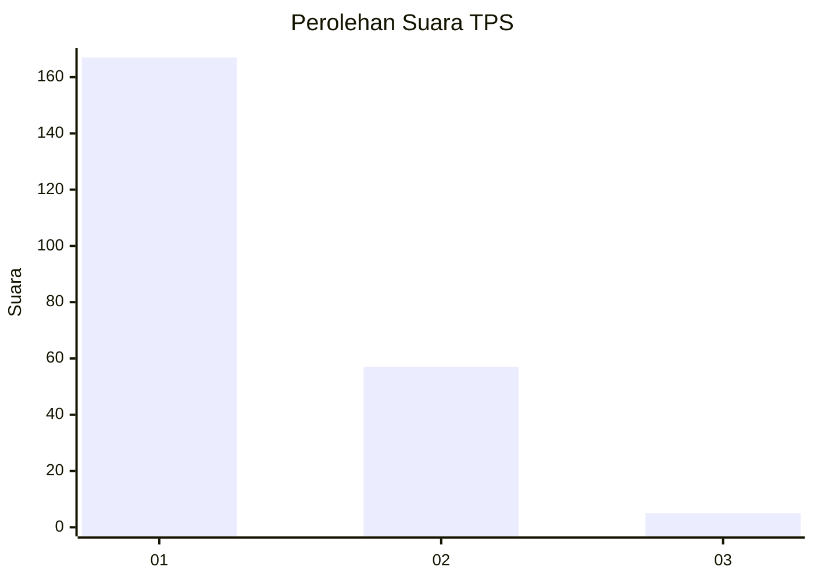
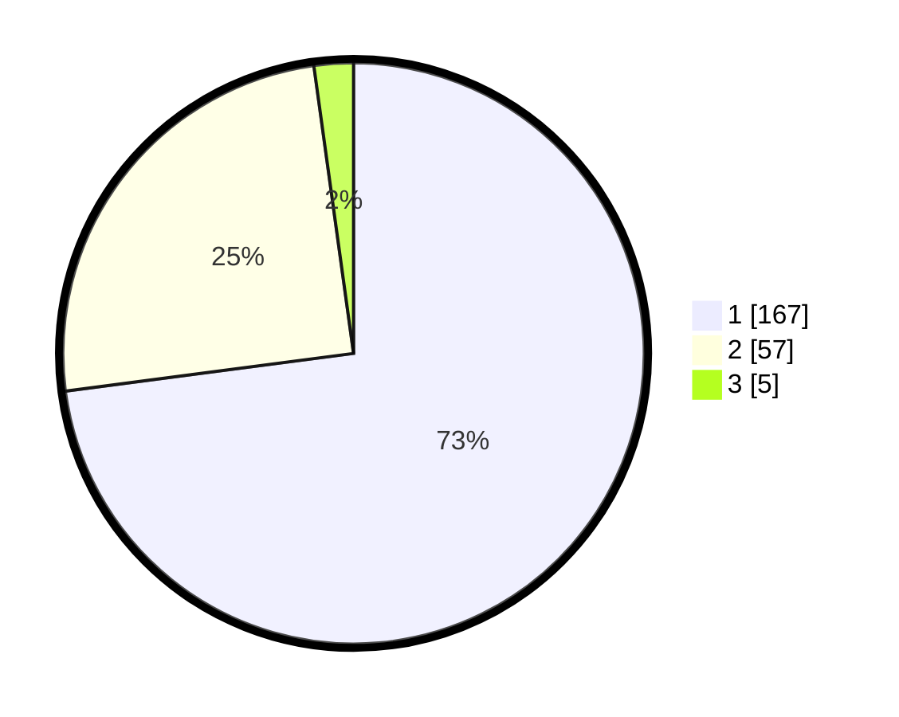

# Hasil

## Grafik

## Tabel

| No. | Nama Paslon    | Suara | Suara (raw) | Persentase |
|:--- |:-------------- | -----:| -----------:| ----------:|
| 1   | ANIES MUHAIMIN | 167   | [167][p-1]  | 72,93      |
| 2   | PRABOWO GIBRAN | 57    | [57][p-2]   | 24,89      |
| 3   | GANJAR MAHFUD  | 5     | [5][p-3]    | 2,18       |

[p-1]: https://github.com/gigit-pemilu/pemilu-2024-11-aceh/blob/main/pilpres/hitung-suara/sub/11-aceh/sub/74-kota-langsa/sub/03-langsa-kota/sub/2013-tualang-teungoh/sub/003-tps/sub/paslon-1.txt
[p-2]: https://github.com/gigit-pemilu/pemilu-2024-11-aceh/blob/main/pilpres/hitung-suara/sub/11-aceh/sub/74-kota-langsa/sub/03-langsa-kota/sub/2013-tualang-teungoh/sub/003-tps/sub/paslon-2.txt
[p-3]: https://github.com/gigit-pemilu/pemilu-2024-11-aceh/blob/main/pilpres/hitung-suara/sub/11-aceh/sub/74-kota-langsa/sub/03-langsa-kota/sub/2013-tualang-teungoh/sub/003-tps/sub/paslon-3.txt

## Foto C Plano

https://sirekap-obj-formc.kpu.go.id/9626/pemilu/ppwp/11/74/03/20/13/1174032013003-20240224-175028--8aa4f4db-7b5f-4965-8c30-e8bb6859a3f5.jpg

https://sirekap-obj-formc.kpu.go.id/9626/pemilu/ppwp/11/74/03/20/13/1174032013003-20240215-003540--11838c2c-4c8b-4e71-8252-76e94baa6c9c.jpg

https://sirekap-obj-formc.kpu.go.id/9626/pemilu/ppwp/11/74/03/20/13/1174032013003-20240215-003702--7c568c9e-8264-4628-b5b9-6931de6b4669.jpg

## Metadata

| Key        | Value               |
| ---------- | ------------------- |
| Time Stamp | 2024-02-24 22:31:28 |

