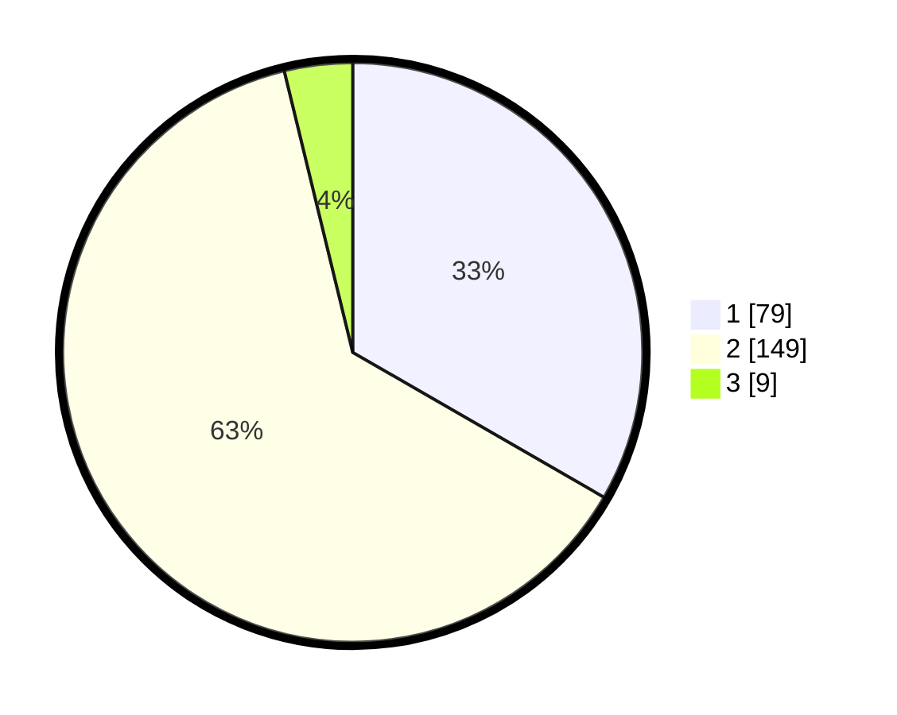

# Hasil

## Grafik

## Tabel

| No. | Nama Paslon    | Suara | Suara (raw) | Persentase |
|:--- |:-------------- | -----:| -----------:| ----------:|
| 1   | ANIES MUHAIMIN | 79    | [79][p-1]   | 33,33      |
| 2   | PRABOWO GIBRAN | 149   | [149][p-2]  | 62,87      |
| 3   | GANJAR MAHFUD  | 9     | [9][p-3]    | 3,80       |

[p-1]: https://github.com/gigit-pemilu/pemilu-2024-11-aceh/blob/main/pilpres/hitung-suara/sub/11-aceh/sub/74-kota-langsa/sub/04-langsa-lama/sub/2001-pondok-kemuning/sub/001-tps/sub/paslon-1.txt
[p-2]: https://github.com/gigit-pemilu/pemilu-2024-11-aceh/blob/main/pilpres/hitung-suara/sub/11-aceh/sub/74-kota-langsa/sub/04-langsa-lama/sub/2001-pondok-kemuning/sub/001-tps/sub/paslon-2.txt
[p-3]: https://github.com/gigit-pemilu/pemilu-2024-11-aceh/blob/main/pilpres/hitung-suara/sub/11-aceh/sub/74-kota-langsa/sub/04-langsa-lama/sub/2001-pondok-kemuning/sub/001-tps/sub/paslon-3.txt

## Foto C Plano

https://sirekap-obj-formc.kpu.go.id/75a3/pemilu/ppwp/11/74/04/20/01/1174042001001-20240214-194042--25084054-3e52-4406-a628-d4b11ce8bb93.jpg

https://sirekap-obj-formc.kpu.go.id/75a3/pemilu/ppwp/11/74/04/20/01/1174042001001-20240214-194204--2fea0e58-7eb8-4780-81a3-95de8e799f17.jpg

https://sirekap-obj-formc.kpu.go.id/75a3/pemilu/ppwp/11/74/04/20/01/1174042001001-20240214-195724--1ce666e7-0937-474d-9dd8-c27c69ebe98c.jpg

## Metadata

| Key        | Value               |
| ---------- | ------------------- |
| Time Stamp | 2024-02-19 18:00:00 |

