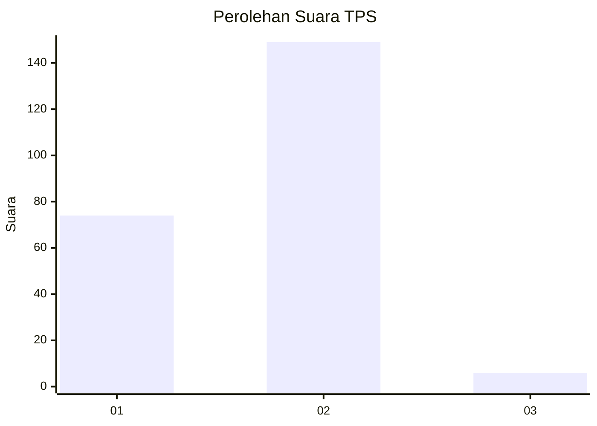
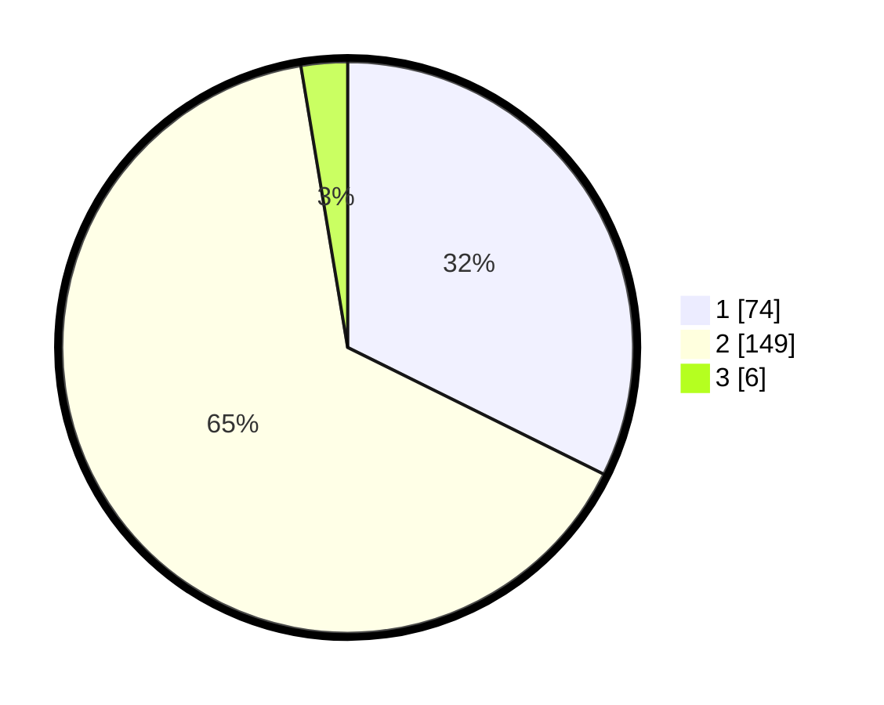

# Hasil

## Grafik

## Tabel

| No. | Nama Paslon    | Suara | Suara (raw) | Persentase |
|:--- |:-------------- | -----:| -----------:| ----------:|
| 1   | ANIES MUHAIMIN | 74    | [74][p-1]   | 32,31      |
| 2   | PRABOWO GIBRAN | 149   | [149][p-2]  | 65,07      |
| 3   | GANJAR MAHFUD  | 6     | [6][p-3]    | 2,62       |

[p-1]: https://github.com/gigit-pemilu/pemilu-2024-11-aceh/blob/main/pilpres/hitung-suara/sub/11-aceh/sub/74-kota-langsa/sub/04-langsa-lama/sub/2001-pondok-kemuning/sub/003-tps/sub/paslon-1.txt
[p-2]: https://github.com/gigit-pemilu/pemilu-2024-11-aceh/blob/main/pilpres/hitung-suara/sub/11-aceh/sub/74-kota-langsa/sub/04-langsa-lama/sub/2001-pondok-kemuning/sub/003-tps/sub/paslon-2.txt
[p-3]: https://github.com/gigit-pemilu/pemilu-2024-11-aceh/blob/main/pilpres/hitung-suara/sub/11-aceh/sub/74-kota-langsa/sub/04-langsa-lama/sub/2001-pondok-kemuning/sub/003-tps/sub/paslon-3.txt

## Foto C Plano

https://sirekap-obj-formc.kpu.go.id/cc0d/pemilu/ppwp/11/74/04/20/01/1174042001003-20240219-123936--e43c54ec-055b-41c9-bbce-e8418b854075.jpg

https://sirekap-obj-formc.kpu.go.id/cc0d/pemilu/ppwp/11/74/04/20/01/1174042001003-20240219-124017--512b76c3-95dd-40b8-813f-45c514fd257d.jpg

https://sirekap-obj-formc.kpu.go.id/cc0d/pemilu/ppwp/11/74/04/20/01/1174042001003-20240219-124051--ed8cc89a-b5ec-46bb-a14c-0e0977224cf7.jpg

## Metadata

| Key        | Value               |
| ---------- | ------------------- |
| Time Stamp | 2024-02-20 11:00:00 |

## DATA PEMILIH TETAP

Jumlah pemilih dalam DPT: **273**.
 * L: **129**.
 * P: **344**.

## DATA PENGGUNA HAK PILIH

Jumlah pengguna hak pilih dalam DPT: **232**.
 * L: **109**.
 * P: **423**.

Jumlah pengguna hak pilih dalam DPTb: **880**.
 * L: **80**.
 * P: **0**.

Jumlah pengguna hak pilih dalam DPK: **3**.
 * L: **6**.
 * P: **82**.

Jumlah pengguna hak pilih: **235**.
 * L: **230**.
 * P: **425**.

## JUMLAH SUARA SAH DAN TIDAK SAH

JUMLAH SELURUH SUARA SAH: **229**.

JUMLAH SUARA TIDAK SAH: **6**.

JUMLAH SELURUH SUARA SAH DAN SUARA TIDAK SAH: **235**.

