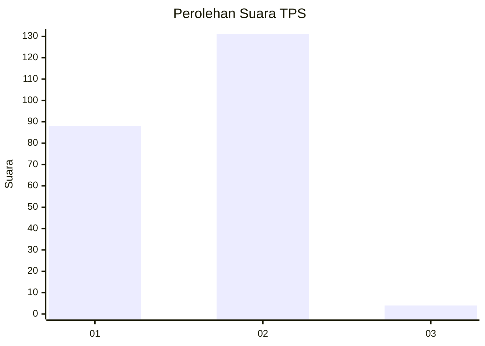
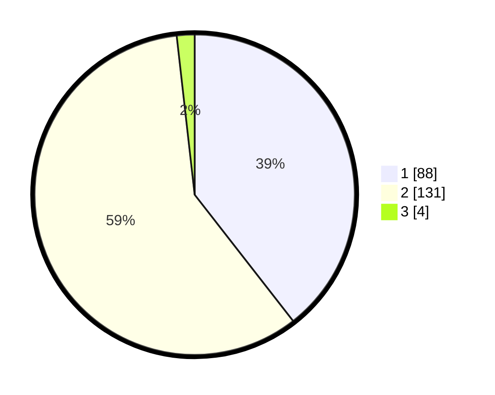

# Hasil

## Grafik

## Tabel

| No. | Nama Paslon    | Suara | Suara (raw) | Persentase |
|:--- |:-------------- | -----:| -----------:| ----------:|
| 1   | ANIES MUHAIMIN | 88    | [88][p-1]   | 39,46      |
| 2   | PRABOWO GIBRAN | 131   | [131][p-2]  | 58,74      |
| 3   | GANJAR MAHFUD  | 4     | [4][p-3]    | 1,79       |

[p-1]: https://github.com/gigit-pemilu/pemilu-2024-11-aceh/blob/main/pilpres/hitung-suara/sub/11-aceh/sub/74-kota-langsa/sub/04-langsa-lama/sub/2001-pondok-kemuning/sub/004-tps/sub/paslon-1.txt
[p-2]: https://github.com/gigit-pemilu/pemilu-2024-11-aceh/blob/main/pilpres/hitung-suara/sub/11-aceh/sub/74-kota-langsa/sub/04-langsa-lama/sub/2001-pondok-kemuning/sub/004-tps/sub/paslon-2.txt
[p-3]: https://github.com/gigit-pemilu/pemilu-2024-11-aceh/blob/main/pilpres/hitung-suara/sub/11-aceh/sub/74-kota-langsa/sub/04-langsa-lama/sub/2001-pondok-kemuning/sub/004-tps/sub/paslon-3.txt

## Foto C Plano

https://sirekap-obj-formc.kpu.go.id/2c1e/pemilu/ppwp/11/74/04/20/01/1174042001004-20240219-141327--a5c2cfb8-7fdd-41ac-bf7b-cce7aec4521d.jpg

https://sirekap-obj-formc.kpu.go.id/2c1e/pemilu/ppwp/11/74/04/20/01/1174042001004-20240219-141434--6b23109e-9524-4a70-a07b-7c60ae9ce0de.jpg

https://sirekap-obj-formc.kpu.go.id/2c1e/pemilu/ppwp/11/74/04/20/01/1174042001004-20240219-141644--9376348b-588e-45ed-9a6e-42a83c832bc9.jpg

## Metadata

| Key        | Value               |
| ---------- | ------------------- |
| Time Stamp | 2024-02-20 16:00:00 |

## DATA PEMILIH TETAP

Jumlah pemilih dalam DPT: **289**.
 * L: **152**.
 * P: **137**.

## DATA PENGGUNA HAK PILIH

Jumlah pengguna hak pilih dalam DPT: **225**.
 * L: **110**.
 * P: **115**.

Jumlah pengguna hak pilih dalam DPTb: **800**.
 * L: **0**.
 * P: **88**.

Jumlah pengguna hak pilih dalam DPK: **6**.
 * L: **4**.
 * P: **2**.

Jumlah pengguna hak pilih: **232**.
 * L: **114**.
 * P: **117**.

## JUMLAH SUARA SAH DAN TIDAK SAH

JUMLAH SELURUH SUARA SAH: **223**.

JUMLAH SUARA TIDAK SAH: **9**.

JUMLAH SELURUH SUARA SAH DAN SUARA TIDAK SAH: **232**.

