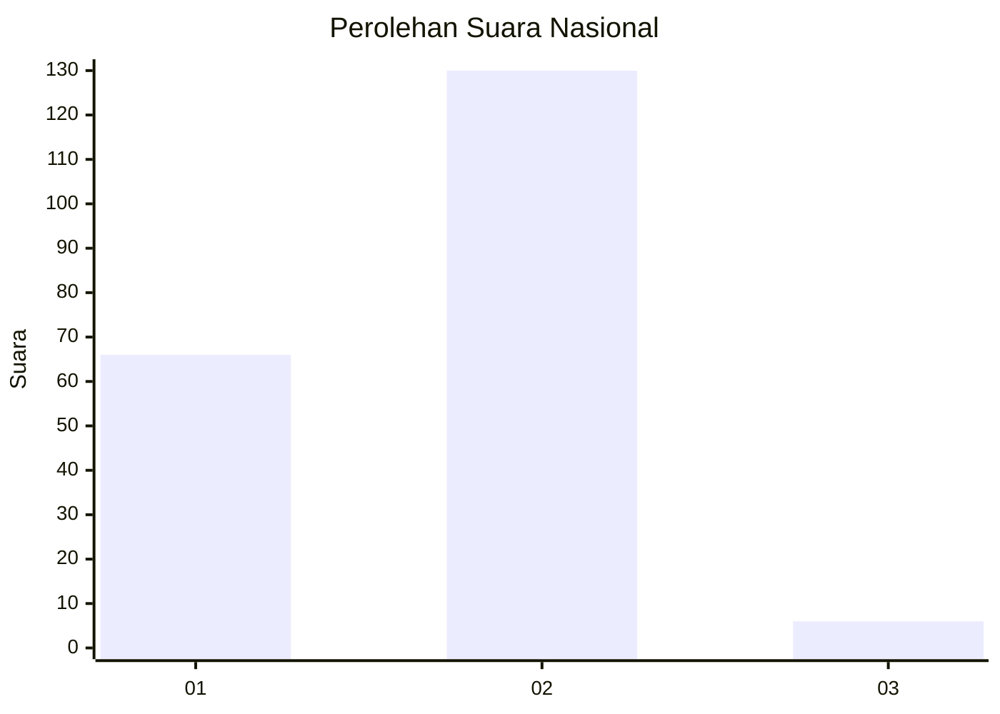
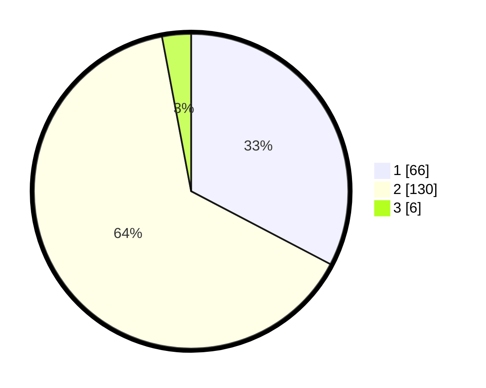

# Hasil

## Grafik

## Tabel

| No. | Nama Paslon    | Suara | Suara (raw) | Persentase |
|:--- |:-------------- | -----:| -----------:| ----------:|
| 1   | ANIES MUHAIMIN | 66    | [66][p-1]   | 32,67      |
| 2   | PRABOWO GIBRAN | 130   | [130][p-2]  | 64,36      |
| 3   | GANJAR MAHFUD  | 6     | [6][p-3]    | 2,97       |

[p-1]: https://github.com/gigit-pemilu/pemilu-2024/blob/main/pilpres/hitung-suara/sub/11-aceh/sub/74-kota-langsa/sub/04-langsa-lama/sub/2001-pondok-kemuning/sub/005-tps/sub/paslon-1.txt
[p-2]: https://github.com/gigit-pemilu/pemilu-2024/blob/main/pilpres/hitung-suara/sub/11-aceh/sub/74-kota-langsa/sub/04-langsa-lama/sub/2001-pondok-kemuning/sub/005-tps/sub/paslon-2.txt
[p-3]: https://github.com/gigit-pemilu/pemilu-2024/blob/main/pilpres/hitung-suara/sub/11-aceh/sub/74-kota-langsa/sub/04-langsa-lama/sub/2001-pondok-kemuning/sub/005-tps/sub/paslon-3.txt

## Foto C Plano

https://sirekap-obj-formc.kpu.go.id/c739/pemilu/ppwp/11/74/04/20/01/1174042001005-20240219-160305--175e2c38-ad90-4481-b488-2bbcc6d1582b.jpg

https://sirekap-obj-formc.kpu.go.id/c739/pemilu/ppwp/11/74/04/20/01/1174042001005-20240219-160600--21b2ff2a-7b58-4114-85aa-60ac13c0bd58.jpg

https://sirekap-obj-formc.kpu.go.id/c739/pemilu/ppwp/11/74/04/20/01/1174042001005-20240219-160517--ae82e420-5c12-4bd9-a4f3-17140d7af0b4.jpg

## Metadata

| Key        | Value               |
| ---------- | ------------------- |
| Time Stamp | 2024-02-20 16:00:00 |

## DATA PEMILIH TETAP

Jumlah pemilih dalam DPT: **777**.
 * L: **271**.
 * P: **75**.

## DATA PENGGUNA HAK PILIH

Jumlah pengguna hak pilih dalam DPT: **307**.
 * L: **777**.
 * P: **706**.

Jumlah pengguna hak pilih dalam DPTb: **888**.
 * L: **848**.
 * P: **200**.

Jumlah pengguna hak pilih dalam DPK: **887**.
 * L: **0**.
 * P: **888**.

Jumlah pengguna hak pilih: **220**.
 * L: **720**.
 * P: **650**.

## JUMLAH SUARA SAH DAN TIDAK SAH

JUMLAH SELURUH SUARA SAH: **202**.

JUMLAH SUARA TIDAK SAH: **5**.

JUMLAH SELURUH SUARA SAH DAN SUARA TIDAK SAH: **207**.

