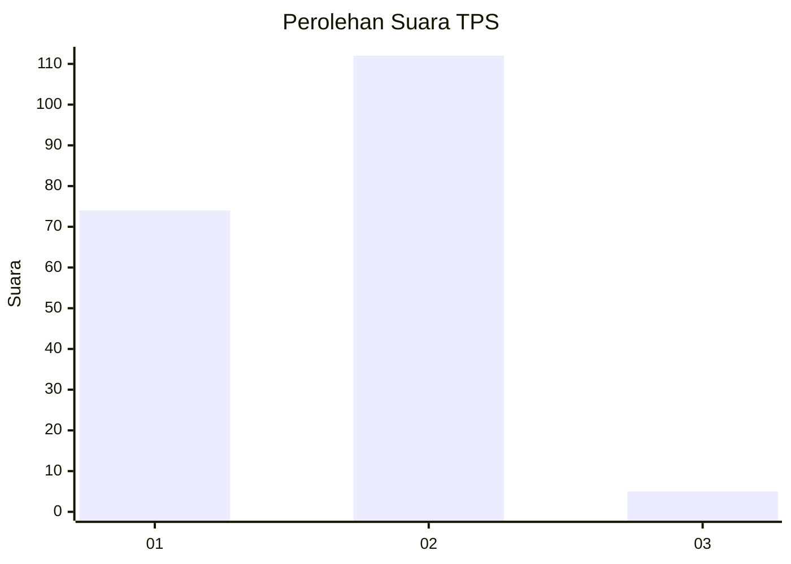
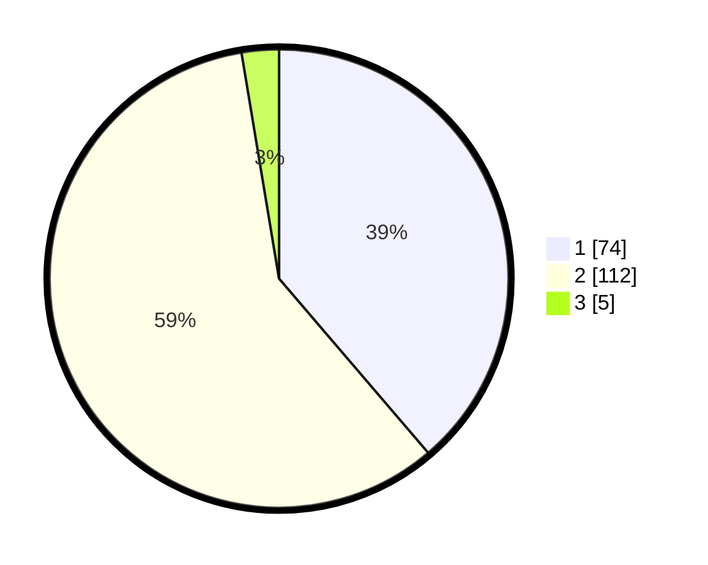

# Hasil

## Grafik

## Tabel

| No. | Nama Paslon    | Suara | Suara (raw) | Persentase |
|:--- |:-------------- | -----:| -----------:| ----------:|
| 1   | ANIES MUHAIMIN | 74    | [74][p-1]   | 38,74      |
| 2   | PRABOWO GIBRAN | 112   | [112][p-2]  | 58,64      |
| 3   | GANJAR MAHFUD  | 5     | [5][p-3]    | 2,62       |

[p-1]: https://github.com/gigit-pemilu/pemilu-2024-11-aceh/blob/main/pilpres/hitung-suara/sub/11-aceh/sub/74-kota-langsa/sub/04-langsa-lama/sub/2001-pondok-kemuning/sub/008-tps/sub/paslon-1.txt
[p-2]: https://github.com/gigit-pemilu/pemilu-2024-11-aceh/blob/main/pilpres/hitung-suara/sub/11-aceh/sub/74-kota-langsa/sub/04-langsa-lama/sub/2001-pondok-kemuning/sub/008-tps/sub/paslon-2.txt
[p-3]: https://github.com/gigit-pemilu/pemilu-2024-11-aceh/blob/main/pilpres/hitung-suara/sub/11-aceh/sub/74-kota-langsa/sub/04-langsa-lama/sub/2001-pondok-kemuning/sub/008-tps/sub/paslon-3.txt

## Foto C Plano

https://sirekap-obj-formc.kpu.go.id/62fa/pemilu/ppwp/11/74/04/20/01/1174042001008-20240214-220556--d49c4a86-8269-4f6c-af55-cf8a4e78776d.jpg

https://sirekap-obj-formc.kpu.go.id/62fa/pemilu/ppwp/11/74/04/20/01/1174042001008-20240214-220159--d406067c-3cc9-4aee-92e5-9b3ac32a95ba.jpg

https://sirekap-obj-formc.kpu.go.id/62fa/pemilu/ppwp/11/74/04/20/01/1174042001008-20240214-220307--23a1f312-d3ce-4f05-bd4c-2f5f9eed0e36.jpg

## Metadata

| Key        | Value               |
| ---------- | ------------------- |
| Time Stamp | 2024-02-19 19:00:00 |

