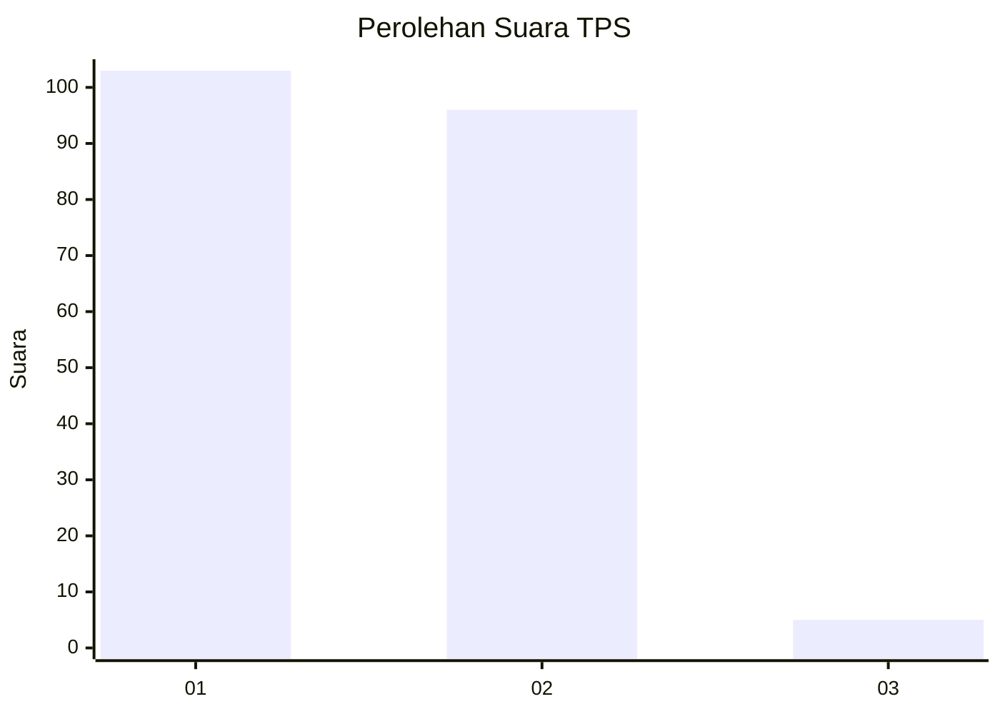
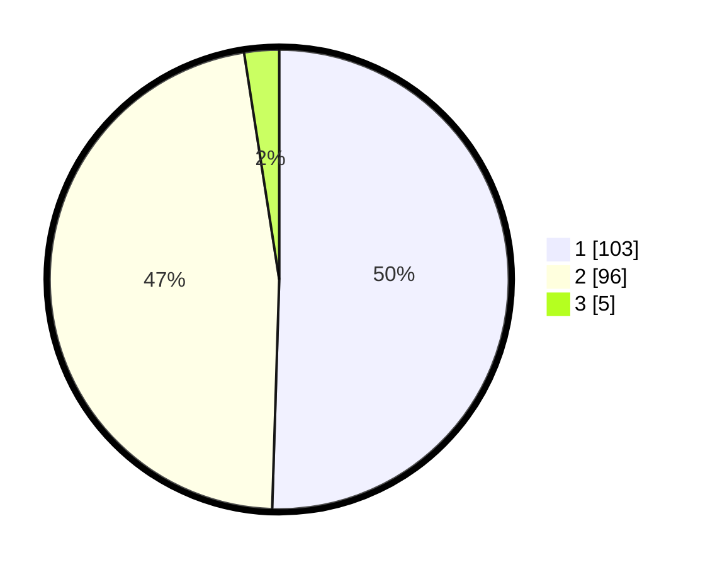

# Hasil

## Grafik

## Tabel

| No. | Nama Paslon    | Suara | Suara (raw) | Persentase |
|:--- |:-------------- | -----:| -----------:| ----------:|
| 1   | ANIES MUHAIMIN | 103   | [103][p-1]  | 50,49      |
| 2   | PRABOWO GIBRAN | 96    | [96][p-2]   | 47,06      |
| 3   | GANJAR MAHFUD  | 5     | [5][p-3]    | 2,45       |

[p-1]: https://github.com/gigit-pemilu/pemilu-2024-11-aceh/blob/main/pilpres/hitung-suara/sub/11-aceh/sub/74-kota-langsa/sub/04-langsa-lama/sub/2002-seulalah/sub/007-tps/sub/paslon-1.txt
[p-2]: https://github.com/gigit-pemilu/pemilu-2024-11-aceh/blob/main/pilpres/hitung-suara/sub/11-aceh/sub/74-kota-langsa/sub/04-langsa-lama/sub/2002-seulalah/sub/007-tps/sub/paslon-2.txt
[p-3]: https://github.com/gigit-pemilu/pemilu-2024-11-aceh/blob/main/pilpres/hitung-suara/sub/11-aceh/sub/74-kota-langsa/sub/04-langsa-lama/sub/2002-seulalah/sub/007-tps/sub/paslon-3.txt

## Foto C Plano

https://sirekap-obj-formc.kpu.go.id/715c/pemilu/ppwp/11/74/04/20/02/1174042002007-20240215-002249--9ece72d0-2ca3-4cdb-b461-a11961c17207.jpg

https://sirekap-obj-formc.kpu.go.id/715c/pemilu/ppwp/11/74/04/20/02/1174042002007-20240216-115243--94c3c9ac-c272-4937-92ee-8b4b11bf66a6.jpg

https://sirekap-obj-formc.kpu.go.id/715c/pemilu/ppwp/11/74/04/20/02/1174042002007-20240215-032644--7a399c57-f022-4971-baf8-2524f3a86164.jpg

## Metadata

| Key        | Value               |
| ---------- | ------------------- |
| Time Stamp | 2024-02-16 16:25:10 |

