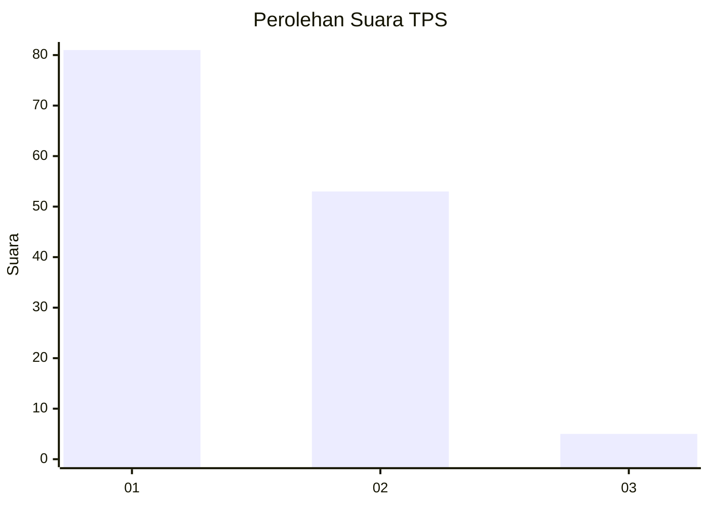
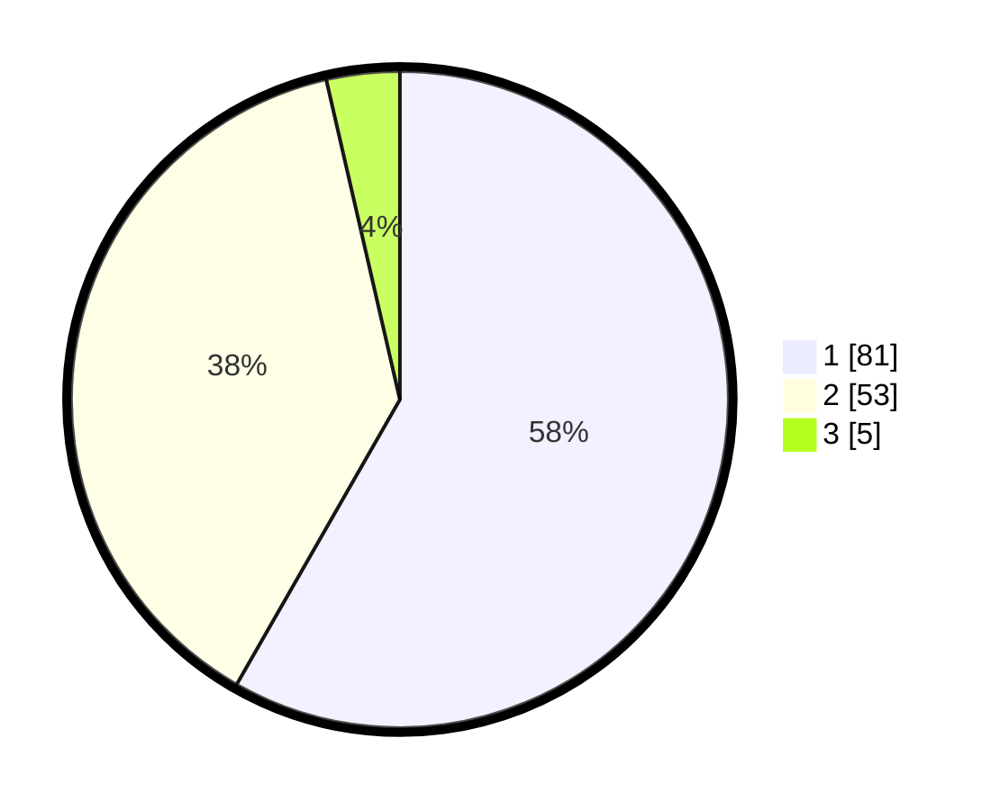

# Hasil

## Grafik

## Tabel

| No. | Nama Paslon    | Suara | Suara (raw) | Persentase |
|:--- |:-------------- | -----:| -----------:| ----------:|
| 1   | ANIES MUHAIMIN | 81    | [81][p-1]   | 58,27      |
| 2   | PRABOWO GIBRAN | 53    | [53][p-2]   | 38,13      |
| 3   | GANJAR MAHFUD  | 5     | [5][p-3]    | 3,60       |

[p-1]: https://github.com/gigit-pemilu/pemilu-2024-11-aceh/blob/main/pilpres/hitung-suara/sub/11-aceh/sub/74-kota-langsa/sub/04-langsa-lama/sub/2002-seulalah/sub/008-tps/sub/paslon-1.txt
[p-2]: https://github.com/gigit-pemilu/pemilu-2024-11-aceh/blob/main/pilpres/hitung-suara/sub/11-aceh/sub/74-kota-langsa/sub/04-langsa-lama/sub/2002-seulalah/sub/008-tps/sub/paslon-2.txt
[p-3]: https://github.com/gigit-pemilu/pemilu-2024-11-aceh/blob/main/pilpres/hitung-suara/sub/11-aceh/sub/74-kota-langsa/sub/04-langsa-lama/sub/2002-seulalah/sub/008-tps/sub/paslon-3.txt

## Foto C Plano

https://sirekap-obj-formc.kpu.go.id/6f48/pemilu/ppwp/11/74/04/20/02/1174042002008-20240216-210637--fce59770-a958-4317-89e9-f8bf03f87b0d.jpg

https://sirekap-obj-formc.kpu.go.id/6f48/pemilu/ppwp/11/74/04/20/02/1174042002008-20240216-210638--8fe69c4a-9ea3-466d-bd41-a1e4c0d74c68.jpg

https://sirekap-obj-formc.kpu.go.id/6f48/pemilu/ppwp/11/74/04/20/02/1174042002008-20240216-210637--9727f0ec-cf24-4a52-a727-b7bb244cbd65.jpg

## Metadata

| Key        | Value               |
| ---------- | ------------------- |
| Time Stamp | 2024-02-16 22:01:00 |

## DATA PEMILIH TETAP

Jumlah pemilih dalam DPT: **282**.
 * L: **128**.
 * P: **154**.

## DATA PENGGUNA HAK PILIH

Jumlah pengguna hak pilih dalam DPT: **120**.
 * L: **48**.
 * P: **72**.

Jumlah pengguna hak pilih dalam DPTb: **0**.
 * L: **0**.
 * P: **0**.

Jumlah pengguna hak pilih dalam DPK: **22**.
 * L: **11**.
 * P: **11**.

Jumlah pengguna hak pilih: **142**.
 * L: **59**.
 * P: **83**.

## JUMLAH SUARA SAH DAN TIDAK SAH

JUMLAH SELURUH SUARA SAH: **139**.

JUMLAH SUARA TIDAK SAH: **3**.

JUMLAH SELURUH SUARA SAH DAN SUARA TIDAK SAH: **142**.

