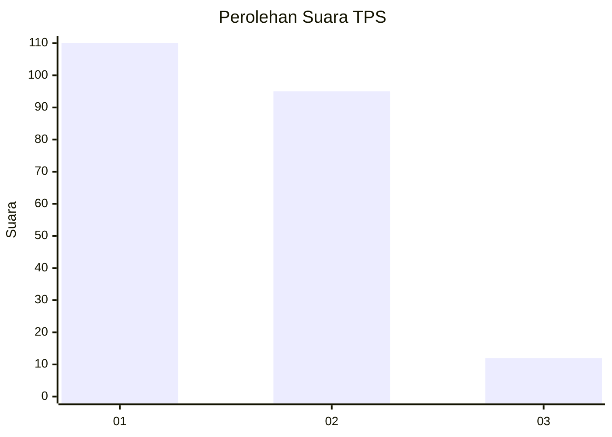
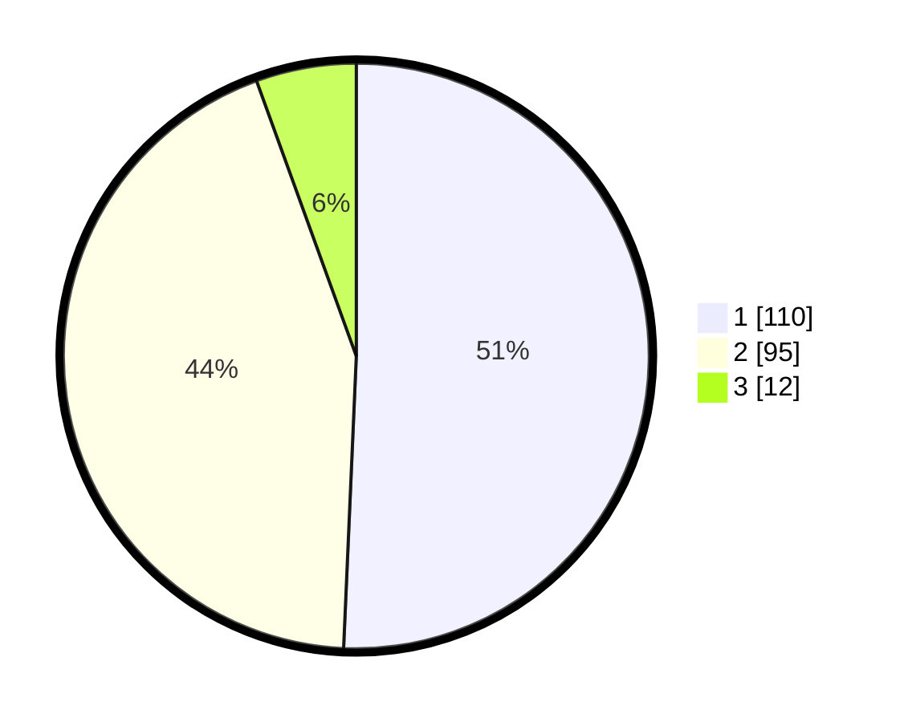

# Hasil

## Grafik

## Tabel

| No. | Nama Paslon    | Suara | Suara (raw) | Persentase |
|:--- |:-------------- | -----:| -----------:| ----------:|
| 1   | ANIES MUHAIMIN | 110   | [110][p-1]  | 50,69      |
| 2   | PRABOWO GIBRAN | 95    | [95][p-2]   | 43,78      |
| 3   | GANJAR MAHFUD  | 12    | [12][p-3]   | 5,53       |

[p-1]: https://github.com/gigit-pemilu/pemilu-2024-11-aceh/blob/main/pilpres/hitung-suara/sub/11-aceh/sub/74-kota-langsa/sub/04-langsa-lama/sub/2003-pondok-pabrik/sub/002-tps/sub/paslon-1.txt
[p-2]: https://github.com/gigit-pemilu/pemilu-2024-11-aceh/blob/main/pilpres/hitung-suara/sub/11-aceh/sub/74-kota-langsa/sub/04-langsa-lama/sub/2003-pondok-pabrik/sub/002-tps/sub/paslon-2.txt
[p-3]: https://github.com/gigit-pemilu/pemilu-2024-11-aceh/blob/main/pilpres/hitung-suara/sub/11-aceh/sub/74-kota-langsa/sub/04-langsa-lama/sub/2003-pondok-pabrik/sub/002-tps/sub/paslon-3.txt

## Foto C Plano

https://sirekap-obj-formc.kpu.go.id/d98a/pemilu/ppwp/11/74/04/20/03/1174042003002-20240220-163343--337d322f-f925-485b-b4ab-6ec53d800255.jpg

https://sirekap-obj-formc.kpu.go.id/d98a/pemilu/ppwp/11/74/04/20/03/1174042003002-20240220-163438--22bc16a1-75e2-4eac-8f98-cd79a5b9aba6.jpg

https://sirekap-obj-formc.kpu.go.id/d98a/pemilu/ppwp/11/74/04/20/03/1174042003002-20240220-163533--4effdd5d-0308-4275-a3bb-1bbe5a9e6ff3.jpg

## Metadata

| Key        | Value               |
| ---------- | ------------------- |
| Time Stamp | 2024-02-20 17:00:00 |

## DATA PEMILIH TETAP

Jumlah pemilih dalam DPT: **268**.
 * L: **126**.
 * P: **142**.

## DATA PENGGUNA HAK PILIH

Jumlah pengguna hak pilih dalam DPT: **219**.
 * L: **298**.
 * P: **522**.

Jumlah pengguna hak pilih dalam DPTb: **60**.
 * L: **2**.
 * P: **0**.

Jumlah pengguna hak pilih dalam DPK: **0**.
 * L: **0**.
 * P: **0**.

Jumlah pengguna hak pilih: **225**.
 * L: **100**.
 * P: **125**.

## JUMLAH SUARA SAH DAN TIDAK SAH

JUMLAH SELURUH SUARA SAH: **217**.

JUMLAH SUARA TIDAK SAH: **8**.

JUMLAH SELURUH SUARA SAH DAN SUARA TIDAK SAH: **225**.

