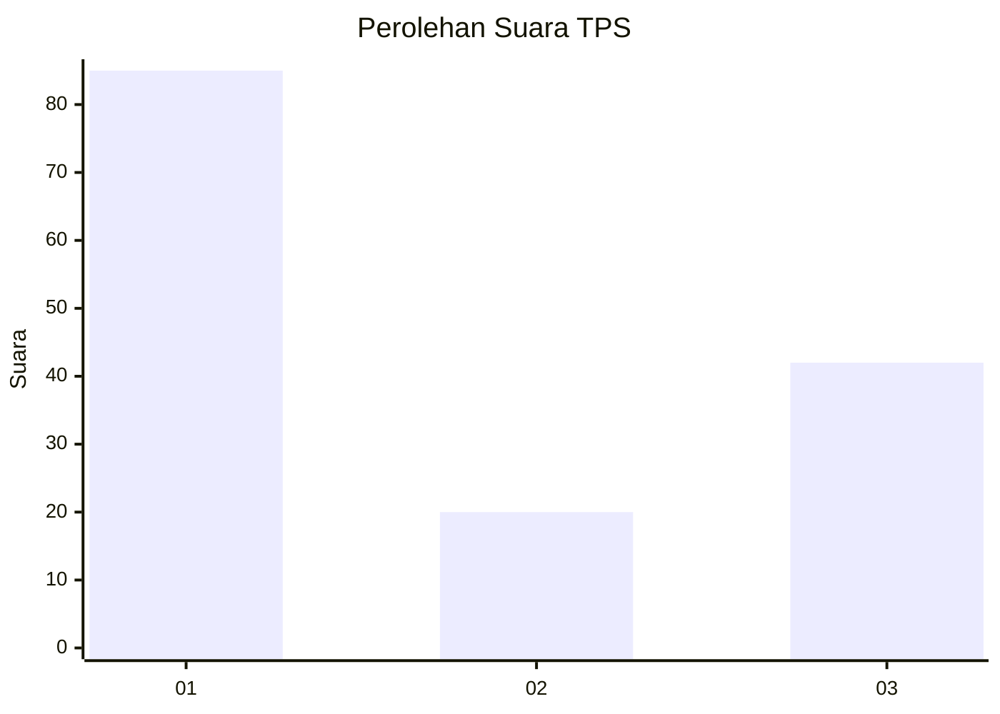
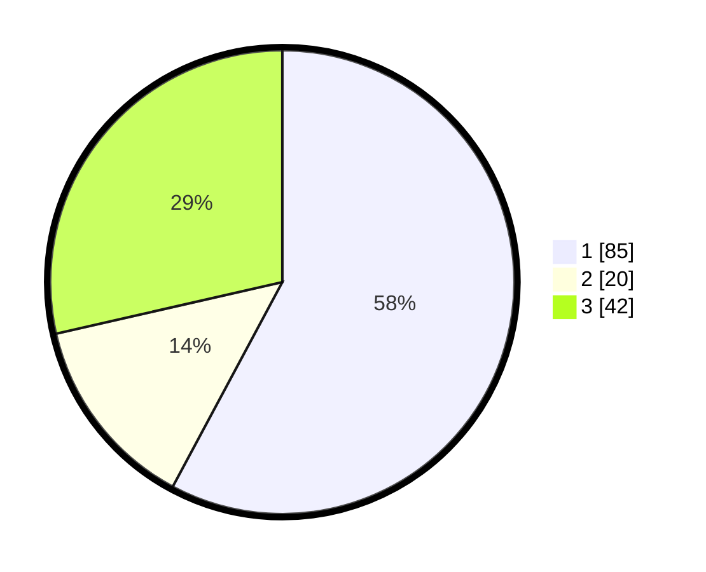

# Hasil

## Grafik

## Tabel

| No. | Nama Paslon    | Suara | Suara (raw) | Persentase |
|:--- |:-------------- | -----:| -----------:| ----------:|
| 1   | ANIES MUHAIMIN | 85    | [85][p-1]   | 57,82      |
| 2   | PRABOWO GIBRAN | 20    | [20][p-2]   | 13,61      |
| 3   | GANJAR MAHFUD  | 42    | [42][p-3]   | 28,57      |

[p-1]: https://github.com/gigit-pemilu/pemilu-2024-11-aceh/blob/main/pilpres/hitung-suara/sub/11-aceh/sub/74-kota-langsa/sub/04-langsa-lama/sub/2003-pondok-pabrik/sub/003-tps/sub/paslon-1.txt
[p-2]: https://github.com/gigit-pemilu/pemilu-2024-11-aceh/blob/main/pilpres/hitung-suara/sub/11-aceh/sub/74-kota-langsa/sub/04-langsa-lama/sub/2003-pondok-pabrik/sub/003-tps/sub/paslon-2.txt
[p-3]: https://github.com/gigit-pemilu/pemilu-2024-11-aceh/blob/main/pilpres/hitung-suara/sub/11-aceh/sub/74-kota-langsa/sub/04-langsa-lama/sub/2003-pondok-pabrik/sub/003-tps/sub/paslon-3.txt

## Foto C Plano

https://sirekap-obj-formc.kpu.go.id/765c/pemilu/ppwp/11/74/04/20/03/1174042003003-20240220-205000--0fecd261-1da9-4ecd-9d41-8cc84a260106.jpg

https://sirekap-obj-formc.kpu.go.id/765c/pemilu/ppwp/11/74/04/20/03/1174042003003-20240220-205136--4282d3f0-f01f-43e1-8d83-6dec0ad8384e.jpg

https://sirekap-obj-formc.kpu.go.id/765c/pemilu/ppwp/11/74/04/20/03/1174042003003-20240220-205243--2e2c022a-93bd-4125-b1a7-c8d2bcd92cb8.jpg

## Metadata

| Key        | Value               |
| ---------- | ------------------- |
| Time Stamp | 2024-02-20 21:00:00 |

## DATA PEMILIH TETAP

Jumlah pemilih dalam DPT: **538**.
 * L: **354**.
 * P: **322**.

## DATA PENGGUNA HAK PILIH

Jumlah pengguna hak pilih dalam DPT: **333**.
 * L: **615**.
 * P: **443**.

Jumlah pengguna hak pilih dalam DPTb: **444**.
 * L: **542**.
 * P: **423**.

Jumlah pengguna hak pilih dalam DPK: **848**.
 * L: **398**.
 * P: **88**.

Jumlah pengguna hak pilih: **234**.
 * L: **246**.
 * P: **423**.

## JUMLAH SUARA SAH DAN TIDAK SAH

JUMLAH SELURUH SUARA SAH: **289**.

JUMLAH SUARA TIDAK SAH: **855**.

JUMLAH SELURUH SUARA SAH DAN SUARA TIDAK SAH: **234**.

