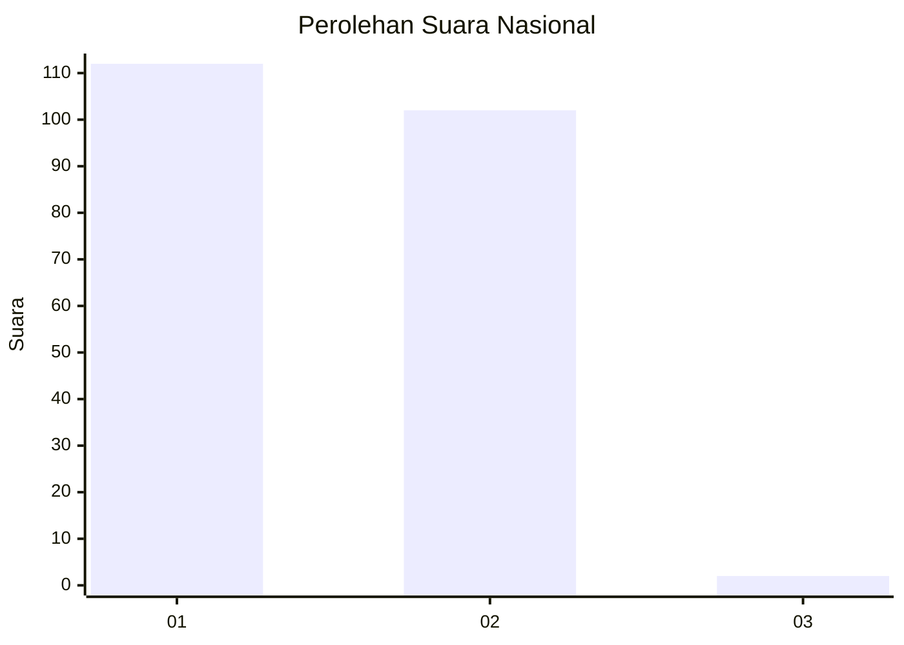
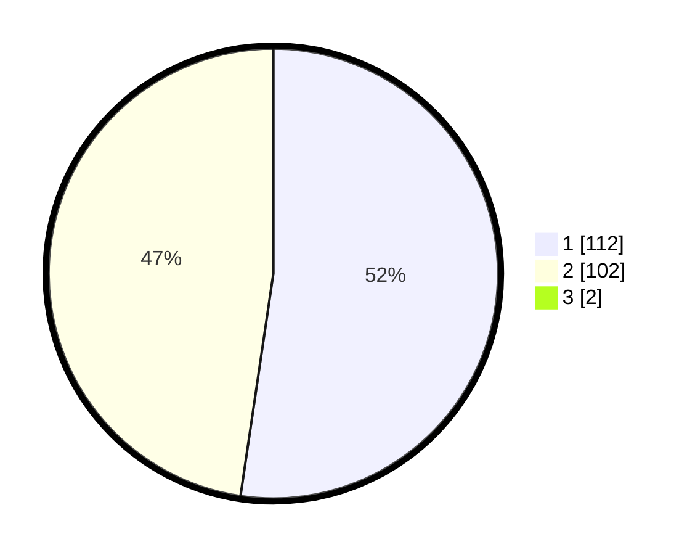

# Hasil

## Grafik

## Tabel

| No. | Nama Paslon    | Suara | Suara (raw) | Persentase |
|:--- |:-------------- | -----:| -----------:| ----------:|
| 1   | ANIES MUHAIMIN | 112   | [112][p-1]  | 51,85      |
| 2   | PRABOWO GIBRAN | 102   | [102][p-2]  | 47,22      |
| 3   | GANJAR MAHFUD  | 2     | [2][p-3]    | 0,93       |

[p-1]: https://github.com/gigit-pemilu/pemilu-2024/blob/main/pilpres/hitung-suara/sub/11-aceh/sub/74-kota-langsa/sub/04-langsa-lama/sub/2003-pondok-pabrik/sub/005-tps/sub/paslon-1.txt
[p-2]: https://github.com/gigit-pemilu/pemilu-2024/blob/main/pilpres/hitung-suara/sub/11-aceh/sub/74-kota-langsa/sub/04-langsa-lama/sub/2003-pondok-pabrik/sub/005-tps/sub/paslon-2.txt
[p-3]: https://github.com/gigit-pemilu/pemilu-2024/blob/main/pilpres/hitung-suara/sub/11-aceh/sub/74-kota-langsa/sub/04-langsa-lama/sub/2003-pondok-pabrik/sub/005-tps/sub/paslon-3.txt

## Foto C Plano

https://sirekap-obj-formc.kpu.go.id/d418/pemilu/ppwp/11/74/04/20/03/1174042003005-20240221-103737--325cc83b-5485-474f-a5f5-e047e4edec51.jpg

https://sirekap-obj-formc.kpu.go.id/d418/pemilu/ppwp/11/74/04/20/03/1174042003005-20240221-104029--e87f980f-3e7d-4847-9944-ac9992efec33.jpg

https://sirekap-obj-formc.kpu.go.id/d418/pemilu/ppwp/11/74/04/20/03/1174042003005-20240221-104130--9fef1292-7a1e-4f08-9f75-3da787019724.jpg

## Metadata

| Key        | Value               |
| ---------- | ------------------- |
| Time Stamp | 2024-02-21 11:00:00 |

## DATA PEMILIH TETAP

Jumlah pemilih dalam DPT: **557**.
 * L: **7**.
 * P: **557**.

## DATA PENGGUNA HAK PILIH

Jumlah pengguna hak pilih dalam DPT: **218**.
 * L: **100**.
 * P: **118**.

Jumlah pengguna hak pilih dalam DPTb: **800**.
 * L: **777**.
 * P: **780**.

Jumlah pengguna hak pilih dalam DPK: **777**.
 * L: **757**.
 * P: **777**.

Jumlah pengguna hak pilih: **777**.
 * L: **107**.
 * P: **177**.

## JUMLAH SUARA SAH DAN TIDAK SAH

JUMLAH SELURUH SUARA SAH: **216**.

JUMLAH SUARA TIDAK SAH: **4**.

JUMLAH SELURUH SUARA SAH DAN SUARA TIDAK SAH: **220**.

