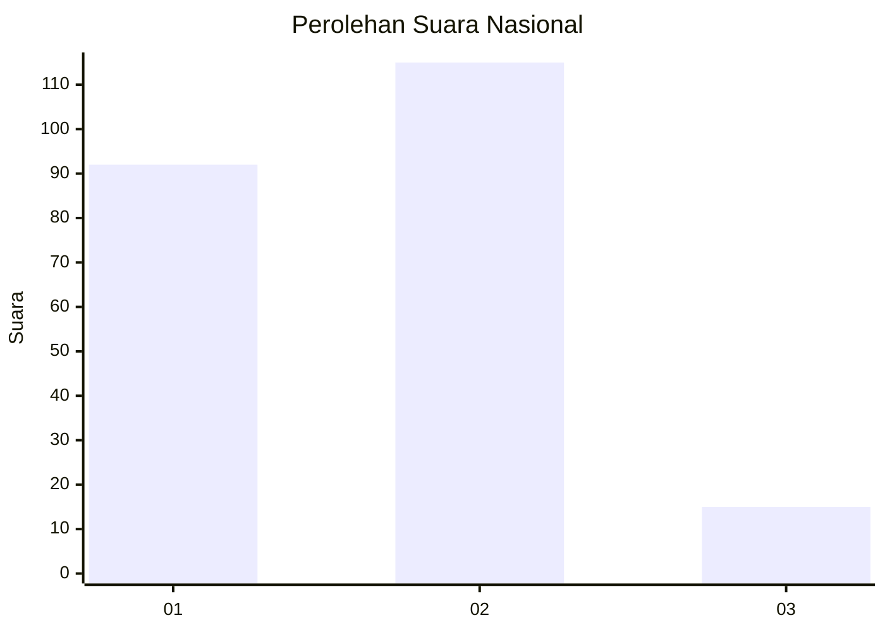

# Hasil

## Grafik

## Tabel

| No. | Nama Paslon    | Suara | Suara (raw) | Persentase |
|:--- |:-------------- | -----:| -----------:| ----------:|
| 1   | ANIES MUHAIMIN | 92    | [92][p-1]   | 41,44      |
| 2   | PRABOWO GIBRAN | 115   | [115][p-2]  | 51,80      |
| 3   | GANJAR MAHFUD  | 15    | [15][p-3]   | 6,76       |

[p-1]: https://github.com/gigit-pemilu/pemilu-2024/blob/main/pilpres/hitung-suara/sub/11-aceh/sub/74-kota-langsa/sub/04-langsa-lama/sub/2004-sidodadi/sub/003-tps/sub/paslon-1.txt
[p-2]: https://github.com/gigit-pemilu/pemilu-2024/blob/main/pilpres/hitung-suara/sub/11-aceh/sub/74-kota-langsa/sub/04-langsa-lama/sub/2004-sidodadi/sub/003-tps/sub/paslon-2.txt
[p-3]: https://github.com/gigit-pemilu/pemilu-2024/blob/main/pilpres/hitung-suara/sub/11-aceh/sub/74-kota-langsa/sub/04-langsa-lama/sub/2004-sidodadi/sub/003-tps/sub/paslon-3.txt

## Foto C Plano

https://sirekap-obj-formc.kpu.go.id/4d2c/pemilu/ppwp/11/74/04/20/04/1174042004003-20240224-224254--d6a2c32c-baf7-40f1-8ca9-600ef1a9fb47.jpg

https://sirekap-obj-formc.kpu.go.id/4d2c/pemilu/ppwp/11/74/04/20/04/1174042004003-20240224-224338--d5c8bd3c-2549-48a3-8c0a-19a779acd743.jpg

https://sirekap-obj-formc.kpu.go.id/4d2c/pemilu/ppwp/11/74/04/20/04/1174042004003-20240224-224549--6f312725-07a1-4d04-8086-6e82c66b9c8b.jpg

## Metadata

| Key        | Value               |
| ---------- | ------------------- |
| Time Stamp | 2024-02-24 23:00:00 |

## DATA PEMILIH TETAP

Jumlah pemilih dalam DPT: **726**.
 * L: **813**.
 * P: **113**.

## DATA PENGGUNA HAK PILIH

Jumlah pengguna hak pilih dalam DPT: **225**.
 * L: **105**.
 * P: **120**.

Jumlah pengguna hak pilih dalam DPTb: **0**.
 * L: **0**.
 * P: **0**.

Jumlah pengguna hak pilih dalam DPK: **1**.
 * L: **0**.
 * P: **801**.

Jumlah pengguna hak pilih: **226**.
 * L: **105**.
 * P: **121**.

## JUMLAH SUARA SAH DAN TIDAK SAH

JUMLAH SELURUH SUARA SAH: **220**.

JUMLAH SUARA TIDAK SAH: **600**.

JUMLAH SELURUH SUARA SAH DAN SUARA TIDAK SAH: **226**.

