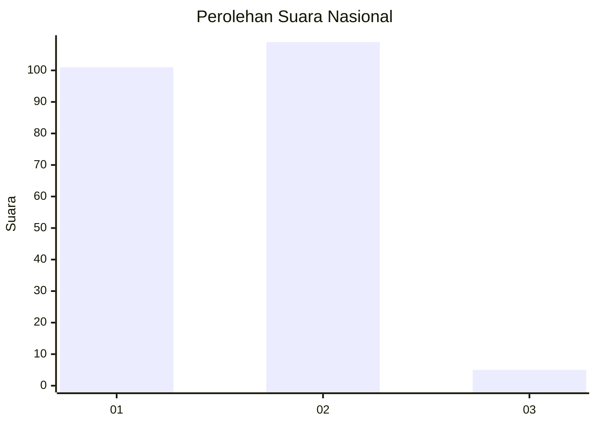
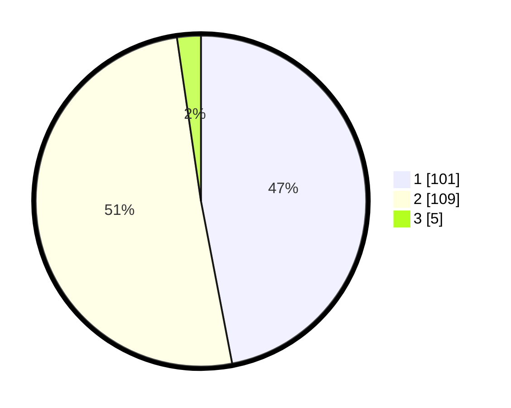

# Hasil

## Grafik

## Tabel

| No. | Nama Paslon    | Suara | Suara (raw) | Persentase |
|:--- |:-------------- | -----:| -----------:| ----------:|
| 1   | ANIES MUHAIMIN | 101   | [101][p-1]  | 46,98      |
| 2   | PRABOWO GIBRAN | 109   | [109][p-2]  | 50,70      |
| 3   | GANJAR MAHFUD  | 5     | [5][p-3]    | 2,33       |

[p-1]: https://github.com/gigit-pemilu/pemilu-2024/blob/main/pilpres/hitung-suara/sub/11-aceh/sub/74-kota-langsa/sub/04-langsa-lama/sub/2004-sidodadi/sub/004-tps/sub/paslon-1.txt
[p-2]: https://github.com/gigit-pemilu/pemilu-2024/blob/main/pilpres/hitung-suara/sub/11-aceh/sub/74-kota-langsa/sub/04-langsa-lama/sub/2004-sidodadi/sub/004-tps/sub/paslon-2.txt
[p-3]: https://github.com/gigit-pemilu/pemilu-2024/blob/main/pilpres/hitung-suara/sub/11-aceh/sub/74-kota-langsa/sub/04-langsa-lama/sub/2004-sidodadi/sub/004-tps/sub/paslon-3.txt

## Foto C Plano

https://sirekap-obj-formc.kpu.go.id/8c2f/pemilu/ppwp/11/74/04/20/04/1174042004004-20240214-215005--ff016122-2276-40eb-831b-0ce05ebb3f1d.jpg

https://sirekap-obj-formc.kpu.go.id/8c2f/pemilu/ppwp/11/74/04/20/04/1174042004004-20240214-215049--59fe418f-6d38-4e73-953d-e6b8c321d40b.jpg

https://sirekap-obj-formc.kpu.go.id/8c2f/pemilu/ppwp/11/74/04/20/04/1174042004004-20240214-215212--f059b851-2a90-4277-8dfd-62b7594bf651.jpg

## Metadata

| Key        | Value               |
| ---------- | ------------------- |
| Time Stamp | 2024-02-20 16:00:00 |

