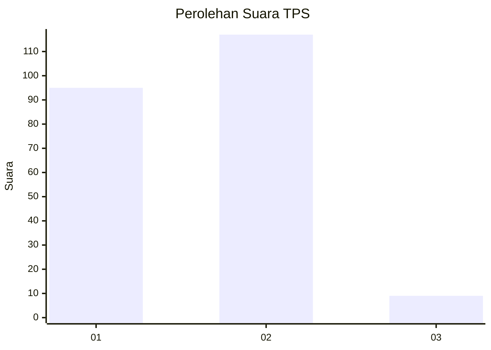
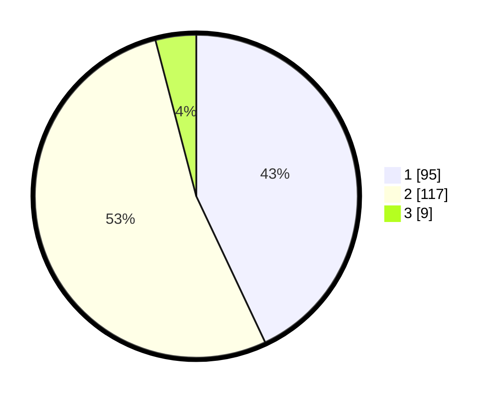

# Hasil

## Grafik

## Tabel

| No. | Nama Paslon    | Suara | Suara (raw) | Persentase |
|:--- |:-------------- | -----:| -----------:| ----------:|
| 1   | ANIES MUHAIMIN | 95    | [95][p-1]   | 42,99      |
| 2   | PRABOWO GIBRAN | 117   | [117][p-2]  | 52,94      |
| 3   | GANJAR MAHFUD  | 9     | [9][p-3]    | 4,07       |

[p-1]: https://github.com/gigit-pemilu/pemilu-2024-11-aceh/blob/main/pilpres/hitung-suara/sub/11-aceh/sub/74-kota-langsa/sub/04-langsa-lama/sub/2004-sidodadi/sub/007-tps/sub/paslon-1.txt
[p-2]: https://github.com/gigit-pemilu/pemilu-2024-11-aceh/blob/main/pilpres/hitung-suara/sub/11-aceh/sub/74-kota-langsa/sub/04-langsa-lama/sub/2004-sidodadi/sub/007-tps/sub/paslon-2.txt
[p-3]: https://github.com/gigit-pemilu/pemilu-2024-11-aceh/blob/main/pilpres/hitung-suara/sub/11-aceh/sub/74-kota-langsa/sub/04-langsa-lama/sub/2004-sidodadi/sub/007-tps/sub/paslon-3.txt

## Foto C Plano

https://sirekap-obj-formc.kpu.go.id/38ab/pemilu/ppwp/11/74/04/20/04/1174042004007-20240214-230517--e0c9e78d-960c-49db-bb16-5a4cf4d92416.jpg

https://sirekap-obj-formc.kpu.go.id/38ab/pemilu/ppwp/11/74/04/20/04/1174042004007-20240214-230631--e0b40b5c-abfb-4cc7-b507-ba8cdcaf693d.jpg

https://sirekap-obj-formc.kpu.go.id/38ab/pemilu/ppwp/11/74/04/20/04/1174042004007-20240214-230740--f2a7e34d-1602-4238-810c-494f8bc5a57e.jpg

## Metadata

| Key        | Value               |
| ---------- | ------------------- |
| Time Stamp | 2024-02-24 22:31:28 |

