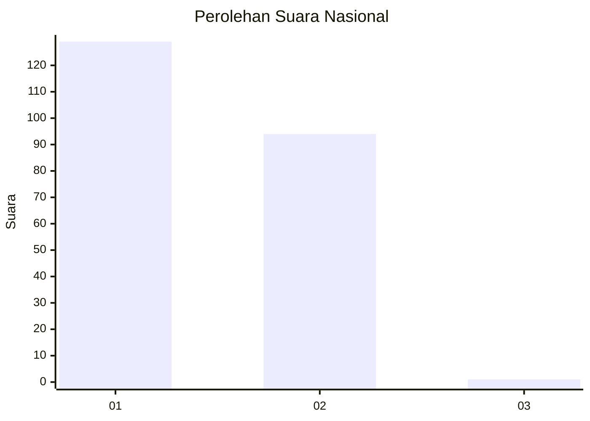
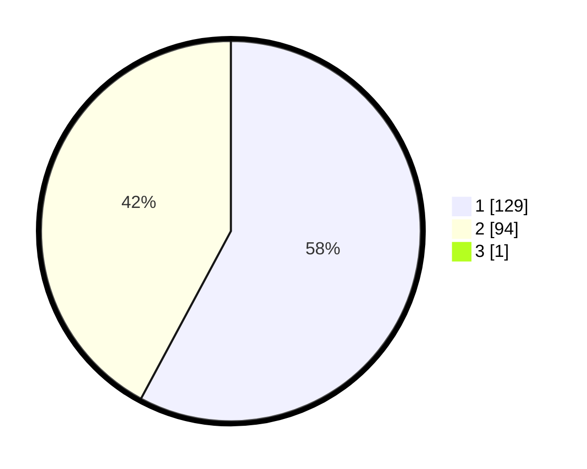

# Hasil

## Grafik

## Tabel

| No. | Nama Paslon    | Suara | Suara (raw) | Persentase |
|:--- |:-------------- | -----:| -----------:| ----------:|
| 1   | ANIES MUHAIMIN | 129   | [129][p-1]  | 57,59      |
| 2   | PRABOWO GIBRAN | 94    | [94][p-2]   | 41,96      |
| 3   | GANJAR MAHFUD  | 1     | [1][p-3]    | 0,45       |

[p-1]: https://github.com/gigit-pemilu/pemilu-2024/blob/main/pilpres/hitung-suara/sub/11-aceh/sub/74-kota-langsa/sub/04-langsa-lama/sub/2005-sidorejo/sub/003-tps/sub/paslon-1.txt
[p-2]: https://github.com/gigit-pemilu/pemilu-2024/blob/main/pilpres/hitung-suara/sub/11-aceh/sub/74-kota-langsa/sub/04-langsa-lama/sub/2005-sidorejo/sub/003-tps/sub/paslon-2.txt
[p-3]: https://github.com/gigit-pemilu/pemilu-2024/blob/main/pilpres/hitung-suara/sub/11-aceh/sub/74-kota-langsa/sub/04-langsa-lama/sub/2005-sidorejo/sub/003-tps/sub/paslon-3.txt

## Foto C Plano

https://sirekap-obj-formc.kpu.go.id/2ade/pemilu/ppwp/11/74/04/20/05/1174042005003-20240215-065540--a9bf5e8e-2a15-4d39-9e1c-ff4d265306c8.jpg

https://sirekap-obj-formc.kpu.go.id/2ade/pemilu/ppwp/11/74/04/20/05/1174042005003-20240215-065638--184ed33c-e410-4b0a-b9bf-60568768dde3.jpg

https://sirekap-obj-formc.kpu.go.id/2ade/pemilu/ppwp/11/74/04/20/05/1174042005003-20240222-221608--fb5bcd86-077d-4d24-8e69-dc2827c6b86f.jpg

## Metadata

| Key        | Value               |
| ---------- | ------------------- |
| Time Stamp | 2024-02-22 23:00:00 |

