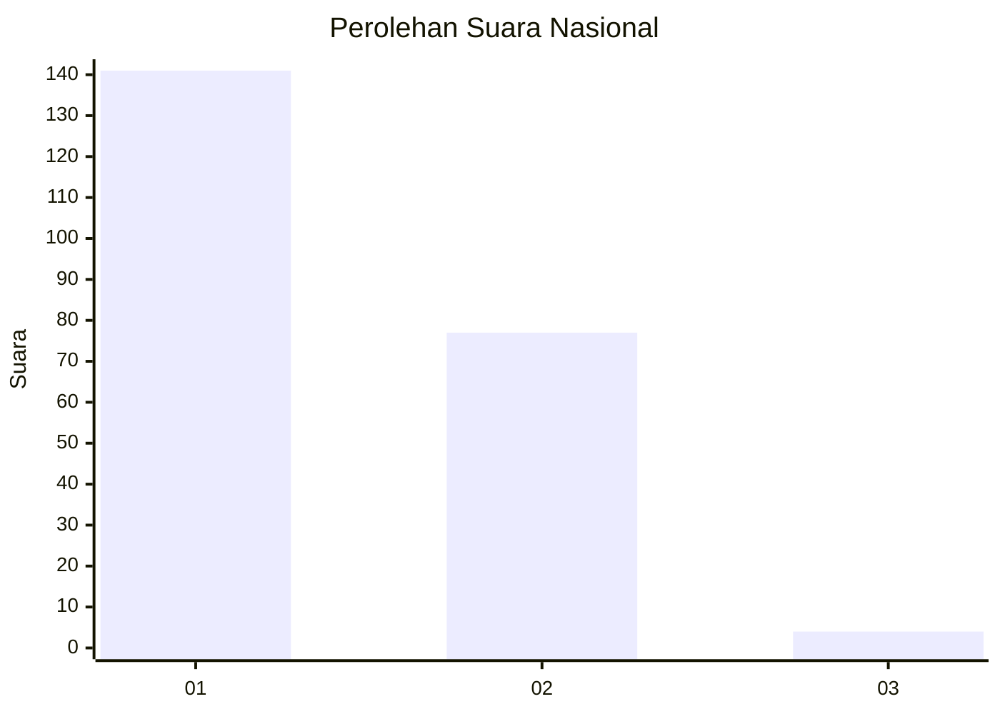
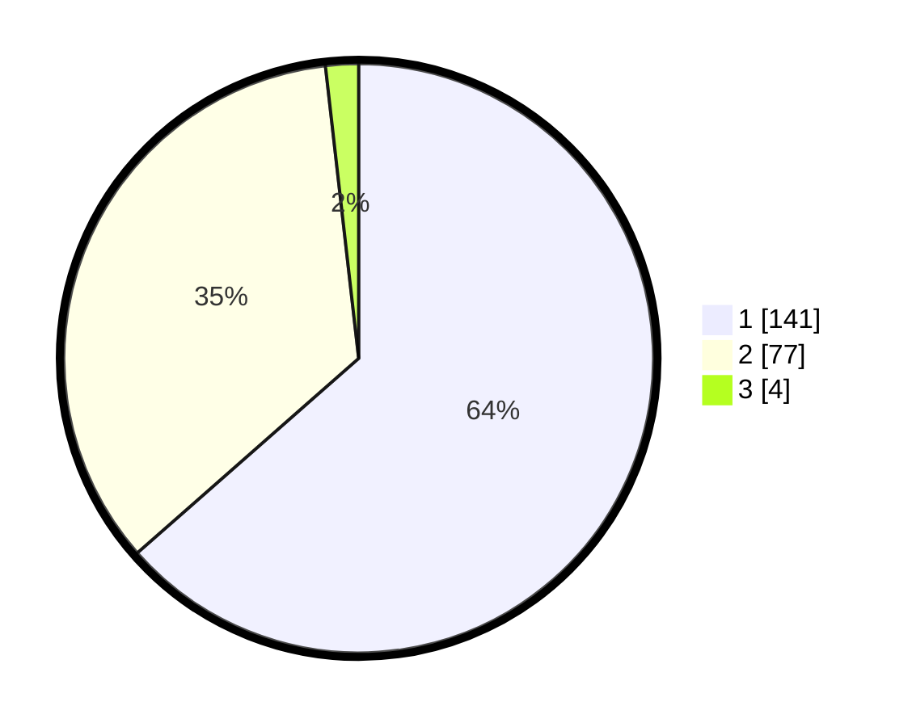

# Hasil

## Grafik

## Tabel

| No. | Nama Paslon    | Suara | Suara (raw) | Persentase |
|:--- |:-------------- | -----:| -----------:| ----------:|
| 1   | ANIES MUHAIMIN | 141   | [141][p-1]  | 63,51      |
| 2   | PRABOWO GIBRAN | 77    | [77][p-2]   | 34,68      |
| 3   | GANJAR MAHFUD  | 4     | [4][p-3]    | 1,80       |

[p-1]: https://github.com/gigit-pemilu/pemilu-2024/blob/main/pilpres/hitung-suara/sub/11-aceh/sub/74-kota-langsa/sub/04-langsa-lama/sub/2005-sidorejo/sub/004-tps/sub/paslon-1.txt
[p-2]: https://github.com/gigit-pemilu/pemilu-2024/blob/main/pilpres/hitung-suara/sub/11-aceh/sub/74-kota-langsa/sub/04-langsa-lama/sub/2005-sidorejo/sub/004-tps/sub/paslon-2.txt
[p-3]: https://github.com/gigit-pemilu/pemilu-2024/blob/main/pilpres/hitung-suara/sub/11-aceh/sub/74-kota-langsa/sub/04-langsa-lama/sub/2005-sidorejo/sub/004-tps/sub/paslon-3.txt

## Foto C Plano

https://sirekap-obj-formc.kpu.go.id/0e41/pemilu/ppwp/11/74/04/20/05/1174042005004-20240215-013501--97a2ed08-f585-4a63-8907-91af7e7a20e2.jpg

https://sirekap-obj-formc.kpu.go.id/0e41/pemilu/ppwp/11/74/04/20/05/1174042005004-20240215-013706--1f2925d2-b7f0-46d9-aa66-bc8b40a588d9.jpg

https://sirekap-obj-formc.kpu.go.id/0e41/pemilu/ppwp/11/74/04/20/05/1174042005004-20240215-013848--90d3d7f5-69e9-4c07-b68d-745da507199a.jpg

## Metadata

| Key        | Value               |
| ---------- | ------------------- |
| Time Stamp | 2024-02-19 19:00:00 |

