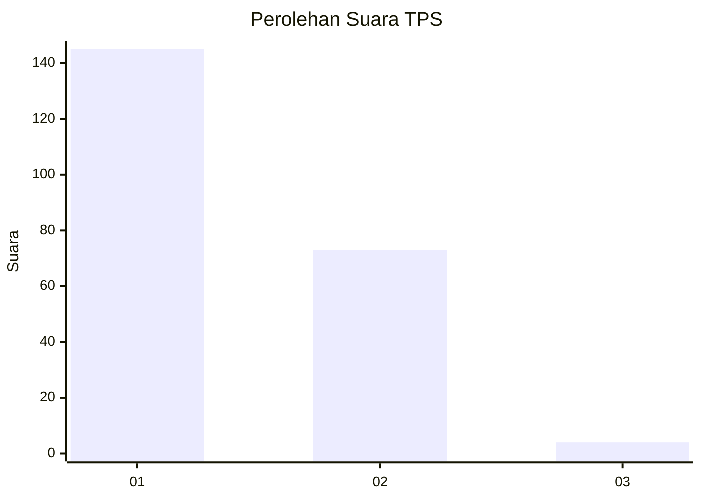
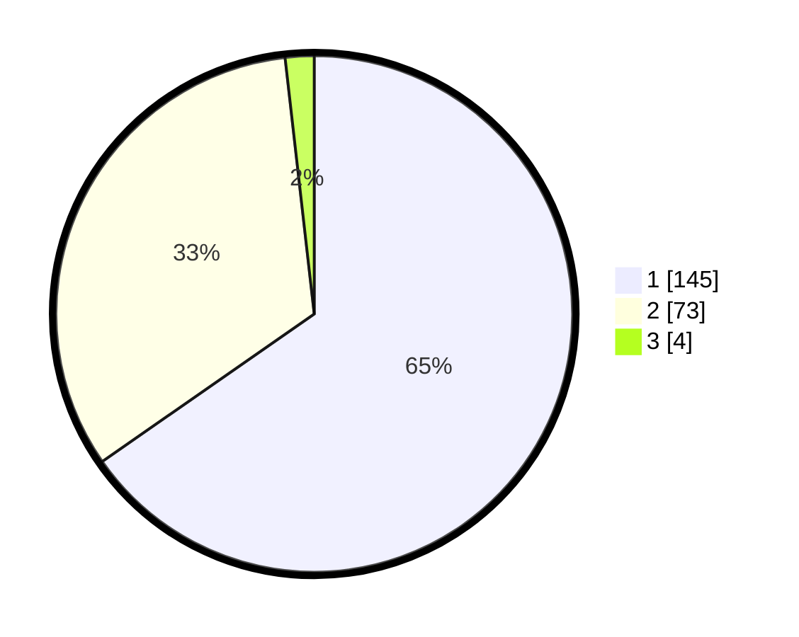

# Hasil

## Grafik

## Tabel

| No. | Nama Paslon    | Suara | Suara (raw) | Persentase |
|:--- |:-------------- | -----:| -----------:| ----------:|
| 1   | ANIES MUHAIMIN | 145   | [145][p-1]  | 65,32      |
| 2   | PRABOWO GIBRAN | 73    | [73][p-2]   | 32,88      |
| 3   | GANJAR MAHFUD  | 4     | [4][p-3]    | 1,80       |

[p-1]: https://github.com/gigit-pemilu/pemilu-2024-11-aceh/blob/main/pilpres/hitung-suara/sub/11-aceh/sub/74-kota-langsa/sub/04-langsa-lama/sub/2005-sidorejo/sub/006-tps/sub/paslon-1.txt
[p-2]: https://github.com/gigit-pemilu/pemilu-2024-11-aceh/blob/main/pilpres/hitung-suara/sub/11-aceh/sub/74-kota-langsa/sub/04-langsa-lama/sub/2005-sidorejo/sub/006-tps/sub/paslon-2.txt
[p-3]: https://github.com/gigit-pemilu/pemilu-2024-11-aceh/blob/main/pilpres/hitung-suara/sub/11-aceh/sub/74-kota-langsa/sub/04-langsa-lama/sub/2005-sidorejo/sub/006-tps/sub/paslon-3.txt

## Foto C Plano

https://sirekap-obj-formc.kpu.go.id/a191/pemilu/ppwp/11/74/04/20/05/1174042005006-20240223-150057--746ad3ea-f002-4392-a731-67e12bd0abd7.jpg

https://sirekap-obj-formc.kpu.go.id/a191/pemilu/ppwp/11/74/04/20/05/1174042005006-20240223-150138--e69fc2bb-c4a8-4ef5-853e-9dd8835c8a5e.jpg

https://sirekap-obj-formc.kpu.go.id/a191/pemilu/ppwp/11/74/04/20/05/1174042005006-20240223-150222--6a3aa96e-28db-427e-8c89-d1606aa1f4f0.jpg

## Metadata

| Key        | Value               |
| ---------- | ------------------- |
| Time Stamp | 2024-02-24 22:31:28 |

## DATA PEMILIH TETAP

Jumlah pemilih dalam DPT: **404**.
 * L: **13**.
 * P: **415**.

## DATA PENGGUNA HAK PILIH

Jumlah pengguna hak pilih dalam DPT: **421**.
 * L: **52**.
 * P: **422**.

Jumlah pengguna hak pilih dalam DPTb: **0**.
 * L: **0**.
 * P: **0**.

Jumlah pengguna hak pilih dalam DPK: **400**.
 * L: **1**.
 * P: **100**.

Jumlah pengguna hak pilih: **422**.
 * L: **109**.
 * P: **912**.

## JUMLAH SUARA SAH DAN TIDAK SAH

JUMLAH SELURUH SUARA SAH: **222**.

JUMLAH SUARA TIDAK SAH: **3**.

JUMLAH SELURUH SUARA SAH DAN SUARA TIDAK SAH: **225**.

