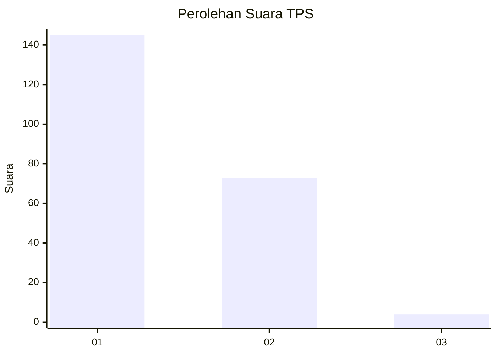
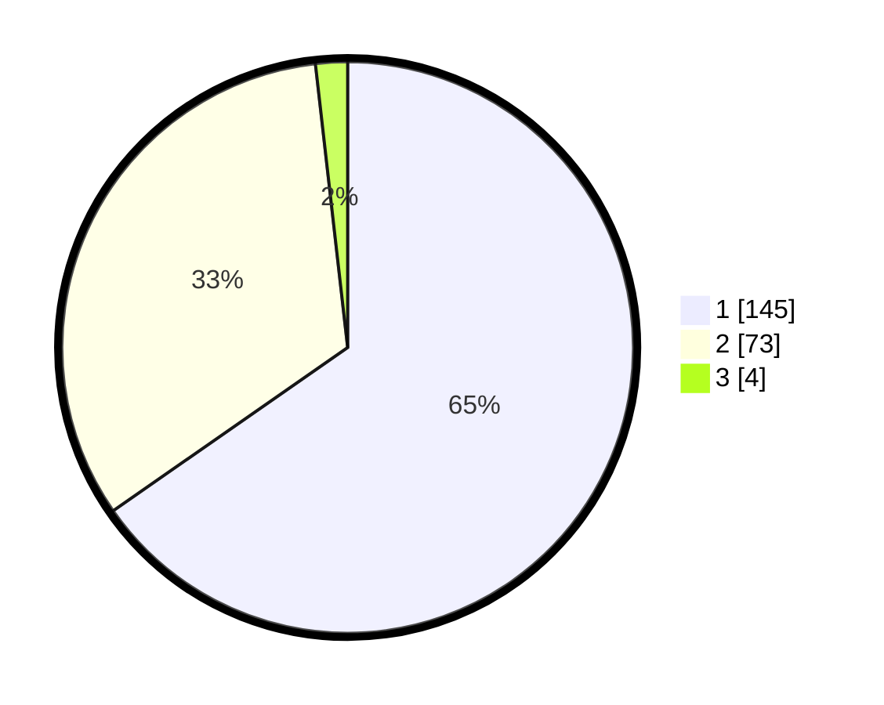

# Hasil

## Grafik

## Tabel

| No. | Nama Paslon    | Suara | Suara (raw) | Persentase |
|:--- |:-------------- | -----:| -----------:| ----------:|
| 1   | ANIES MUHAIMIN | 145   | [145][p-1]  | 65,32      |
| 2   | PRABOWO GIBRAN | 73    | [73][p-2]   | 32,88      |
| 3   | GANJAR MAHFUD  | 4     | [4][p-3]    | 1,80       |

[p-1]: https://github.com/gigit-pemilu/pemilu-2024-11-aceh/blob/main/pilpres/hitung-suara/sub/11-aceh/sub/74-kota-langsa/sub/04-langsa-lama/sub/2005-sidorejo/sub/007-tps/sub/paslon-1.txt
[p-2]: https://github.com/gigit-pemilu/pemilu-2024-11-aceh/blob/main/pilpres/hitung-suara/sub/11-aceh/sub/74-kota-langsa/sub/04-langsa-lama/sub/2005-sidorejo/sub/007-tps/sub/paslon-2.txt
[p-3]: https://github.com/gigit-pemilu/pemilu-2024-11-aceh/blob/main/pilpres/hitung-suara/sub/11-aceh/sub/74-kota-langsa/sub/04-langsa-lama/sub/2005-sidorejo/sub/007-tps/sub/paslon-3.txt

## Foto C Plano

https://sirekap-obj-formc.kpu.go.id/e97b/pemilu/ppwp/11/74/04/20/05/1174042005007-20240215-001617--feabc24b-d12b-42d1-af48-193db328e67d.jpg

https://sirekap-obj-formc.kpu.go.id/e97b/pemilu/ppwp/11/74/04/20/05/1174042005007-20240215-001738--6e420e92-dd71-46ce-a093-9b71005481ef.jpg

https://sirekap-obj-formc.kpu.go.id/e97b/pemilu/ppwp/11/74/04/20/05/1174042005007-20240215-001838--8e3088f2-faef-4385-b58a-9d47279d68d1.jpg

## Metadata

| Key        | Value               |
| ---------- | ------------------- |
| Time Stamp | 2024-02-20 16:00:00 |

