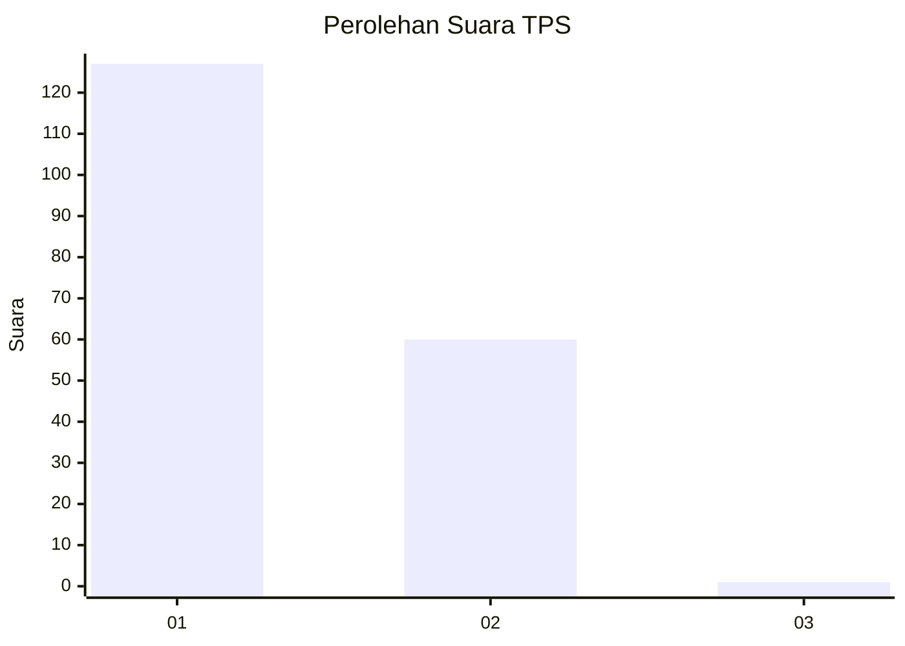
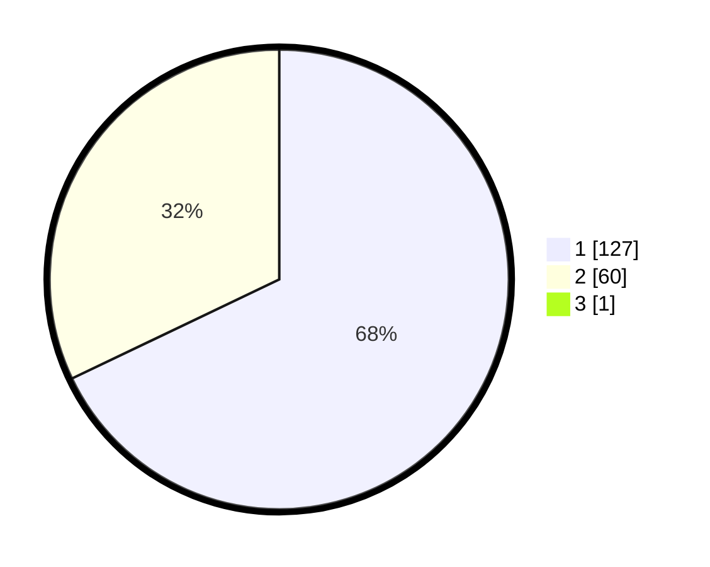

# Hasil

## Grafik

## Tabel

| No. | Nama Paslon    | Suara | Suara (raw) | Persentase |
|:--- |:-------------- | -----:| -----------:| ----------:|
| 1   | ANIES MUHAIMIN | 127   | [127][p-1]  | 67,55      |
| 2   | PRABOWO GIBRAN | 60    | [60][p-2]   | 31,91      |
| 3   | GANJAR MAHFUD  | 1     | [1][p-3]    | 0,53       |

[p-1]: https://github.com/gigit-pemilu/pemilu-2024-11-aceh/blob/main/pilpres/hitung-suara/sub/11-aceh/sub/74-kota-langsa/sub/04-langsa-lama/sub/2005-sidorejo/sub/009-tps/sub/paslon-1.txt
[p-2]: https://github.com/gigit-pemilu/pemilu-2024-11-aceh/blob/main/pilpres/hitung-suara/sub/11-aceh/sub/74-kota-langsa/sub/04-langsa-lama/sub/2005-sidorejo/sub/009-tps/sub/paslon-2.txt
[p-3]: https://github.com/gigit-pemilu/pemilu-2024-11-aceh/blob/main/pilpres/hitung-suara/sub/11-aceh/sub/74-kota-langsa/sub/04-langsa-lama/sub/2005-sidorejo/sub/009-tps/sub/paslon-3.txt

## Foto C Plano

https://sirekap-obj-formc.kpu.go.id/5328/pemilu/ppwp/11/74/04/20/05/1174042005009-20240215-000935--28744897-73c3-401b-96d1-4d7d6bf3f98a.jpg

https://sirekap-obj-formc.kpu.go.id/5328/pemilu/ppwp/11/74/04/20/05/1174042005009-20240215-002050--e61364c4-0800-4d05-9377-bea95b081826.jpg

https://sirekap-obj-formc.kpu.go.id/5328/pemilu/ppwp/11/74/04/20/05/1174042005009-20240215-002404--a314a3d7-e48b-49fc-8de0-20de420dc11b.jpg

## Metadata

| Key        | Value               |
| ---------- | ------------------- |
| Time Stamp | 2024-02-20 16:00:00 |

