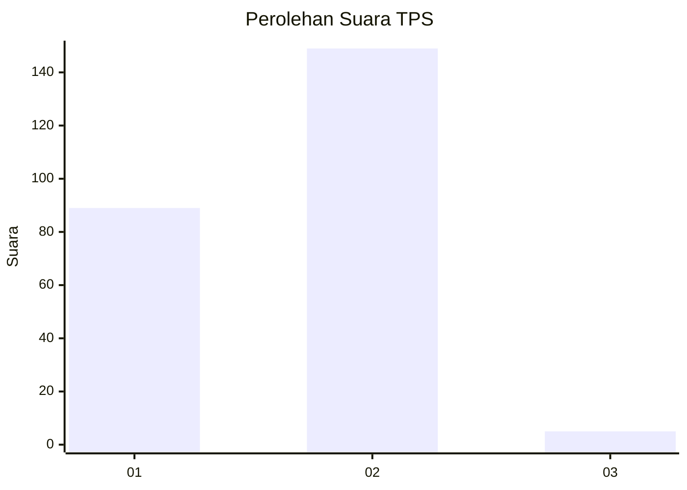
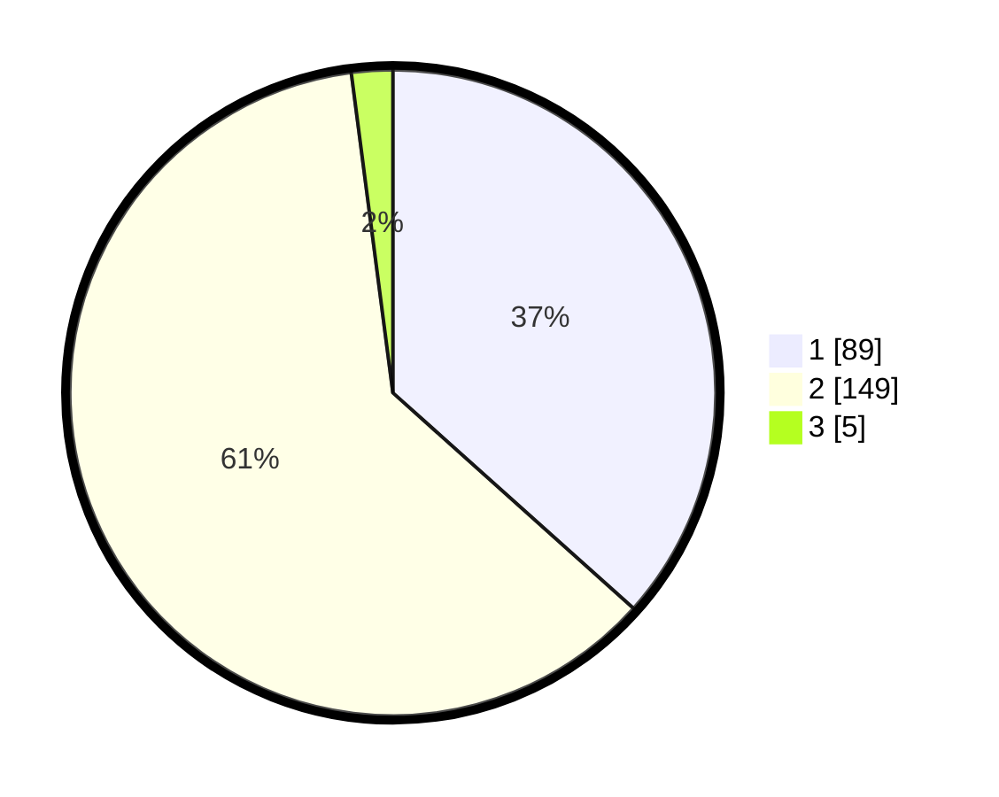

# Hasil

## Grafik

## Tabel

| No. | Nama Paslon    | Suara | Suara (raw) | Persentase |
|:--- |:-------------- | -----:| -----------:| ----------:|
| 1   | ANIES MUHAIMIN | 89    | [89][p-1]   | 36,63      |
| 2   | PRABOWO GIBRAN | 149   | [149][p-2]  | 61,32      |
| 3   | GANJAR MAHFUD  | 5     | [5][p-3]    | 2,06       |

[p-1]: https://github.com/gigit-pemilu/pemilu-2024-11-aceh/blob/main/pilpres/hitung-suara/sub/11-aceh/sub/74-kota-langsa/sub/04-langsa-lama/sub/2008-asam-peutik/sub/001-tps/sub/paslon-1.txt
[p-2]: https://github.com/gigit-pemilu/pemilu-2024-11-aceh/blob/main/pilpres/hitung-suara/sub/11-aceh/sub/74-kota-langsa/sub/04-langsa-lama/sub/2008-asam-peutik/sub/001-tps/sub/paslon-2.txt
[p-3]: https://github.com/gigit-pemilu/pemilu-2024-11-aceh/blob/main/pilpres/hitung-suara/sub/11-aceh/sub/74-kota-langsa/sub/04-langsa-lama/sub/2008-asam-peutik/sub/001-tps/sub/paslon-3.txt

## Foto C Plano

https://sirekap-obj-formc.kpu.go.id/0738/pemilu/ppwp/11/74/04/20/08/1174042008001-20240224-155917--6168223a-d6ad-493a-a2f4-42d5af1af5dd.jpg

https://sirekap-obj-formc.kpu.go.id/0738/pemilu/ppwp/11/74/04/20/08/1174042008001-20240224-155944--ec721a32-a10b-435e-baad-378ceed6dad4.jpg

https://sirekap-obj-formc.kpu.go.id/0738/pemilu/ppwp/11/74/04/20/08/1174042008001-20240224-160015--8a12ace2-ba30-43be-8174-93d8cca2d614.jpg

## Metadata

| Key        | Value               |
| ---------- | ------------------- |
| Time Stamp | 2024-02-24 22:31:28 |

## DATA PEMILIH TETAP

Jumlah pemilih dalam DPT: **384**.
 * L: **143**.
 * P: **141**.

## DATA PENGGUNA HAK PILIH

Jumlah pengguna hak pilih dalam DPT: **243**.
 * L: **125**.
 * P: **123**.

Jumlah pengguna hak pilih dalam DPTb: **0**.
 * L: **33**.
 * P: **60**.

Jumlah pengguna hak pilih dalam DPK: **2**.
 * L: **1**.
 * P: **81**.

Jumlah pengguna hak pilih: **258**.
 * L: **126**.
 * P: **824**.

## JUMLAH SUARA SAH DAN TIDAK SAH

JUMLAH SELURUH SUARA SAH: **243**.

JUMLAH SUARA TIDAK SAH: **7**.

JUMLAH SELURUH SUARA SAH DAN SUARA TIDAK SAH: **250**.

