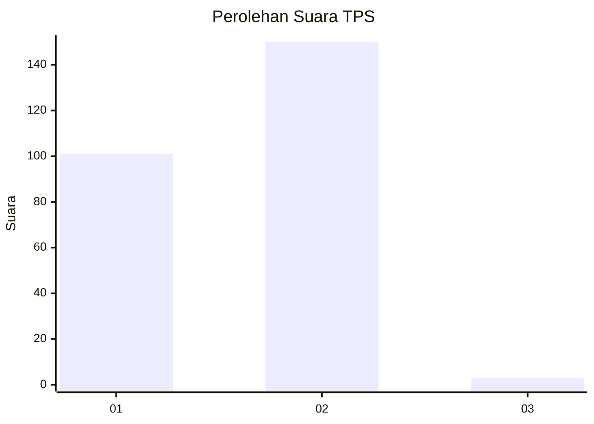
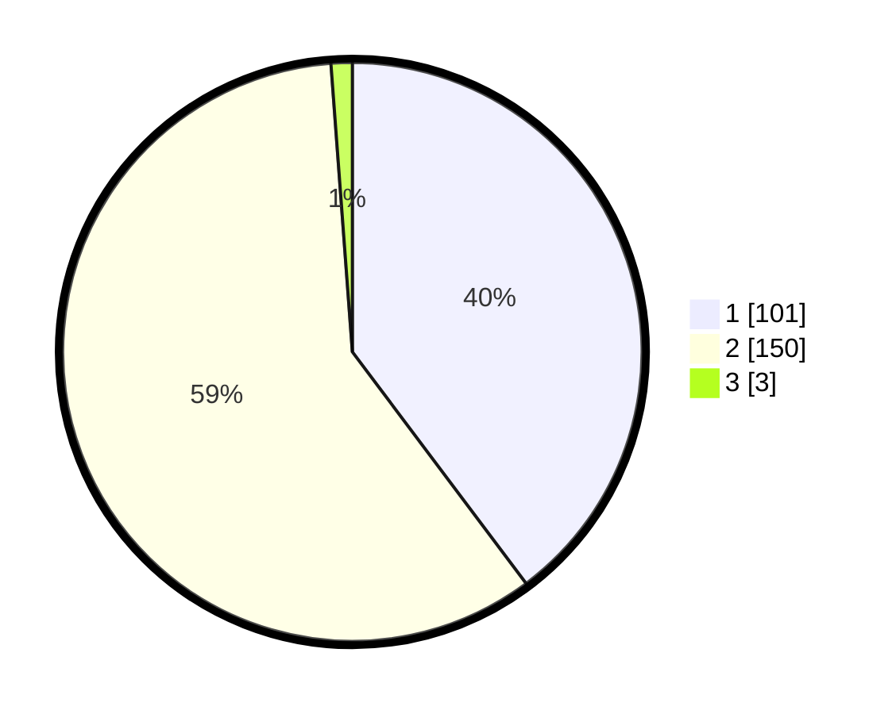

# Hasil

## Grafik

## Tabel

| No. | Nama Paslon    | Suara | Suara (raw) | Persentase |
|:--- |:-------------- | -----:| -----------:| ----------:|
| 1   | ANIES MUHAIMIN | 101   | [101][p-1]  | 39,76      |
| 2   | PRABOWO GIBRAN | 150   | [150][p-2]  | 59,06      |
| 3   | GANJAR MAHFUD  | 3     | [3][p-3]    | 1,18       |

[p-1]: https://github.com/gigit-pemilu/pemilu-2024-11-aceh/blob/main/pilpres/hitung-suara/sub/11-aceh/sub/74-kota-langsa/sub/04-langsa-lama/sub/2008-asam-peutik/sub/003-tps/sub/paslon-1.txt
[p-2]: https://github.com/gigit-pemilu/pemilu-2024-11-aceh/blob/main/pilpres/hitung-suara/sub/11-aceh/sub/74-kota-langsa/sub/04-langsa-lama/sub/2008-asam-peutik/sub/003-tps/sub/paslon-2.txt
[p-3]: https://github.com/gigit-pemilu/pemilu-2024-11-aceh/blob/main/pilpres/hitung-suara/sub/11-aceh/sub/74-kota-langsa/sub/04-langsa-lama/sub/2008-asam-peutik/sub/003-tps/sub/paslon-3.txt

## Foto C Plano

https://sirekap-obj-formc.kpu.go.id/8ece/pemilu/ppwp/11/74/04/20/08/1174042008003-20240224-141719--06f0e976-eda0-4c3d-ab00-db33f2431817.jpg

https://sirekap-obj-formc.kpu.go.id/8ece/pemilu/ppwp/11/74/04/20/08/1174042008003-20240224-141754--9e66e983-7547-4913-b5a0-820886840938.jpg

https://sirekap-obj-formc.kpu.go.id/8ece/pemilu/ppwp/11/74/04/20/08/1174042008003-20240224-141827--48f10f1d-d910-42b2-95e6-292be1868f9d.jpg

## Metadata

| Key        | Value               |
| ---------- | ------------------- |
| Time Stamp | 2024-02-25 12:00:00 |

## DATA PEMILIH TETAP

Jumlah pemilih dalam DPT: **640**.
 * L: **130**.
 * P: **150**.

## DATA PENGGUNA HAK PILIH

Jumlah pengguna hak pilih dalam DPT: **252**.
 * L: **115**.
 * P: **137**.

Jumlah pengguna hak pilih dalam DPTb: **80**.
 * L: **0**.
 * P: **0**.

Jumlah pengguna hak pilih dalam DPK: **5**.
 * L: **2**.
 * P: **4**.

Jumlah pengguna hak pilih: **259**.
 * L: **117**.
 * P: **841**.

## JUMLAH SUARA SAH DAN TIDAK SAH

JUMLAH SELURUH SUARA SAH: **254**.

JUMLAH SUARA TIDAK SAH: **4**.

JUMLAH SELURUH SUARA SAH DAN SUARA TIDAK SAH: **258**.

