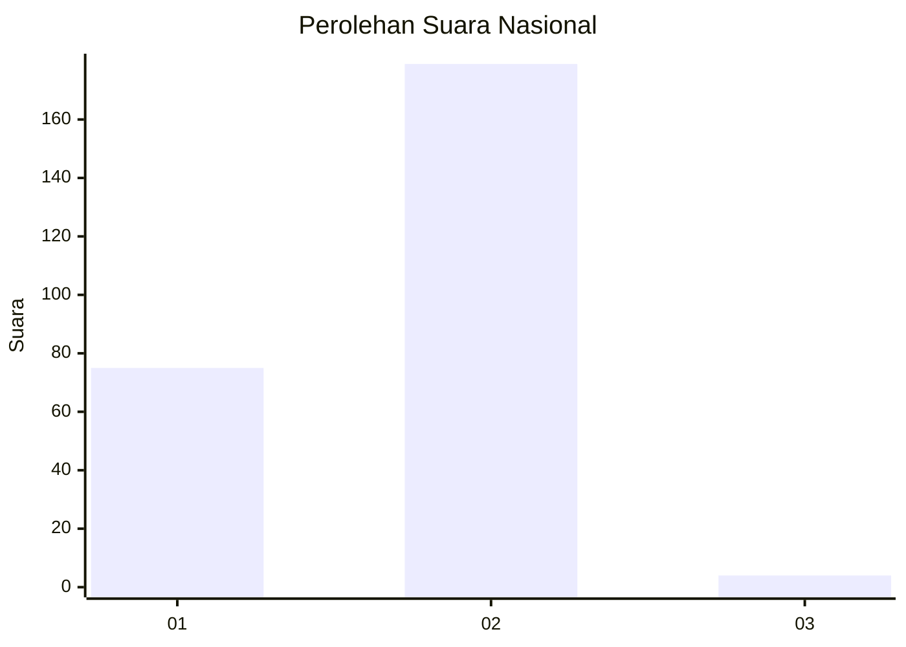
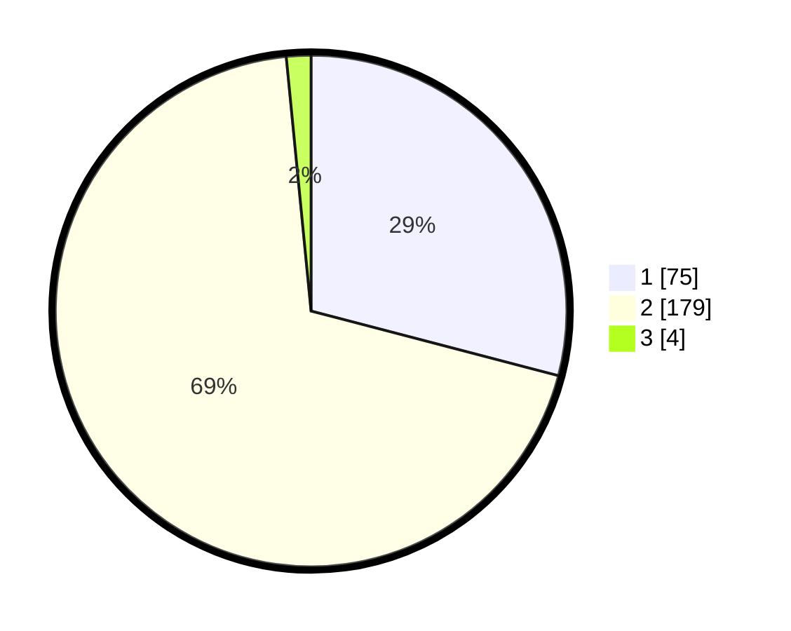

# Hasil

## Grafik

## Tabel

| No. | Nama Paslon    | Suara | Suara (raw) | Persentase |
|:--- |:-------------- | -----:| -----------:| ----------:|
| 1   | ANIES MUHAIMIN | 75    | [75][p-1]   | 29,07      |
| 2   | PRABOWO GIBRAN | 179   | [179][p-2]  | 69,38      |
| 3   | GANJAR MAHFUD  | 4     | [4][p-3]    | 1,55       |

[p-1]: https://github.com/gigit-pemilu/pemilu-2024/blob/main/pilpres/hitung-suara/sub/11-aceh/sub/74-kota-langsa/sub/04-langsa-lama/sub/2008-asam-peutik/sub/005-tps/sub/paslon-1.txt
[p-2]: https://github.com/gigit-pemilu/pemilu-2024/blob/main/pilpres/hitung-suara/sub/11-aceh/sub/74-kota-langsa/sub/04-langsa-lama/sub/2008-asam-peutik/sub/005-tps/sub/paslon-2.txt
[p-3]: https://github.com/gigit-pemilu/pemilu-2024/blob/main/pilpres/hitung-suara/sub/11-aceh/sub/74-kota-langsa/sub/04-langsa-lama/sub/2008-asam-peutik/sub/005-tps/sub/paslon-3.txt

## Foto C Plano

https://sirekap-obj-formc.kpu.go.id/9146/pemilu/ppwp/11/74/04/20/08/1174042008005-20240224-172420--6cf9fa92-bddb-4819-9b51-9a1a7cd2ecb2.jpg

https://sirekap-obj-formc.kpu.go.id/9146/pemilu/ppwp/11/74/04/20/08/1174042008005-20240224-172546--9bb16061-1643-4e13-a9cc-0bc19d0cb0d2.jpg

https://sirekap-obj-formc.kpu.go.id/9146/pemilu/ppwp/11/74/04/20/08/1174042008005-20240224-172509--dda1167e-04b7-4bf5-83d7-43562a32da06.jpg

## Metadata

| Key        | Value               |
| ---------- | ------------------- |
| Time Stamp | 2024-02-24 22:31:28 |

## DATA PEMILIH TETAP

Jumlah pemilih dalam DPT: **253**.
 * L: **130**.
 * P: **233**.

## DATA PENGGUNA HAK PILIH

Jumlah pengguna hak pilih dalam DPT: **223**.
 * L: **111**.
 * P: **118**.

Jumlah pengguna hak pilih dalam DPTb: **886**.
 * L: **4**.
 * P: **882**.

Jumlah pengguna hak pilih dalam DPK: **8**.
 * L: **8**.
 * P: **0**.

Jumlah pengguna hak pilih: **235**.
 * L: **115**.
 * P: **120**.

## JUMLAH SUARA SAH DAN TIDAK SAH

JUMLAH SELURUH SUARA SAH: **219**.

JUMLAH SUARA TIDAK SAH: **15**.

JUMLAH SELURUH SUARA SAH DAN SUARA TIDAK SAH: **235**.

