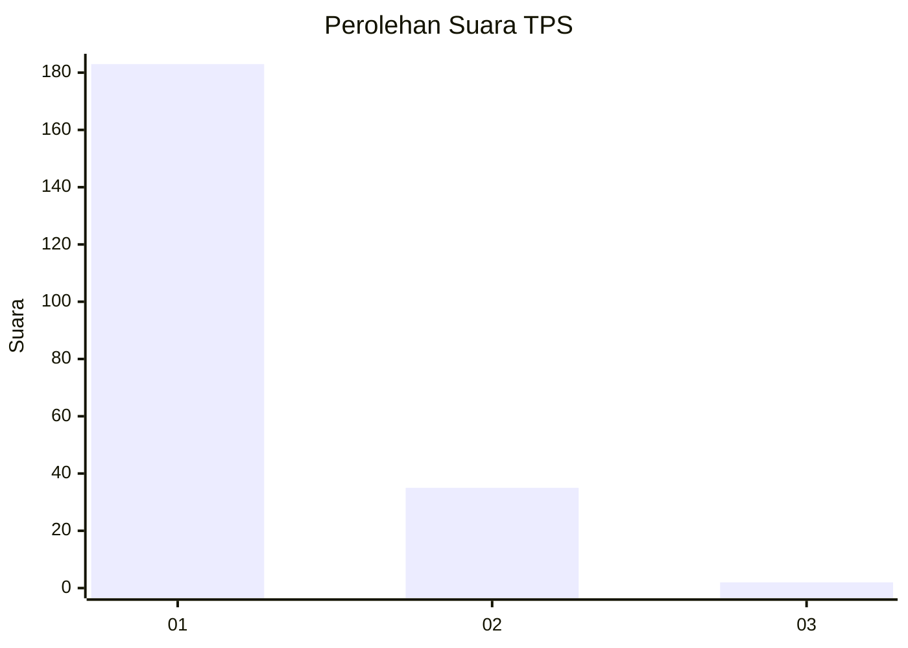
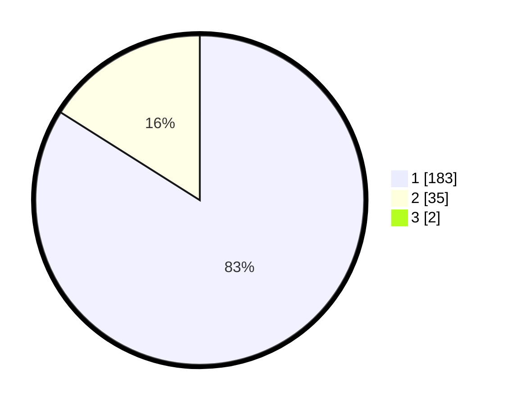

# Hasil

## Grafik

## Tabel

| No. | Nama Paslon    | Suara | Suara (raw) | Persentase |
|:--- |:-------------- | -----:| -----------:| ----------:|
| 1   | ANIES MUHAIMIN | 183   | [183][p-1]  | 83,18      |
| 2   | PRABOWO GIBRAN | 35    | [35][p-2]   | 15,91      |
| 3   | GANJAR MAHFUD  | 2     | [2][p-3]    | 0,91       |

[p-1]: https://github.com/gigit-pemilu/pemilu-2024-11-aceh/blob/main/pilpres/hitung-suara/sub/11-aceh/sub/74-kota-langsa/sub/04-langsa-lama/sub/2009-baroh-langsa-lama/sub/001-tps/sub/paslon-1.txt
[p-2]: https://github.com/gigit-pemilu/pemilu-2024-11-aceh/blob/main/pilpres/hitung-suara/sub/11-aceh/sub/74-kota-langsa/sub/04-langsa-lama/sub/2009-baroh-langsa-lama/sub/001-tps/sub/paslon-2.txt
[p-3]: https://github.com/gigit-pemilu/pemilu-2024-11-aceh/blob/main/pilpres/hitung-suara/sub/11-aceh/sub/74-kota-langsa/sub/04-langsa-lama/sub/2009-baroh-langsa-lama/sub/001-tps/sub/paslon-3.txt

## Foto C Plano

https://sirekap-obj-formc.kpu.go.id/827f/pemilu/ppwp/11/74/04/20/09/1174042009001-20240215-063436--660b0ea9-4301-4c75-ac25-3b1d113efd61.jpg

https://sirekap-obj-formc.kpu.go.id/827f/pemilu/ppwp/11/74/04/20/09/1174042009001-20240215-063559--e17d358d-9613-438e-8666-008abaf9fda4.jpg

https://sirekap-obj-formc.kpu.go.id/827f/pemilu/ppwp/11/74/04/20/09/1174042009001-20240215-063659--5522c4a9-ab04-460a-a5d6-24d58900df8c.jpg

## Metadata

| Key        | Value               |
| ---------- | ------------------- |
| Time Stamp | 2024-02-20 16:00:00 |

