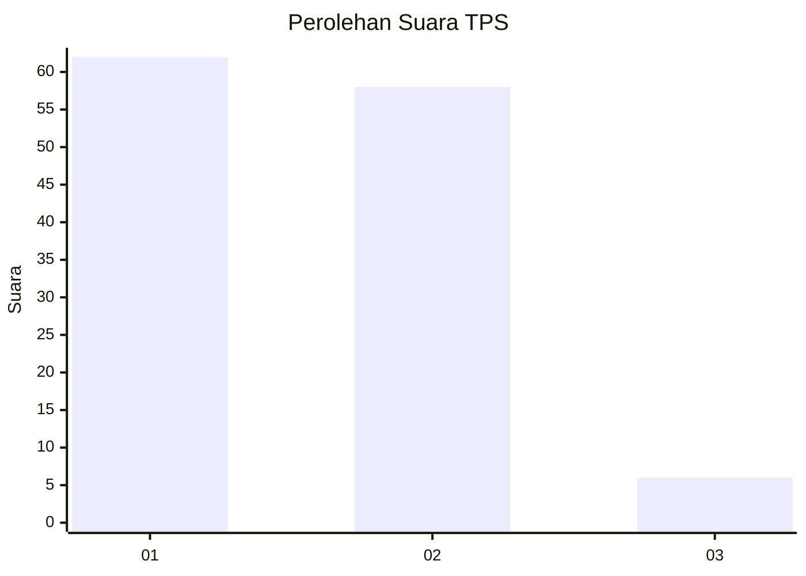
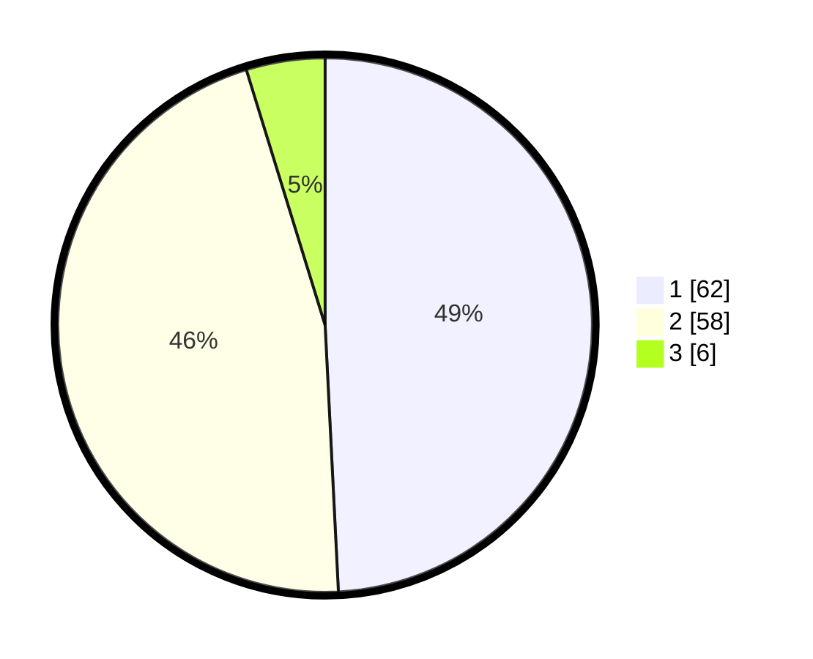

# Hasil

## Grafik

## Tabel

| No. | Nama Paslon    | Suara | Suara (raw) | Persentase |
|:--- |:-------------- | -----:| -----------:| ----------:|
| 1   | ANIES MUHAIMIN | 62    | [62][p-1]   | 49,21      |
| 2   | PRABOWO GIBRAN | 58    | [58][p-2]   | 46,03      |
| 3   | GANJAR MAHFUD  | 6     | [6][p-3]    | 4,76       |

[p-1]: https://github.com/gigit-pemilu/pemilu-2024-11-aceh/blob/main/pilpres/hitung-suara/sub/11-aceh/sub/74-kota-langsa/sub/04-langsa-lama/sub/2009-baroh-langsa-lama/sub/006-tps/sub/paslon-1.txt
[p-2]: https://github.com/gigit-pemilu/pemilu-2024-11-aceh/blob/main/pilpres/hitung-suara/sub/11-aceh/sub/74-kota-langsa/sub/04-langsa-lama/sub/2009-baroh-langsa-lama/sub/006-tps/sub/paslon-2.txt
[p-3]: https://github.com/gigit-pemilu/pemilu-2024-11-aceh/blob/main/pilpres/hitung-suara/sub/11-aceh/sub/74-kota-langsa/sub/04-langsa-lama/sub/2009-baroh-langsa-lama/sub/006-tps/sub/paslon-3.txt

## Foto C Plano

https://sirekap-obj-formc.kpu.go.id/1f93/pemilu/ppwp/11/74/04/20/09/1174042009006-20240222-103236--52469d97-bb87-469a-a5bb-90a23de83086.jpg

https://sirekap-obj-formc.kpu.go.id/1f93/pemilu/ppwp/11/74/04/20/09/1174042009006-20240222-103328--5d0f7f54-99ae-4186-874a-4854c1158ef4.jpg

https://sirekap-obj-formc.kpu.go.id/1f93/pemilu/ppwp/11/74/04/20/09/1174042009006-20240222-103440--239a76ae-c542-407e-b255-ad8155c7848e.jpg

## Metadata

| Key        | Value               |
| ---------- | ------------------- |
| Time Stamp | 2024-02-22 12:00:00 |

## DATA PEMILIH TETAP

Jumlah pemilih dalam DPT: **279**.
 * L: **433**.
 * P: **446**.

## DATA PENGGUNA HAK PILIH

Jumlah pengguna hak pilih dalam DPT: **226**.
 * L: **402**.
 * P: **424**.

Jumlah pengguna hak pilih dalam DPTb: **8**.
 * L: **800**.
 * P: **80**.

Jumlah pengguna hak pilih dalam DPK: **3**.
 * L: **2**.
 * P: **1**.

Jumlah pengguna hak pilih: **229**.
 * L: **604**.
 * P: **635**.

## JUMLAH SUARA SAH DAN TIDAK SAH

JUMLAH SELURUH SUARA SAH: **226**.

JUMLAH SUARA TIDAK SAH: **383**.

JUMLAH SELURUH SUARA SAH DAN SUARA TIDAK SAH: **229**.

