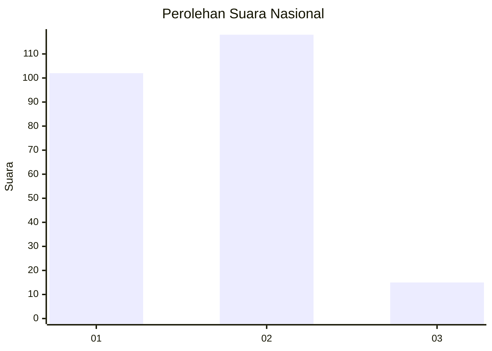
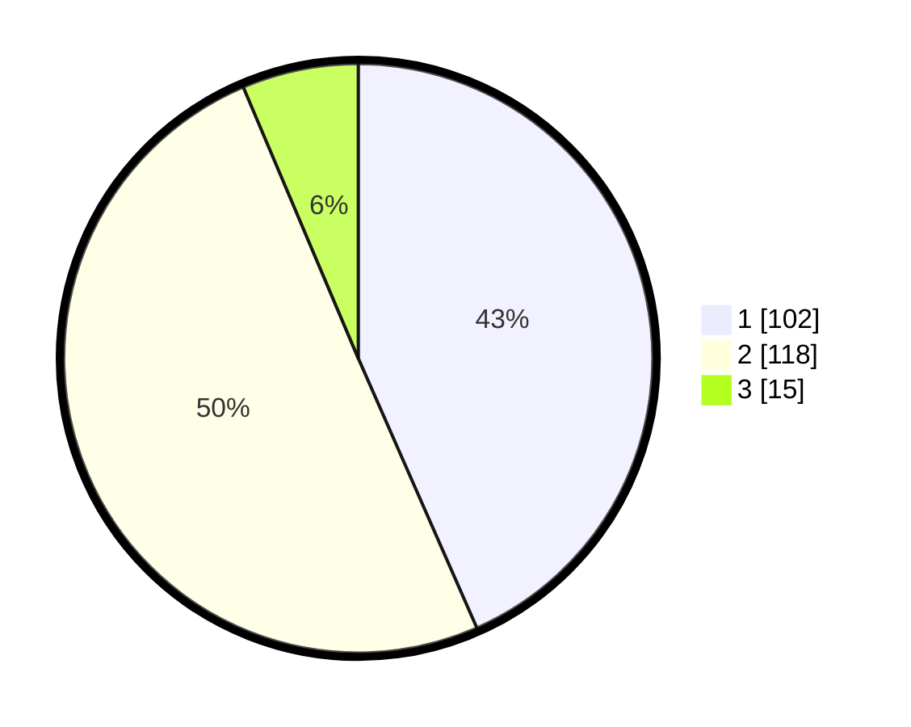

# Hasil

## Grafik

## Tabel

| No. | Nama Paslon    | Suara | Suara (raw) | Persentase |
|:--- |:-------------- | -----:| -----------:| ----------:|
| 1   | ANIES MUHAIMIN | 102   | [102][p-1]  | 43,40      |
| 2   | PRABOWO GIBRAN | 118   | [118][p-2]  | 50,21      |
| 3   | GANJAR MAHFUD  | 15    | [15][p-3]   | 6,38       |

[p-1]: https://github.com/gigit-pemilu/pemilu-2024/blob/main/pilpres/hitung-suara/sub/11-aceh/sub/74-kota-langsa/sub/04-langsa-lama/sub/2010-seulalah-baru/sub/001-tps/sub/paslon-1.txt
[p-2]: https://github.com/gigit-pemilu/pemilu-2024/blob/main/pilpres/hitung-suara/sub/11-aceh/sub/74-kota-langsa/sub/04-langsa-lama/sub/2010-seulalah-baru/sub/001-tps/sub/paslon-2.txt
[p-3]: https://github.com/gigit-pemilu/pemilu-2024/blob/main/pilpres/hitung-suara/sub/11-aceh/sub/74-kota-langsa/sub/04-langsa-lama/sub/2010-seulalah-baru/sub/001-tps/sub/paslon-3.txt

## Foto C Plano

https://sirekap-obj-formc.kpu.go.id/abbb/pemilu/ppwp/11/74/04/20/10/1174042010001-20240219-224044--b7b79928-a8a5-4ddf-a278-467154ee6c93.jpg

https://sirekap-obj-formc.kpu.go.id/abbb/pemilu/ppwp/11/74/04/20/10/1174042010001-20240219-224212--14befe39-52ce-4544-be40-a38102bb0385.jpg

https://sirekap-obj-formc.kpu.go.id/abbb/pemilu/ppwp/11/74/04/20/10/1174042010001-20240219-224324--da440ee9-10b7-4aa2-ba7e-cc9444dd1cac.jpg

## Metadata

| Key        | Value               |
| ---------- | ------------------- |
| Time Stamp | 2024-02-20 16:00:00 |

## DATA PEMILIH TETAP

Jumlah pemilih dalam DPT: **233**.
 * L: **236**.
 * P: **147**.

## DATA PENGGUNA HAK PILIH

Jumlah pengguna hak pilih dalam DPT: **236**.
 * L: **605**.
 * P: **34**.

Jumlah pengguna hak pilih dalam DPTb: **2**.
 * L: **1**.
 * P: **1**.

Jumlah pengguna hak pilih dalam DPK: **0**.
 * L: **9**.
 * P: **0**.

Jumlah pengguna hak pilih: **239**.
 * L: **107**.
 * P: **832**.

## JUMLAH SUARA SAH DAN TIDAK SAH

JUMLAH SELURUH SUARA SAH: **235**.

JUMLAH SUARA TIDAK SAH: **4**.

JUMLAH SELURUH SUARA SAH DAN SUARA TIDAK SAH: **239**.

