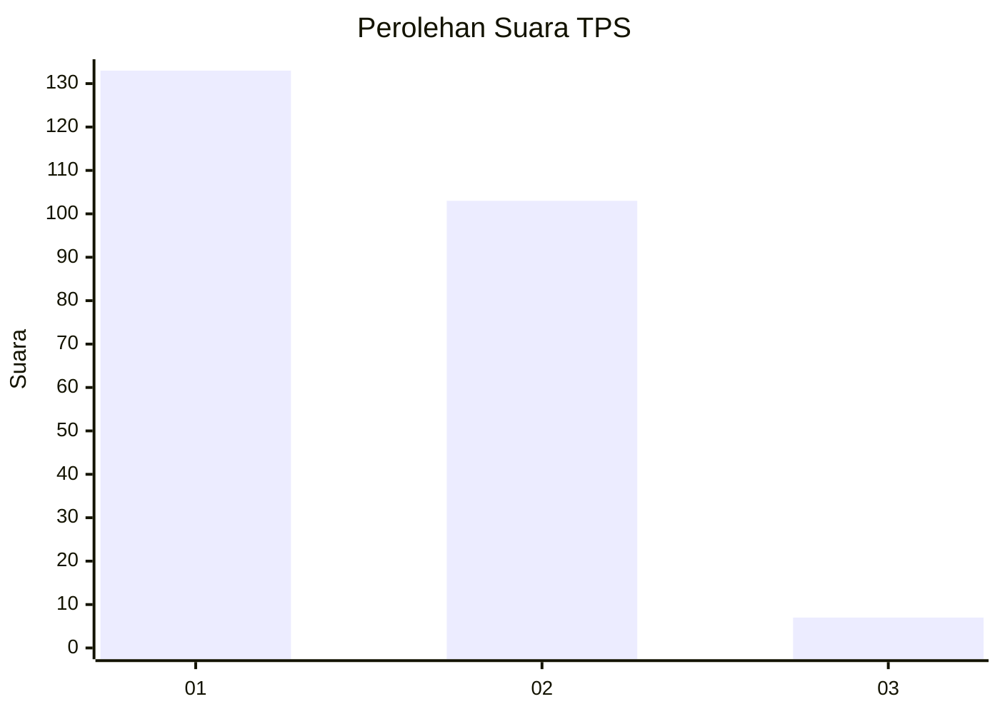
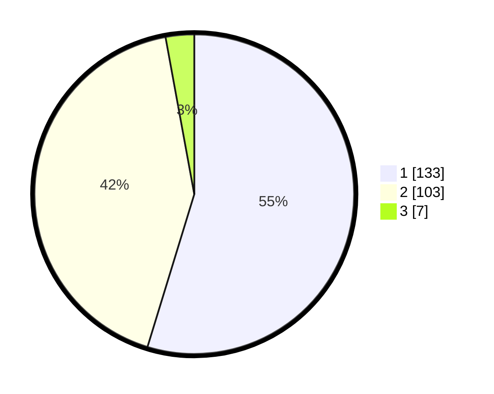

# Hasil

## Grafik

## Tabel

| No. | Nama Paslon    | Suara | Suara (raw) | Persentase |
|:--- |:-------------- | -----:| -----------:| ----------:|
| 1   | ANIES MUHAIMIN | 133   | [133][p-1]  | 54,73      |
| 2   | PRABOWO GIBRAN | 103   | [103][p-2]  | 42,39      |
| 3   | GANJAR MAHFUD  | 7     | [7][p-3]    | 2,88       |

[p-1]: https://github.com/gigit-pemilu/pemilu-2024-11-aceh/blob/main/pilpres/hitung-suara/sub/11-aceh/sub/74-kota-langsa/sub/04-langsa-lama/sub/2010-seulalah-baru/sub/004-tps/sub/paslon-1.txt
[p-2]: https://github.com/gigit-pemilu/pemilu-2024-11-aceh/blob/main/pilpres/hitung-suara/sub/11-aceh/sub/74-kota-langsa/sub/04-langsa-lama/sub/2010-seulalah-baru/sub/004-tps/sub/paslon-2.txt
[p-3]: https://github.com/gigit-pemilu/pemilu-2024-11-aceh/blob/main/pilpres/hitung-suara/sub/11-aceh/sub/74-kota-langsa/sub/04-langsa-lama/sub/2010-seulalah-baru/sub/004-tps/sub/paslon-3.txt

## Foto C Plano

https://sirekap-obj-formc.kpu.go.id/0d08/pemilu/ppwp/11/74/04/20/10/1174042010004-20240220-125551--ab2bb562-9e18-40c5-aba6-912aa0226ea8.jpg

https://sirekap-obj-formc.kpu.go.id/0d08/pemilu/ppwp/11/74/04/20/10/1174042010004-20240220-125716--2b70ba4f-dd1e-4b0b-b147-1b89ed65b236.jpg

https://sirekap-obj-formc.kpu.go.id/0d08/pemilu/ppwp/11/74/04/20/10/1174042010004-20240220-125820--3361928e-3f19-4e49-a922-c605709080fe.jpg

## Metadata

| Key        | Value               |
| ---------- | ------------------- |
| Time Stamp | 2024-02-20 13:00:00 |

## DATA PEMILIH TETAP

Jumlah pemilih dalam DPT: **283**.
 * L: **127**.
 * P: **756**.

## DATA PENGGUNA HAK PILIH

Jumlah pengguna hak pilih dalam DPT: **913**.
 * L: **624**.
 * P: **510**.

Jumlah pengguna hak pilih dalam DPTb: **0**.
 * L: **0**.
 * P: **0**.

Jumlah pengguna hak pilih dalam DPK: **0**.
 * L: **0**.
 * P: **0**.

Jumlah pengguna hak pilih: **245**.
 * L: **199**.
 * P: **136**.

## JUMLAH SUARA SAH DAN TIDAK SAH

JUMLAH SELURUH SUARA SAH: **243**.

JUMLAH SUARA TIDAK SAH: **2**.

JUMLAH SELURUH SUARA SAH DAN SUARA TIDAK SAH: **245**.

